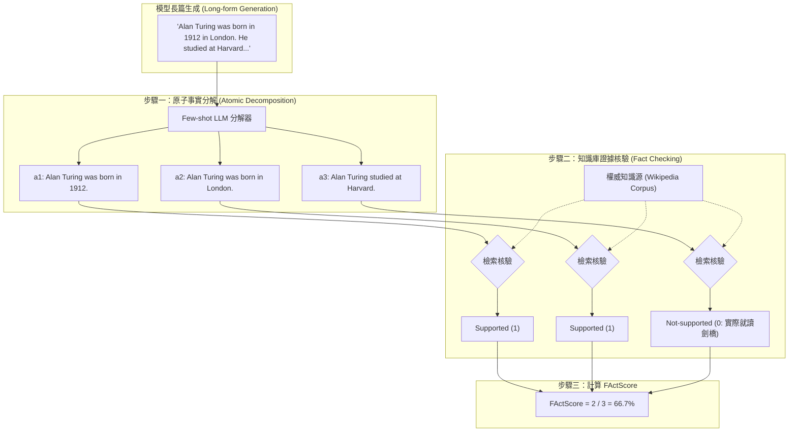

# FActScore: Fine-grained Atomic Evaluation of Factual Precision in Long Form Text Generation

## 一話摘要 (TL;DR)
FActScore 提出將非結構化長篇生成文本解構為一組獨立的「原子事實（Atomic Facts）」清單，並依據可靠知識庫（如 Wikipedia）逐一核驗各原子命題是否得到實質支撐，以「受支撐原子事實百分比」量化長文本的事實精準度，有效解決長篇文本中真實與虛假資訊高度混雜無法客觀打分的評測難題。

---

## 研究背景與問題定義 (Problem Statement)
在評估大語言模型生成長篇文字（如人物傳記、學術文獻綜述、行業分析報告）的事實精準度時，傳統指標存在根本性障礙：
1. **二元評判（Binary Judgment）失效**：長篇文字通常混雜著「部分正確、部分虛假、部分無法查證」的多項陳述。將整篇文章粗暴標記為「真」或「假」極不客觀，無法捕捉模型的事實錯誤密度。
2. **表面字串指標（ROUGE / BLEU）脫節**：ROUGE 僅衡量 n-gram 重疊度，完全無法辨識關鍵事實（如時間、地點、數值、人名）的扭曲。
3. **人工評測代價極高**：審核一份數百字的長篇傳記需要人工逐句查證多個外部來源，成本昂貴且標註者間一致性難以保證。

---

## 核心方法與技術架構 (Methodology & Architecture)

FActScore 提出了兩階段長篇事實精準度評估框架：**原子事實分解（Atomic Fact Decomposition）** 與 **基於證據的原子驗證（Evidence-Grounded Verification）**：
1. **原子事實解構（Step 1: Atomic Fact Generation）**：
   - 定義「原子事實」為不可再分的最小短句陳述（包含單一實體及其屬性或動作）；
   - 利用 Few-shot Prompting 指導 LLM 將複雜長句分解為一組自包含的原子短句集合 $\mathcal{A}(y) = \{a_1, a_2, \dots, a_k\}$。
2. **逐項事實核驗（Step 2: Fact Checking against Knowledge Source）**：
   - 針對每個原子事實 $a_i$，在權威知識源（如對應實體的 Wikipedia 頁面）中定位相關證據；
   - 判定 $a_i$ 的標籤為：**Supported（受證據支撐）**、**Not-supported（不受支撐/事實錯誤）** 或 **Irrelevant（與主題無關）**。
3. **FActScore 量化計算公式**：
   - 長篇文本 $y$ 的事實精準度為受支撐原子事實佔有效原子事實的比例：
     $$\text{FActScore}(y) = \frac{|\{a \in \mathcal{A}(y) \mid \text{Label}(a) = \text{Supported}\}|}{|\{a \in \mathcal{A}(y) \mid \text{Label}(a) \in \{\text{Supported}, \text{Not-supported}\}\}|}$$
4. **自動化評測器（Automated FActScore Evaluator）**：
   - 提出免人工的無監督管線：利用檢索模型撈取相關文檔，並由專門微調或引導的判別模型判定原子事實，達到與人類專家評審高達 88%–96% 的一致性。

### 圖中節點對照
- `DEC`：將長複合句拆解為單事實原子命題的模組。
- `A1..A3`：原子事實清單。
- `WIKI`：基準真實知識庫（Ground Truth Source）。
- `CALC`：計算受支撐事實百分比的核心打分器。

---

## 主要實驗結果與證據 (Empirical Results & Evidence)

論文在為不同知名度人物撰寫傳記（Biographies）任務上，評測了 InstructGPT、ChatGPT 與外掛搜尋的 PerplexityAI。

### 傳記生成的事實精準度評測 (Table 1, Page 4)
- **InstructGPT**：
  - 受支撐事實佔比（Supported）：42.3%；
  - 事實錯誤佔比（Not-supported）：**43.2%**；
  - 拒答率（Abstain）：0.5%；
  - **FActScore**：僅為 **42.5%**（超過一半的事實為捏造）。
- **ChatGPT**：
  - 受支撐事實佔比：50.0%；
  - 事實錯誤佔比：27.5%；
  - 拒答率：14.2%；
  - **FActScore**：達到 **58.3%**（比 InstructGPT 提高 +15.8%）。
- **PerplexityAI (Search-Augmented RAG)**：
  - 受支撐事實佔比：64.9%；
  - 事實錯誤佔比：**11.1%**；
  - **FActScore**：達到 **71.5%**（相較純參數模型大幅提升，但仍有 11% 的錯誤事實源於錯誤檢索與未對齊摘要）。

---

## 優勢、限制及 Trade-offs (Strengths, Limitations & Trade-offs)

### 優勢
1. **細粒度、可歸因的診斷能力**：不僅給出一個百分比分數，還精確標註出「具體哪一個原子事實出錯」，為錯誤歸因（Error Attribution）提供直接線索。
2. **與人類專家高度一致**：自動化評審器在人物傳記評測中達到 88%–96% 的一致性，大幅降低了長篇事實性審查的成本。

### 限制與 Trade-offs
1. **知識源偏誤**：目前 FActScore 主要依賴 Wikipedia 等特定封閉文本庫，面對前沿科研論文、私有企業內部日誌等非結構化非公開資料時，需要自行構建證據檢索器。
2. **無法單獨評估論證邏輯**：FActScore 衡量的是「事實真假（Precision）」，並不衡量文章的篇章結構、因果推導或修辭完整性。

---

## 對本專案研究領域的實際意義 (Implications for Research Domains)
1. **對 Domain 16 (Context Utilization & Faithfulness) 的標準化意義**：確立了「長篇生成必須先做原子事實拆解（Decomposition）」的學術共識，是構建 Faithfulness 評估管線的黃金標準。
2. **對 Domain 04 (Proposition Retrieval) 的理論呼應**：FActScore 的原子事實思想與 Dense X 的命題檢索（Proposition）在語意表示上高度契合，證明了「原子命題」無論在檢索端還是評測端都是最穩健的治理單元。

---

## 原始來源及相關筆記連結 (Sources & Related Notes)
- 原始論文 PDF：[[Papers/06 - Benchmarks & Evaluation/(EMNLP 2023-12) FActScore - Fine-grained Atomic Evaluation of Factual Precision in Long Form Text Generation.pdf|開啟本地 PDF]]
- arXiv 永久連結：[arXiv:2305.14251](https://arxiv.org/abs/2305.14251)
- 關聯專題領域：[[02 - 研究領域專題 (Research Domains)/Canonical RAG Domains/Domain 07 - Context Construction & Evidence Utilization|D07 Context Construction & Evidence Utilization]]、[[02 - 研究領域專題 (Research Domains)/Canonical RAG Domains/Domain 13 - RAG Evaluation & Failure Attribution|D13 RAG Evaluation & Failure Attribution]]
