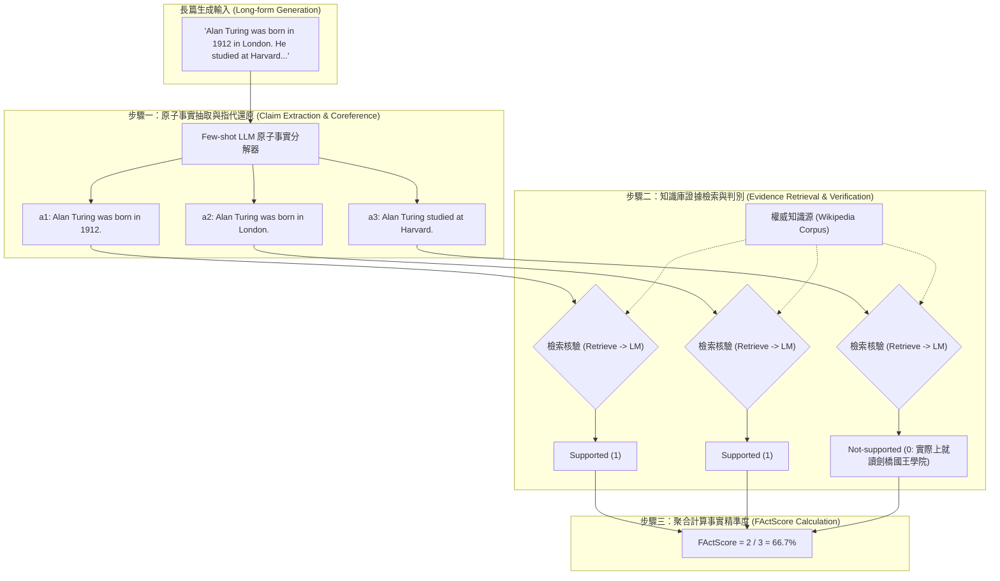

# FActScore: Fine-grained Atomic Evaluation of Factual Precision in Long Form Text Generation

> [!INFO] 論文元數據 (Metadata)
> - **Paper ID**：`Min2023_FActScore`
> - **作者**：Sewon Min, Kalpesh Krishna, Xinxi Lyu, Mike Lewis, Wen-tau Yih, Pang Wei Koh, Mohit Iyyer, Luke Zettlemoyer, Hannaneh Hajishirzi (University of Washington, UMass Amherst, Allen Institute for AI, Meta AI)
> - **預印本初次發布年份 (Preprint)**：2023
> - **正式發表年份 / 會議或期刊 (Venue)**：EMNLP 2023 Main Conference (Pages 12076–12100)
> - **DOI**：10.18653/v1/2023.emnlp-main.741
> - **arXiv**：[2305.14251](https://arxiv.org/abs/2305.14251)
> - **驗證狀態**：`verified` (基於原始論文 PDF 全文核實)
> - **本地 PDF 連結**：[[Papers/06 - Benchmarks & Evaluation/(EMNLP 2023-12) FActScore - Fine-grained Atomic Evaluation of Factual Precision in Long Form Text Generation.pdf|開啟本地 PDF 檔案]]

---

## 一話摘要 (TL;DR)
**FActScore 提出將非結構化長篇生成文本解構為一組獨立的「原子事實（Atomic Facts）」清單，並依據權威知識庫（如 Wikipedia）逐一核驗各原子命題是否得到實質支撐，以「受支撐原子事實百分比」量化長文本的事實精準度，有效解決長篇文本中真實與虛假資訊高度混雜無法客觀打分的評測難題。**

---

## 研究背景與問題定義 (Problem Statement)

在評估大語言模型生成長篇文字（如人物傳記、學術文獻綜述、行業分析報告）的事實精準度時，傳統指標存在根本性障礙：
1. **二元評判（Binary Judgment）失效**：長篇文字通常混雜著「部分正確、部分虛假、部分無法查證」的多項陳述（在 ChatGPT 生成中，約 40% 的句子同時包含正確與錯誤事實）。將整篇或整句粗暴標記為「真」或「假」極不客觀，無法捕捉模型的事實錯誤密度。
2. **表面字串指標（ROUGE / BLEU）脫節**：ROUGE 僅衡量 n-gram 重疊度，完全無法辨識關鍵事實（如時間、地點、數值、人名、就讀學校）的實質扭曲。
3. **人工評測代價極高**：審核一份數百字的長篇傳記需要人工逐句查證多個外部來源，成本昂貴且標註者間一致性難以保證。

---

## 核心方法與技術架構 (Methodology & Architecture)

### 1. 原子事實（Atomic Fact）的定義與解構 (Section 3, Page 3)
FActScore 提出將原子事實作為長文事實性評估的最基本單位：
- **原子性**：包含單一資訊片斷（Single Piece of Information）的極短陳述句（例如 ChatGPT 生成文本平均每句包含 4.4 個原子事實）。
- **去脈絡自足性**：長句分解為原子事實時，必須完成**代名詞消解（Coreference Resolution）**，將「他」、「這所大學」等替換為具體實體全稱（例如「Alan Turing was born in 1912」而非「He was born in 1912」）。
- **生成長篇文本 $y$ 的分解**：
  $$\mathcal{A}(y) = \{a_1, a_2, \dots, a_k\}$$

### 2. 兩階段自動化評估管線 (Section 4, Page 5-7)
1. **步驟一：原子事實分解（Atomic Fact Generation）**：
   - 採用 Few-shot Prompting 指導大語言模型（如 InstructGPT / ChatGPT）將輸入長句拆分為自包含的短命題列表。
2. **步驟二：基於知識源的證據定位與核驗（Retrieve $\to$ LM Fact Checking）**：
   - 針對每個原子事實 $a_i$，在權威知識源（Wikipedia 相關實體頁面 $\mathcal{C}$）中利用檢索器（如基於名詞短語檢索或密集檢索）提取 Top-k 相關證據段落。
   - 利用判別模型判定 $a_i$ 的標籤為：
     - **Supported**：受外部文獻直接支撐。
     - **Not-supported**：與文獻衝突或無證據支持（事實捏造）。
     - **Irrelevant**：與主題無關的非實質修辭。
3. **FActScore 量化計算公式 (Section 3, Page 3)**：
   $$\text{FActScore}(y, \mathcal{C}) = \frac{1}{|\mathcal{A}(y)|} \sum_{a \in \mathcal{A}(y)} \mathbb{I}(a \text{ is supported by } \mathcal{C})$$

```mermaid
flowchart TD
    subgraph input_stage["長篇生成輸入 (Long-form Generation)"]
        GEN["'Alan Turing was born in 1912 in London. He studied at Harvard...'"]
    end

    subgraph decomp_stage["步驟一：原子事實抽取與指代還原 (Claim Extraction & Coreference)"]
        GEN --> DEC["Few-shot LLM 原子事實分解器"]
        DEC --> A1["a1: Alan Turing was born in 1912."]
        DEC --> A2["a2: Alan Turing was born in London."]
        DEC --> A3["a3: Alan Turing studied at Harvard."]
    end

    subgraph verif_stage["步驟二：知識庫證據檢索與判別 (Evidence Retrieval & Verification)"]
        WIKI["權威知識源 (Wikipedia Corpus)"]
        A1 --> V1{"檢索核驗 (Retrieve -> LM)"}
        A2 --> V2{"檢索核驗 (Retrieve -> LM)"}
        A3 --> V3{"檢索核驗 (Retrieve -> LM)"}
        WIKI -.-> V1
        WIKI -.-> V2
        WIKI -.-> V3
        V1 --> S1["Supported (1)"]
        V2 --> S2["Supported (1)"]
        V3 --> S3["Not-supported (0: 實際上就讀劍橋國王學院)"]
    end

    subgraph score_stage["步驟三：聚合計算事實精準度 (FActScore Calculation)"]
        S1 --> CALC["FActScore = 2 / 3 = 66.7%"]
        S2 --> CALC
        S3 --> CALC
    end
```

#### 圖中節點對照 (Node Reference Table)
| 節點代號 | 模組名稱 | 關鍵作用與運算機制 |
| :--- | :--- | :--- |
| `GEN` | 模型長篇生成輸出 | 待評估的自然語言長篇文本（包含人物生平、事件陳述） |
| `DEC` | 原子事實分解器 | 利用 Few-shot Prompting 抽取單一事實並還原代名詞 |
| `A1` ~ `A3` | 原子事實集合 $\mathcal{A}(y)$ | 獨立、最小且自包含的事實命題清單 |
| `WIKI` | 基準知識庫 | 作為 Ground Truth 查驗來源的維基百科文檔集合 |
| `V1` ~ `V3` | 自動化查驗器 | 透過 Retrieve $\to$ LM 流程對比證據段落打出真偽標籤 |
| `CALC` | FActScore 聚合計算 | 計算受支撐原子事實佔總原子事實數的精確百分比 |

---

## 主要實驗結果與證據 (Empirical Results & Evidence)

### 1. 人類標註與前沿模型事實性評測 (Table 1, Page 4)
針對為各領域知名人物生成傳記任務，評估不同模型的長篇事實精準度：
- **InstructGPT**：
  - 平均每篇生成字數 151 words，包含 41.3 個原子事實；
  - 受支撐事實佔比（Supported）：42.3%；
  - 事實錯誤佔比（Not-supported）：**43.2%**；
  - 拒答率（Abstain）：0.5%；
  - **FActScore**：僅為 **42.5%**（超過一半的事實為模型幻覺捏造）。
- **ChatGPT**：
  - 平均每篇生成字數 110 words，包含 25.8 個原子事實；
  - 受支撐事實佔比：50.0%；
  - 事實錯誤佔比：27.5%；
  - 拒答率：14.2%；
  - **FActScore**：達到 **58.3%**（相較 InstructGPT 提高 +15.8%）。
- **PerplexityAI (Search-Augmented RAG)**：
  - 平均每篇生成字數 125 words，包含 29.5 個原子事實；
  - 受支撐事實佔比：64.9%；
  - 事實錯誤佔比：**11.1%**；
  - **FActScore**：達到 **71.5%**（檢索增強顯著降低錯誤率，但仍有 11% 錯誤來自檢索誤報或摘要幻覺）。

### 2. 事實錯誤類型細分 (Table 2, Page 5)
針對模型生成中的 Not-supported 錯誤進行細緻分類分析：
- **實體替換（Entity Substitution）**：模型保留正確的動作或事件，但將關聯的人物、機構或地名替換為錯誤實體。
- **關聯捏造（Relation Fabrication）**：完全虛構無中生有的成就、經歷或職位。
- **時間與數字錯誤（Temporal & Quantitative Errors）**：年份、年齡或統計數字產生偏移。
- **超出範疇與無法驗證（Out of Scope / Irrelevant）**：包含主觀價值判斷或無法在公開文獻中找到佐證之細節。

### 3. 自動化核驗器與人類審查的一致性 (Table 3, Page 7)
- 評估自動化評測器（Automated Evaluators，包含 LLaMA+NP、ChatGPT 以及集成模型）：
- 自動化打分與人類專業審核結果的相關係數（Pearson's $r$）高達 **0.99**，排名一致性（Spearman's $\rho$）達到 **0.97**。
- 自動化驗證器的單事實判別錯誤率僅約 2.0%~3.5%，證明使用 LLM + 檢索器可以低成本、高可靠性地替代昂貴的人工長文事實審查。

### 4. 12 款商業與開源模型大橫評 (Table 4, Page 8 & Figure 4, Page 9)
- **開源 7B 模型（Alpaca-7B, Vicuna-7B）**：FActScore 普遍落在 25%~38% 之間，長篇事實幻覺極為嚴重。
- **開源 65B 模型（LLaMA-65B, Alpaca-65B）**：FActScore 提升至 50%~55% 區間。
- **GPT-4 與 ChatGPT**：在同等測試下表現最優，GPT-4 的事實精準度達到 84.2%（但在長尾未知實體上仍存在顯著幻覺）。

---

## 優勢、限制及 Trade-offs (Strengths, Limitations & Trade-offs)

### 1. 技術優勢
- **極高診斷性與錯誤溯源（Fine-grained Attribution）**：不僅給出宏觀分數，還能精確定位具體哪句話、哪個單詞發生了實體捏造或時序倒錯。
- **完美契合長篇生成特質**：突破傳統 Sentence/Paragraph 二元對立，精確捕捉「半真半假」的複合語句。
- **客觀可重複性**：自動化評審流水線使不同模型、不同 RAG 策略的事實精準度具備可比對的定量基準。

### 2. 限制與 Trade-offs
- **依賴封閉知識源的完整性**：若參考知識庫（如 Wikipedia）自身存在覆蓋率不足或更新滯後，未被記載的事實會被誤判為 Not-supported。
- **原子切分丟失語境限制條件**：在過度切分時，可能將從屬子句中的「假設條件」或「否定限定」錯誤剝離，導致單一原子句看起來不成立。
- **不衡量論證結構與文章宏觀流暢度**：FActScore 專注於事實精準度（Precision），無法衡量論述邏輯、修辭連貫性與結構完整性。

---

## 對本專案研究領域的實際意義 (Implications for Research Domains)

1. **對 D13 (Evaluation & Failure Attribution) 的基石作用**：
   - FActScore 確立了「長篇文本的事實性評測必須下沉至原子命題（Atomic Claims）」的工業與學術標準，是 RAG 幻覺診斷、受支持度量測（Supported Ratio）的核心依據。
2. **對 D03 (Knowledge Extraction & Semantic Units) 的方法論呼應**：
   - FActScore 的 Step 1（Atomic Fact Generation）本質上是一種**高保真度、無監督/弱監督的自然語言 Claim Extraction 機制**。
   - 與 Dense X 的 Propositionizer 相互印證：兩者均證明了自然語言命題/原子事實是超越粗暴 Token Chunking 的最佳語意單元。
3. **對 D09 (Grounded Generation & Long-form Synthesis) 的引導價值**：
   - 為長篇報告撰寫系統提供了「句子級生成 $\to$ 實時原子事實分解 $\to$ 檢索反思校驗」的閉環生成框架基礎。

---

## 原始來源及相關筆記連結 (Sources & Related Notes)

- **本地文獻**：[[Papers/06 - Benchmarks & Evaluation/(EMNLP 2023-12) FActScore - Fine-grained Atomic Evaluation of Factual Precision in Long Form Text Generation.pdf|開啟本地 PDF 檔案]]
- **相關理論專題**：
  - [[02 - 研究領域專題 (Research Domains)/Domain 13 - RAG Evaluation & Failure Attribution|D13 RAG Evaluation & Failure Attribution]]
  - [[02 - 研究領域專題 (Research Domains)/Domain 03 - Knowledge Extraction & Information Preservation|D03 Knowledge Extraction & Consolidation]]
  - [[02 - 研究領域專題 (Research Domains)/Domain 09 - Grounded Generation & Long-form Synthesis|D09 Grounded Generation & Long-form Synthesis]]
- **同系列相關論文**：
  - [[03 - 論文庫 (Literature Notes)/04 - Knowledge & Graph RAG/(EMNLP 2024-11) Dense X - Exploring the Limit of Proposition Retrieval for Open-Domain QA|Dense X]] (命題化檢索單元與 Propositionizer)
  - [[03 - 論文庫 (Literature Notes)/06 - Benchmarks & Evaluation/(EACL 2024-03) RAGAS - Automated Evaluation of Retrieval Augmented Generation|RAGAS]] (RAG 自動化多維度評估框架)
