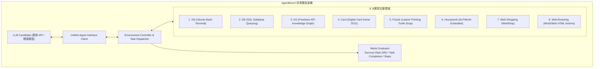

# AgentBench: Evaluating LLMs as Agents

## 一話摘要 (TL;DR)
AgentBench 是學界第一個針對大語言模型作為智能體（LLM-as-Agent）能力的綜合性基準評測，涵蓋作業系統終端機、資料庫 SQL、知識圖譜、網頁操作及具身決策等 8 大互動環境，對 29 個模型進行多輪閉環評估，定量揭示了開源模型與頂級商用模型在複雜 Agent 能力上的巨大鴻溝。

---

## 研究背景與問題定義 (Problem Statement)

1. **傳統 NLP 靜態評測的失效**：
   - 傳統基準（如 MMLU、GSM8k）僅評估靜態的單輪問答或局部生成能力，完全無法反映 LLM 在真實世界複雜動態環境中的長期規劃、工具呼叫、狀態跟蹤與反思適應能力；
   - 雖然社群提出了大量基於 LLM 的智能體（AutoGPT, BabyAGI 等），但缺乏嚴謹、可量化、可重現的基準與統一 API 協議。
2. **核心研究目標**：
   - 構建涵蓋文字、代碼、終端機與圖形網頁的多環境互動基準，系統性檢驗各 LLM 是否真正具備在複雜環境中完成實質性目標的 Agent 核心能力。

---

## 核心方法與技術架構 (Methodology & Architecture)

AgentBench 建立了包含 8 大環境、由多輪交互客戶端與自動化評估器構成的架構體系：

### 圖中節點對照
- `CLIENT`：標準化 Agent 輸入輸出協議，處理 Context 拼接、歷史 Action 維護與超時中斷。
- `envs`：涵蓋符號系統操作（OS/DB/KG）、常識邏輯博弈（Card/Puzzle）與真實世界網頁及具身環境（ALFWorld/WebShop/Mind2Web）。
- `EVAL`：基於環境真實狀態變更進行客觀判定（例如檔案是否被正確修改、SQL 查詢結果是否正確）。

---

## 主要實驗結果與證據 (Empirical Results & Evidence)

論文評估了 29 個代表性 LLM，涵蓋商用 API 模型與各主流開源模型（Table 1, Page 3 & Table 2, Page 6）：

1. **模型總體綜合表現 (Table 1, Page 3)**：
   - **GPT-4** 展現出絕對領先優勢，總體 Agent 得分高達 **4.01**；
   - **Claude-v1.3** 位居第二，得分為 **2.89**；
   - **GPT-3.5-Turbo** 得分為 **2.34**；
   - **開源模型表現極度疲軟**：
     - LLaMA-2-70B-Chat 得分僅 **0.94**；
     - Vicuna-33B-v1.3 得分僅 **0.81**；
     - 許多 7B/13B 開源模型在終端機 OS 與網頁操作環境中的成功率接近 **0%**。
2. **細分環境核心發現 (Table 2, Page 6)**：
   - **OS 終端機環境**：GPT-4 成功率達到 42.0%，而次佳的 GPT-3.5 僅 17.0%，開源模型幾乎無法處理包含複雜 grep, sed, chmod 的長序列指令反饋；
   - **DB 資料庫環境**：GPT-4 成功率達 37.0%，開源模型在面對大表 Schema 理解時極易發生 SQL 語法錯誤；
   - **Web 網頁環境 (Mind2Web)**：多數模型因無法在龐大 DOM 樹中精確定位元素與維持歷史狀態而頻繁崩潰。

---

## 優勢、限制及 Trade-offs (Strengths, Limitations & Trade-offs)

1. **適用任務與資料集**：為多輪交互式 Agent 提供量化基準，有效隔離靜態知識背誦與動態工具執行能力；
2. **資源消耗與測試開銷**：完整跑完 8 大環境 1,471 輪任務需要龐大的 API 費用與數小時的沙盒伺服器運算時間；
3. **失效情境**：
   - **長度偏置與上下文衰減**：隨交互輪數增加（平均多達 14 輪），模型容易遺忘最初的系統指令；
   - **環境不可逆副作用**：若沙盒未完全容器化隔離，危險命令（如 `rm -rf`）可能造成環境崩潰。

---

## 對本專案研究領域的實際意義 (Implications for Research Domains)

1. **確立 Agentic RAG 與工具呼叫的真實評測標準**：證明單純在文字資料集上提升 BLEU/ROUGE 無法代表模型具備在動態檢索系統中生存的能力。
2. **為開源與私有化落地敲響警鐘**：明確指出當前開源模型在指令跟蹤與多輪狀態維護上的短板，指明了強化微調（SFT on Agent trajectories）與記憶體增強架構（如 MemGPT, LongMem）的迫切需求。

---

## 原始來源及相關筆記連結 (Sources & Related Notes)

- **本地 PDF 原文**：[[Papers/06 - Benchmarks & Evaluation/(ICLR 2024-05) AgentBench - Evaluating LLMs as Agents.pdf|開啟本地 PDF 檔案]]
- **相關領域專題**：
  - [[02 - 研究領域專題 (Research Domains)/Domain 17 - RAG Benchmarks & Evaluation Protocols|Domain 17: RAG 評測基準與評估協議]]
  - [[02 - 研究領域專題 (Research Domains)/Domain 09 - Agentic 工作流與自主研究 (Planning, Multi-Agent)|Domain 09: Agentic 工作流與自主研究]]
- **相關核心文獻**：
  - [[03 - 論文庫 (Literature Notes)/05 - Memory & Agents/(ICLR 2023-05) ReAct - Synergizing Reasoning and Acting in Language Models|ReAct (Yao et al., ICLR 2023)]]
  - [[03 - 論文庫 (Literature Notes)/05 - Memory & Agents/(NeurIPS 2023-12) Reflexion - Language Agents with Verbal Reinforcement Learning|Reflexion (Shinn et al., NeurIPS 2023)]]
  - [[03 - 論文庫 (Literature Notes)/06 - Benchmarks & Evaluation/(NAACL 2024-06) ARES - An Automated Evaluation Framework for Retrieval-Augmented Generation Systems|ARES (Saad-Falcon et al., NAACL 2024)]]
