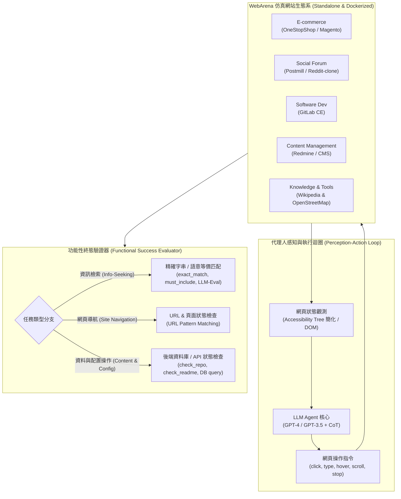

# WebArena: A Realistic Web Environment for Building Autonomous Agents

## 1. 一話摘要 (TL;DR)
WebArena 構建了一個可完全本地化部署的四大類真實網站高仿真環境（E-commerce, Social Forum, Collaborative Software Dev, CMS），包含 812 個多步驟、長視野日常任務與難以達成的任務（Unachievable Tasks），並基於終態功能執行正確性進行評測；實驗顯示人類成功率達 78.24%，而最頂尖的 GPT-4 即使無 UA 提示也僅達 14.41%（有 UA 提示時為 11.70%），凸顯了現有 LLM 在動態網頁交互、多跳規劃與拒答校準上的巨大鴻溝。

---

## 2. 研究背景與問題定義 (Problem Statement)

### 現有 Agent 評測基準的四大瓶頸
1. **合成與玩具化環境（Synthetic & Simplified Environments）**：
   - 早期 Web 代理人基準（如 MiniWoB++、WebShop）過於簡化，多依賴受限的表單或合成按鈕，缺乏真實 Web 應用中複雜的 DOM 樹、動態 JavaScript 渲染、iframe、深層嵌套及多頁面交互。
2. **缺乏長視野與多站點協同（Short-Horizon & Isolated Tasks）**：
   - 真實世界的 Web 任務往往需要跨越多個應用程式（例如：在 Wikipedia 查詢匹茲堡藝術博物館列表，在 OpenStreetMap 規劃最優駕駛路線，並將結果記錄至 GitLab repository 的 README 中）。
3. **文本相似度評測的脆弱性（Brittle Lexical Evaluation）**：
   - 先前基準常比對代理人的動作軌跡（Action Trajectory Emulation）或生成文字，但 Web 任務具有高度的多路徑等價性（Multi-path Equivalence），唯有驗證環境的最終功能狀態（Functional Correctness / State Verification）才能公正評估。
4. **缺乏不可達成任務的校準評估（Unachievable Task Calibration）**：
   - 真實使用者經常提出權限不足、資料缺失或功能不支援的要求；現有代理人通常會盲目幻覺操作，缺乏辨識任務不可行並主動拒答的能力。

---

## 3. 核心方法與技術架構 (Methodology & Architecture)

### 圖中節點對照
- `Env`：[[00 - 導覽與心智圖 (Navigation & MOC)/RAG Adjacent Interfaces|A04 General Agents & Tool Use]]
- `AgentLoop`：[[00 - 導覽與心智圖 (Navigation & MOC)/RAG Adjacent Interfaces|A04 General Agents & Tool Use]]
- `Evaluator`：[[00 - 導覽與心智圖 (Navigation & MOC)/RAG Adjacent Interfaces|A04 General Agents & Tool Use]]

### 關鍵機制與設計細節
1. **四大開源真實網站完全 Docker 化**：
   - 封裝 Magento（電子商務）、Postmill（社交論壇）、GitLab（協同軟體開發）、Redmine（專案管理與 CMS），並輔以 Wikipedia 與 OpenStreetMap 工具站，完全可離線重複執行，避免真實網路環境動態漂移。
2. **Accessibility Tree 狀態表示**：
   - 原始 HTML DOM 包含海量無用標籤與樣式資訊，WebArena 採用瀏覽器的無障礙樹（Accessibility Tree / AXT），過濾無關 DOM 節點並賦予每個可交互元素唯一數值 ID，使 Context 長度由數萬 Token 壓縮至數千 Token。
3. **雙重功能驗證體系（Table 1, Page 7）**：
   - **資訊檢索類任務**：使用 `exact_match`、`must_include` 或經嚴密驗證的 `gpt-4-0613` 語意等價比對。
   - **操作類任務**：提供專屬 Locator 與 Validator，直接查詢 GitLab API、資料庫記錄、伺服器配置或最終 URL 狀態，確保操作確實生效。
4. **不可達成任務（Unachievable Tasks）設計**：
   - 設計因缺乏權限、產品缺貨、目標不存在等根本無法完成的任務，評估代理人在無法達成時是否能輸出特定停止信號（例如回答無法完成），而非胡亂點擊。

---

## 4. 主要實驗結果與證據 (Empirical Results & Evidence)

### 端到端任務成功率 (End-to-End Task Success Rate)
依據論文 **Table 2 (Page 8)** 與 **Human Performance (Page 7)**，812 個任務的端到端成功率如下：

| 模型 / 評估設定 | CoT | UA 提示 (UA Hint) | 全體成功率 ($SR_{all}$ %) | 可達成任務 ($SR_{AC}$ %) | 不可達成任務 ($SR_{UA}$ %) |
| :--- | :---: | :---: | :---: | :---: | :---: |
| **人類 (Human)** | — | ✓ | **78.24%** | **77.30%** | **100.00%** |
| **GPT-4** (w/ UA Hint) | ✓ | ✓ | **11.70%** | 8.63% | **77.78%** |
| **GPT-4** (no UA Hint) | ✓ | ✗ | **14.41%** | **13.02%** | 44.44% |
| **GPT-3.5** (w/ UA Hint) | ✓ | ✓ | 8.75% | 6.44% | 58.33% |
| **GPT-3.5** (no UA Hint) | ✓ | ✗ | 6.16% | 6.06% | 8.33% |
| **GPT-3.5** (No CoT, w/ UA) | ✗ | ✓ | 6.41% | 4.90% | 38.89% |
| **GPT-3.5** (No CoT, no UA) | ✗ | ✗ | 5.10% | 4.90% | 8.33% |

### 核心發現與失效分析
1. **巨大的人機表現落差**：
   - 人類在全體任務達成 **78.24%** 的成功率，而最強的 GPT-4 僅有 **11.70%–14.41%**，GPT-3.5 僅有 **6.16%–8.75%**，開源模型甚至低於 5.05%。
2. **提示詞對不可達成任務的副作用（UA Hint Dilemma, Page 8）**：
   - 當提示詞中告知「任務可能不可達成（UA Hint）」時，GPT-4 的不可達成識別率由 44.44% 大幅躍升至 **77.78%**；然而，GPT-4 會因此變得過度保守，**將 54.9% 實際上可達成的正常任務誤判為不可能**，導致可達成任務成功率由 13.02% 驟降至 8.63%。
3. **長視野規劃與錯誤恢復脆弱性**：
   - 失敗主要來自三類：
     - 缺乏即時反思機制（缺乏自我糾錯能力，陷入無效點擊循環）；
     - 觀測長度超出 Context 窗口（多次滾動後累積過長歷史）；
     - DOM 複雜結構理解失敗（無法對準正確的表單或下拉選單）。

---

## 5. 優勢、限制及 Trade-offs (Strengths, Limitations & Trade-offs)

### 優勢
1. **極高真實度與工程完整度**：完整封裝 4 個業界級開源 Web 應用，真實反映網頁載入延遲、API 回應與多狀態遷移。
2. **可重現且無漂移**：Docker 本地化容器化架構解決了商業網站隨時改版導致 Benchmark 失效的難題。
3. **嚴密的終態執行評測**：擺脫傳統 BLEU/ROUGE 或軌跡模擬比對，以環境真實狀態作為真值標準。

### 限制與 Trade-offs
1. **環境部署維護成本極高**：全套 Docker 映像檔需要超過 32GB 記憶體與 100GB 磁碟空間，完整評測一次 812 個任務需要調用大量瀏覽器實例與 API，推論成本與時間高昂。
2. **缺乏動態 JavaScript 複雜動畫交互**：主要依賴靜態無障礙樹快照，對 Canvas、拖曳（Drag & Drop）或高度依賴 WebGL 的複雜互動支援有限。
3. **拒答校準依然困難**：LLM 在積極探索（探索可行方案）與及時拒答（判斷不可能完成）之間存在嚴重的 Trade-off。

---

## 6. 對本專案研究領域的實際意義 (Implications for Research Domains)

### 對 D12 (Agentic RAG & Orchestration) 與 D13 (RAG Evaluation & Failure Attribution) 的啟發
1. **奠定 Agent 評測的金標準（Gold Standard for Web Agents）**：
   - WebArena 確立了「真實環境 Docker 化 + Accessibility Tree 觀測 + 終態功能性驗證」的評測範式，後續的 WorkArena、VisualWebArena 等皆沿用此核心設計。
2. **對 Multi-Agent 協同的迫切需求**：
   - 單一 LLM Agent 在長視野任務中容易 Context 污染與迷航。WebArena 的低成功率證明了必須引入階層式規劃（Hierarchical Planning）、反思記憶體（Reflection & Episodic Memory）以及專門的驗證子 Agent。
3. **長上下文與狀態壓縮的真實測試場**：
   - WebArena 的軌跡長度動輒 20–50 步，每一步的 AXT 達數千 Token，直接考驗長文本檢索、動態 KV Cache 管理與短期記憶摘要的工程能力。

---

## 7. 原始來源及相關筆記連結 (Sources & Related Notes)

### 原始來源
- 本地 PDF：[[Papers/06 - Benchmarks & Evaluation/(ICLR 2024-05) WebArena - A Realistic Web Environment for Building Autonomous Agents.pdf|開啟本地 PDF 檔案]]
- arXiv：[2307.13854](https://arxiv.org/abs/2307.13854)
- 官方專案庫：[https://webarena.dev/](https://webarena.dev/)

### 相關文獻與領域筆記
- 所屬領域專題：
  - [[00 - 導覽與心智圖 (Navigation & MOC)/RAG Adjacent Interfaces|A04 General Agents & Tool Use]]
  - [[00 - 導覽與心智圖 (Navigation & MOC)/RAG Adjacent Interfaces|A04 General Agents & Tool Use]]
- 相關代理人與評測筆記：
  - [[03 - 論文庫 (Literature Notes)/06 - Benchmarks & Evaluation/(NeurIPS 2023-11) AgentBench - Evaluating LLMs as Agents.md|(NeurIPS 2023-11) AgentBench]]
  - [[03 - 論文庫 (Literature Notes)/06 - Benchmarks & Evaluation/(ACL 2024-08) FreshLLMs - Refreshing Large Language Models with Search Engine Augmentation.md|(ACL 2024-08) FreshLLMs]]
  - [[03 - 論文庫 (Literature Notes)/05 - Memory & Agents/(arXiv 2023-08) AutoGen - Enabling Next-Gen LLM Applications via Multi-Agent Conversation.md|(arXiv 2023-08) AutoGen]]
