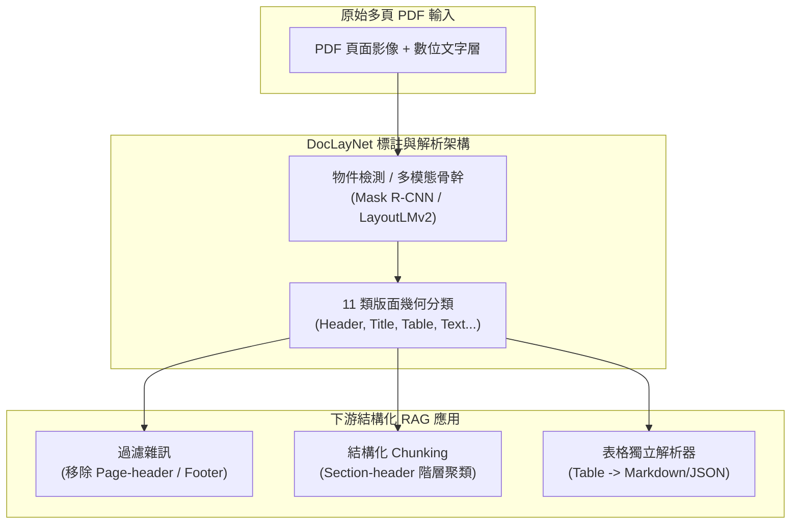

# DocLayNet: A Large Human-Annotated Dataset for Document-Layout Analysis

## 一話摘要 (TL;DR)
IBM Research 推出的 **DocLayNet** 是目前規模最大、類別最細緻的專家級人工標註文件版面分析（DLA）基準資料集，涵蓋 80,863 頁 PDF 跨六大異質領域，標註 110 萬個高精度邊界框與 11 類版面元素，為現代 RAG 文件解析器與多模態 Chunking 提供了堅實的版面辨識基準（Mask R-CNN 達 73.7% mAP，LayoutLMv2 達 78.4% mAP）。

---

## 研究背景與問題定義 (Problem Statement)

1. **傳統版面分析資料集的領域偏差與人工合成限制**：
   - 先前主流資料集如 PubLayNet 主要聚焦於 PubMed 生物醫學文獻，DocBank 則基於 LaTeX 原始碼自動生成邊界框；這些資料集風格高度單一、規則過於工整，無法反映真實世界中複雜、多變的商業報告與法律公文。
2. **缺乏多樣化版面結構與細粒度類別**：
   - 真實世界的非結構化文件包含多欄排版、複雜巢狀表格、穿插圖表、頁首頁尾與註腳。若解析器無法精確辨識這些元素，在 RAG 切塊（Chunking）時將導致語義被硬生生切斷，將頁首頁尾誤當內文，引發嚴重的檢索幻覺。
3. **高品質專家標註的稀缺性**：
   - 傳統光學字元辨識（OCR）容易忽略閱讀順序與邏輯層級。建立包含廣泛領域、跨類別、有明確標註規範且具備高標註者間一致性（Inter-Annotator Agreement）的基準至關重要。

---

## 核心方法與技術架構 (Methodology & Architecture)

DocLayNet 針對 6 大文件領域進行嚴密採樣與雙/三重覆核標註：

### 1. 六大異質文件類別與 11 類核心標籤
- **六大領域來源**：
  1. Financial Reports（財務報表、上市公司年報）；
  2. Scientific Articles（多元科學期刊論文）；
  3. Patents（專利說明書與圖紙）；
  4. Government Tenders & Documents（政府招標與合約文件）；
  5. Manuals & Technical Reports（技術規格手冊）；
  6. Legal Acts & Laws（法規判例與法令條文）。
- **11 類核心版面元素（Table 1, Page 4）**：
  - `Caption`（圖表說明文字，共 22,524 筆）；
  - `Footnote`（腳註，共 6,318 筆）；
  - `Formula`（數學公式與編號，共 25,027 筆）；
  - `List-item`（項目清單，共 185,660 筆）；
  - `Page-footer`（頁尾，共 70,878 筆）；
  - `Page-header`（頁首，共 58,022 筆）；
  - `Picture`（插圖與圖片，共 45,976 筆）；
  - `Section-header`（章節標題，共 142,884 筆）；
  - `Table`（表格本體，共 34,733 筆）；
  - `Text`（一般連續內文段落，共 510,377 筆）；
  - `Title`（文件主標題，共 5,071 筆）。
  - **總標註邊界框數**：**1,107,470 個**（分佈於 80,863 頁）。

### 圖中節點對照
- `RAW_PDF`：原始未經結構化的 PDF 頁面影像或數位流。
- `DET`：基於 DocLayNet 訓練之版面辨識模型。
- `CLASS`：輸出包含坐標與類別之 11 類幾何區域。
- `CLEAN` / `STRUCT` / `TABLE_EXT`：利用版面元素進行過濾、章節切割與表格抽取。

---

## 主要實驗結果與證據 (Empirical Results & Evidence)

論文使用 COCO 評測標準的 **mAP@0.5-0.95**（以 0.05 步長計算 10 個 IoU 門檻之平均精度）評估多個經典電腦視覺與多模態模型（第 6–8 頁）：

1. **主流模型版面辨識基準表現（Table 2, Page 6）**：
   - **Mask R-CNN (ResNet-50)**：達到 **73.7%** mAP@0.5-0.95。
   - **Faster R-CNN (ResNet-50)**：達到 **73.6%** mAP@0.5-0.95。
   - **YOLOv5x**：達到 **73.7%** mAP@0.5-0.95。
   - **LayoutLMv2 (Multimodal)**：結合視覺、文字與二維空間嵌入，達到最高 **78.4%** mAP@0.5-0.95。
2. **各類別詳細辨識難度（Table 2, Page 6）**：
   - **高準確度類別**：`Text`（88.1%）、`Table`（86.3%）、`List-item`（86.2%）、`Title`（82.7%）。
   - **低準確度挑戰類別**：`Page-footer`（61.1%）、`Formula`（66.2%）、`Page-header`（67.9%）、`Section-header`（74.6%）。
3. **人類標註一致性（Inter-Annotator Agreement, Table 1, Page 4）**：
   - 針對三重標註（Triple-annotated）頁面計算人類 pairwise mAP，整體協議度落在 **82%–83%** 之間；在 `Page-footer` 上人類協議度高達 93–94%，而在多義性較高的 `Picture` 上為 69–71%。
4. **跨資料集遷移泛化評估（Table 5, Page 8）**：
   - 在 DocLayNet 上訓練的 Mask R-CNN 模型在 PubLayNet 與 ICDAR 表格競賽資料集上的零樣本遷移表現，顯著優於僅在單一領域資料集上訓練的模型，證實了 DocLayNet 豐富的多領域特徵能顯著提升泛化力。

---

## 優勢、限制及 Trade-offs (Strengths, Limitations & Trade-offs)

### 優勢
1. **多樣性與真實感最強**：涵蓋六大產業真實文件，避免了純論文排版的學術偏差。
2. **標註規範嚴謹完備**：區分了 List-item 與常規段落、Caption 與 Picture 的一對一綁定規則。
3. **全公開可存取**：資料集已在 Hugging Face（`ds4sd/DocLayNet`）完全開源，成為工業界 DLA 的黃金標準。

### 限制與 Trade-offs
1. **僅提供邊界框，缺乏閱讀順序（Reading Order）金標**：DocLayNet 本身僅標註空間區域，未顯式標註複雜多欄排版下的跨區塊線性閱讀順序連線。
2. **缺乏表格內部單元格（Table Cells）標註**：將整個表格標註為單一 bounding box，若要進行單元格級別抽取需串接 TableMaster 等次級模型。
3. **語言偏向**：雖然涵蓋跨國文件，但文字內容主要以英語為主，多語言或雙語文件的覆蓋有限。

---

## 對本專案研究領域的實際意義 (Implications for Research Domains)

1. **對 Domain 04（Chunking 策略）的關鍵支撐**：
   - 證明了「盲目以固定 Token 數切塊」是 RAG 的低效做法；利用 DocLayNet 訓練的模型可將文檔解析為語義完整的 Section-header、Paragraph 與 Table，實現「版面感知切塊（Layout-aware Chunking）」。
2. **對 Domain 17（RAG 評測基準）的關鍵支撐**：
   - 作為 RAG 前置解析（Parser / Ingestion）階段不可或缺的 Oracle 評測基準，可用於精確診斷資訊遺失究竟是發生在 PDF 解析層還是後續檢索層。

---

## 原始來源及相關筆記連結 (Sources & Related Notes)

- **本地 PDF**：`[[Papers/06 - Benchmarks & Evaluation/(KDD 2022-08) DocLayNet - A Large Human-Annotated Dataset for Document-Layout Analysis.pdf|開啟本地 PDF 檔案]]`
- **官方開源庫**：[Hugging Face ds4sd/DocLayNet](https://huggingface.co/datasets/ds4sd/DocLayNet) · [GitHub ds4sd/DocLayNet](https://github.com/DS4SD/DocLayNet)
- **關聯領域筆記**：
  - [[02 - 研究領域專題 (Research Domains)/Canonical RAG Domains/Domain 13 - RAG Evaluation & Failure Attribution|D13 RAG Evaluation & Failure Attribution]]
  - [[02 - 研究領域專題 (Research Domains)/Canonical RAG Domains/Domain 02 - Segmentation & Contextualization|D02 Segmentation & Contextualization]]
- **同類/相關論文筆記**：
  - [[03 - 論文庫 (Literature Notes)/06 - Benchmarks & Evaluation/(EACL 2026-03) T2-RAGBench - Benchmarking Text-and-Table Retrieval Augmented Generation|(EACL 2026-03) T2-RAGBench]]
  - [[03 - 論文庫 (Literature Notes)/04 - Knowledge & Graph RAG/(EMNLP 2024-11) Dense X - Exploring the Limit of Proposition Retrieval for Open-Domain QA|(EMNLP 2024-11) Dense X]]
