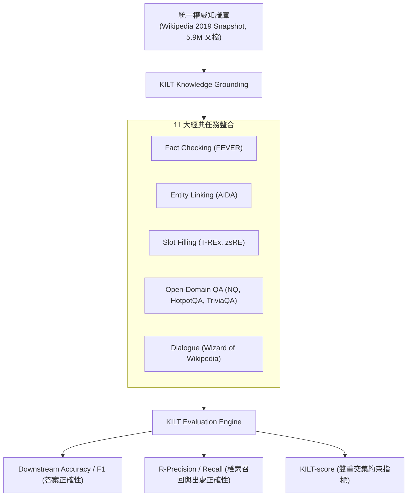

# KILT: a Benchmark for Knowledge Intensive Language Tasks

## 1. 一話摘要 (TL;DR)
KILT 是知識密集型 NLP 與 RAG 領域的里程碑式評測基準，首次將 5 大核心任務共 11 個經典資料集統一映射到單一固定維基百科快照（5.9M 頁面），並提出嚴格綁定檢索出處與生成正確性的「KILT-score」雙重指標。

---

## 2. 研究背景與問題定義 (Problem Statement)

### 2.1 歷史評測的破碎與不可比性
在 KILT 出現之前，學界在評估知識密集型任務時面臨嚴重碎片化：
1. **外部知識源不一致**：不同論文使用不同年份的維基百科 Dump、Freebase 或專有語料庫，導致不同檢索器之間的比較缺乏公平基準；
2. **只看答案不問出處**：傳統 QA 評測僅比對最終答案字串（Exact Match），忽視了模型究竟是依據正確文檔推理，還是憑藉參數化偶然猜中或生成虛假出處；
3. **任務割裂**：事實查核（Fact Checking）、槽位填充（Slot Filling）、開放問答（Open-Domain QA）與對話（Dialogue）被作為獨立孤島分開研究。

---

## 3. 核心方法與技術架構 (Methodology & Architecture)

### 3.1 統一知識庫與 11 大任務映射
KILT 構建了一個統一的生態系統（Section 2, Page 2 & Table 1）：
- **統一知識來源**：以 2019/08/01 的 Wikipedia 快照為唯一權威知識庫，共包含 5,903,530 篇預處理結構化文檔；
- **涵蓋 5 大任務類別的 11 個核心資料集**：
  1. *Fact Checking*：FEVER
  2. *Entity Linking*：AIDA CoNLL-YAGO, WNED-WIKI, WNED-CWEB
  3. *Slot Filling*：T-REx, Zero-Shot RE
  4. *Open-Domain QA*：Natural Questions (NQ), HotpotQA, TriviaQA, ELI5
  5. *Dialogue*：Wizard of Wikipedia (WoW)

### 3.2 評估協議與 KILT-score 核心定義
KILT 提出了劃時代的評估公式：
$$\text{KILT-score} = \text{Downstream Metric} \times \text{Provenance Match}$$
- 也就是說，**模型只有在「產出正確答案」且「精確引用了標註出處（Gold Provenance Page）」時才能獲得分數**。
- 如果模型猜中了答案但檢索結果不包含正確頁面，或者檢索對了但答案錯誤，KILT-score 均計為 0。

---

## 4. 主要實驗結果與證據 (Empirical Results & Evidence)

論文評估了 BM25、DPR、REALM、RAG、BART 等多種基礎模型架構（Table 2, Page 6）：
- **參數模型猜答案現象被揭露**：純閉卷生成模型（BART-large 零檢索）在 TriviaQA 上能獲得 26.5% 的答案準確率，但在 KILT-score 上直接歸零（0.0），凸顯出傳統指標的虛假繁榮；
- **檢索增強模型的基準分數 (Table 2, Page 6)**：
  - **RAG-Token (Lewis et al.)**：在 FEVER 上獲得 54.4% KILT-score；在 NQ 上獲得 32.7% KILT-score；在 HotpotQA 上獲得 13.9% KILT-score；
  - **DPR + BART**：在實體槽位填充 T-REx 上獲得 52.8% KILT-score，驗證了顯式檢索出處在結構化知識抽取中的關鍵作用。

---

## 5. 優勢、限制及 Trade-offs (Strengths, Limitations & Trade-offs)

### 優勢
1. **建立出處檢驗黃金標準**：徹底終結了「不問檢索來源只測字面匹配」的評測偏誤；
2. **多任務跨領域泛化評估**：一套檢索系統可同時在 QA、事實查證與對話任務上進行跨領域 Stress-test。

### 限制與 Trade-offs
1. **出處標註單一**：多數任務的 Gold Provenance 僅標註到頁面（Page-level）而非段落或句子級別（Sentence-level）；
2. **知識庫版本固定**：2019 快照無法評測 2020 年後的最新時效性問題（Temporal RAG）。

---

## 6. 對本專案研究領域的實際意義 (Implications for Research Domains)
- **支撐 Domain 17（評測協議）**：KILT-score 是現代 RAG 評測中「雙重約束（Groundedness + Accuracy）」的鼻祖，直接啟發了 ALCE、Ragas 與 RAGTruth 的設計思維。
- **統一檢索底座**：為本專案在對比不同檢索算法時提供了公認的跨任務基準參照。

---

## 7. 原始來源及相關筆記連結 (Sources & Related Notes)
- **開啟本地 PDF**：[[Papers/06 - Benchmarks & Evaluation/(NAACL 2021-06) KILT - A Benchmark for Knowledge Intensive Language Tasks.pdf|開啟原始論文 PDF]]
- **關聯文獻**：
  - [[03 - 論文庫 (Literature Notes)/03 - RAG & Retrieval/(NeurIPS 2020-12) Retrieval-Augmented Generation for Knowledge-Intensive NLP Tasks|(NeurIPS 2020-12) RAG (Lewis et al.)]]
  - [[03 - 論文庫 (Literature Notes)/03 - RAG & Retrieval/(EMNLP 2020-11) Dense Passage Retrieval for Open-Domain Question Answering|(EMNLP 2020-11) DPR]]
  - [[03 - 論文庫 (Literature Notes)/06 - Benchmarks & Evaluation/(EMNLP 2023-12) Enabling Large Language Models to Generate Text with Citations|(EMNLP 2023-12) ALCE]]
