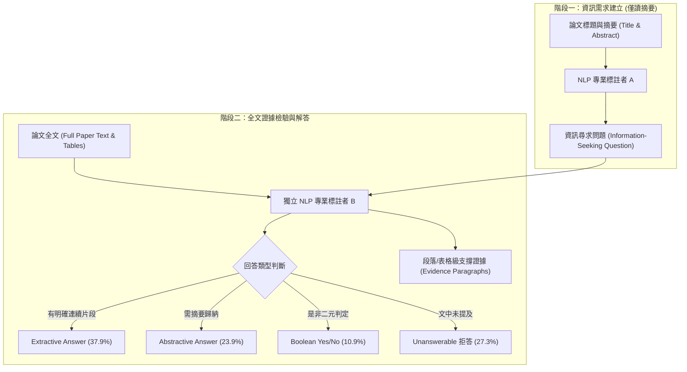

# A Dataset of Information-Seeking Questions and Answers Anchored in Research Papers (QASPER)

## 一話摘要 (TL;DR)
AI2（艾倫人工智慧研究所）與華盛頓大學推出的 **QASPER** 是學術科學文獻資訊尋求（Information-Seeking）問答的代表性基準，包含 1,585 篇 NLP 完整論文與 5,049 組由僅讀摘要的研究者所提的真實問題，並附帶段落與表格級證據標註；最強長文本模型（LED）的 Answer-F1 僅 24.95%，距離人類表現（60.92%）落後近 36 個百分點，揭示了跨章節多步證據定位與拒答校準的巨大挑戰。

---

## 研究背景與問題定義 (Problem Statement)

1. **現有問答資料集的人工預設偏差（Prior Knowledge / Artificial Questions）**：
   - 傳統閱讀理解基準（如 SQuAD）的標註者是在「已閱讀全文」後出題，出題者傾向尋找與文本高度字面重疊的句子，導致資料集退化為簡單的字面匹配；
2. **科學文獻閱讀的真實資訊尋求場景（Information-Seeking Scenario）**：
   - 真實研究者查閱論文時，通常僅瀏覽標題與摘要（Title & Abstract），接著產生針對方法細節、評測指標、資料集劃分或實驗基準的具體疑問（例如「這篇論文使用幾折交叉驗證？」、「與 baseline 相比提升多少？」）；
3. **全文長度與證據分散挑戰**：
   - 論文全文平均長達數千至上萬字，答案通常分散在實驗段落、附錄或複雜的數值表格中，甚至有高達四分之一的問題在論文中完全未提及（需要系統具備明確的拒答 Abstention 能力）。

---

## 核心方法與技術架構 (Methodology & Architecture)

QASPER 採取雙盲資訊不對稱的標註流程，精確模擬學術研究者的閱讀心智模型：

### 1. 雙階段標註協議 (Information-Asymmetric Protocol)
- **階段一：出題者（Question Writers）**：
  - 僅提供 NLP 論文的 Title 與 Abstract；
  - 標註者扮演對該研究感興趣的領域從業者，寫出在閱讀內文前最想獲得解答的具體問題。
- **階段二：答題者與證據標註者（Answerers & Evidence Annotators）**：
  - 由另一組獨立的 NLP 專業研究者閱讀**整篇論文全文**；
  - 提供答案文字，並在文檔中標出一個或多個具體支撐段落或表格（Evidence Spans/Paragraphs）；
  - 若論文未包含足夠資訊，明確標註為「不可回答（Unanswerable）」。

### 圖中節點對照
- `ABS`：論文摘要與元數據，出題者的唯一可見內容。
- `Q_WRITER`：提問標註者，產出真實資訊尋求問題。
- `FULL`：完整全文解析內容，包含正文與表格。
- `A_WRITER`：解答標註者，提供答案與對應證據段落。

---

## 主要實驗結果與證據 (Empirical Results & Evidence)

論文在 QASPER 測試集上評估了長文本 Transformer 模型（Longformer Encoder-Decoder, LED）與人類表現（第 6–8 頁）：

1. **端到端問答表現（Table 2, Page 7）**：
   - **LED-base (Row 5)**：Answer-F1 為 **24.95%**；
     - 抽取式問題（Extractive）：32.74%；
     - 生成式問題（Abstractive）：17.58%；
     - 是非題（Boolean）：75.31%；
     - 拒答不可回答（Unanswerable）：44.96%；
   - **人類下界基準（Human Lower-Bound）**：
     - Overall Answer-F1 達到 **60.92%**（各項分別為 Extractive 58.92%, Abstractive 39.71%, Boolean 78.98%, Unanswerable 69.44%）；
     - **模型落後人類下界超過 35.9 個 F1 百分點**。
2. **證據定位表現（Table 3, Page 7）**：
   - **LED-base** 的 Evidence-F1 僅 **23.94%**；
   - **LED-large** 的 Evidence-F1 提升至 **31.25%**；
   - **人類下界（Human Lower-Bound）** 的 Evidence-F1 高達 **71.62%**；
   - 顯示即使模型能猜中部分答案，其定位支撐證據段落的精確度極為匱乏（相差逾 40 個百分點）。
3. **錯誤歸因分析（Table 5, Page 9）**：
   - 針對 55 個低 F1 樣例進行人工歸因：
     - **40%** 屬於「證據檢索失敗（Evidence Retrieval Failure）」；
     - **22%** 屬於「表格與數值理解失敗（Table / Numerical Reasoning Failure）」；
     - **18%** 屬於「過度推論或拒答誤判（Over-inference / Abstention Calibration）」；
     - **13%** 屬於「跨章節多步資訊合成失敗（Cross-section Synthesis）」。

---

## 優勢、限制及 Trade-offs (Strengths, Limitations & Trade-offs)

### 優勢
1. **模擬真實資訊尋求**：出題協議杜絕了 SQuAD 式的字面匹配作弊，是長文本科學問答最真實的基準。
2. **金標附帶段落級 Evidence**：既可作為端到端 QA 評測，亦可單獨作為全文段落檢索（Evidence Retrieval）與可解釋性評估基準。
3. **內建高比例不可回答題（27.3%）**：自然評測模型在證據缺失時的拒答（Abstention）能力。

### 限制與 Trade-offs
1. **領域專門性（Domain Narrowness）**：僅涵蓋 NLP 與計算語言學論文，無法直接代表生物醫療、化學或金融合約的版面風格。
2. **純文字解析限制**：原始資料集將表格線性化為文字，對表格拓撲與幾何對齊關係存在部分資訊遺失。

---

## 對本專案研究領域的實際意義 (Implications for Research Domains)

1. **對 Domain 08（長篇生成與報告撰寫）的啟示**：
   - 在構建科學論文問答助手（如 OpenScholar / PaperQA）時，QASPER 是評估模型能否從萬字論文中精準摘取實驗數值與結論的核心基準。
2. **對 Domain 14（證據充分性與拒答）的啟示**：
   - QASPER 中 27.3% 的 Unanswerable 題型是測試 RAG 系統「知道自己不知道」的天然黃金資料。

---

## 原始來源及相關筆記連結 (Sources & Related Notes)

- **本地 PDF**：`[[Papers/06 - Benchmarks & Evaluation/(NAACL 2021-06) QASPER - A Dataset of Information-Seeking Questions and Answers Anchored in Research Papers.pdf|開啟本地 PDF 檔案]]`
- **官方開源庫**：[AI2 QASPER](https://allenai.org/data/qasper) · [Hugging Face QASPER](https://huggingface.co/datasets/allenai/qasper) · [ACL Anthology](https://aclanthology.org/2021.naacl-main.365/)
- **關聯領域筆記**：
  - [[02 - 研究領域專題 (Research Domains)/Domain 17 - RAG Benchmarks & Evaluation Protocols|Domain 17 - RAG Benchmarks & Evaluation Protocols]]
  - [[02 - 研究領域專題 (Research Domains)/Domain 08 - 長篇生成與報告撰寫 (STORM, Evidence Store, Ledger)|Domain 08 - 長篇生成與報告撰寫 (STORM, Evidence Store, Ledger)]]
  - [[02 - 研究領域專題 (Research Domains)/Domain 14 - Evidence Sufficiency & Adaptive Retrieval|Domain 14 - Evidence Sufficiency & Adaptive Retrieval]]
- **同類/相關論文筆記**：
  - [[03 - 論文庫 (Literature Notes)/05 - Memory & Agents/(arXiv 2024-11) OpenScholar - Synthesizing Scientific Literature with Retrieval-Augmented Language Models|(arXiv 2024-11) OpenScholar]]
  - [[03 - 論文庫 (Literature Notes)/06 - Benchmarks & Evaluation/(CMC 2026-08) Do LLMs Know When Evidence is Insufficient - An Evidence Sufficiency Benchmark|(CMC 2026-08) Do LLMs Know When Evidence is Insufficient]]
