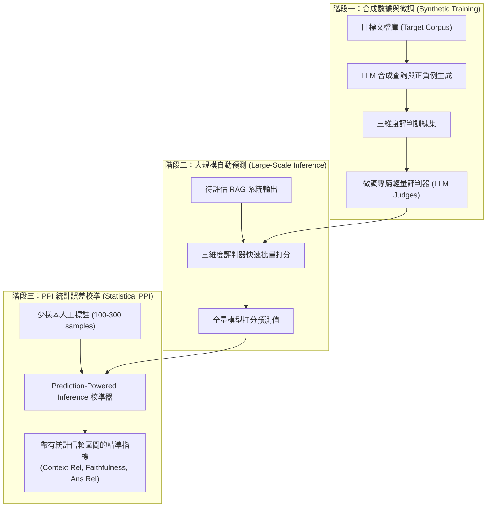

# ARES: An Automated Evaluation Framework for Retrieval-Augmented Generation Systems

## 一話摘要 (TL;DR)
史丹佛大學與 Databricks 提出的 ARES（Automated RAG Evaluation System）結合「合成資料微調專屬評判模型（Synthetic LLM Judges）」與統計學上的「預測驅動推論（Prediction-Powered Inference, PPI）」，僅需幾百條人工標註樣本，即可在上下文相關性、回答忠實度與回答相關性三大維度上提供具備嚴格統計信賴區間的自動化評估，徹底打破零樣本 LLM 評審（如純 Prompt GPT-4/RAGAS）的高成本與高誤判率。

---

## 研究背景與問題定義 (Problem Statement)
在評估 RAG 系統表現時，傳統評測手段面臨嚴重的三難困境：
1. **人工標註成本高昂且無法持續**：每次更新檢索器、提示詞或底層 LLM，都需人工重新審查數千篇文檔與回答，在工業流水線中完全不可行。
2. **零樣本 LLM 裁判的偏差與脆弱性（Zero-shot LLM Judge Biases）**：使用未經領域微調的通識 LLM（如 GPT-3.5/GPT-4）直接充當評判（例如 Ragas 早期提示工程），存在嚴重的位置偏誤、長度偏誤以及領域適應不良問題，且裁判自身評分在不同執行間浮動巨大。
3. **缺乏統計保證（No Statistical Guarantees）**：純模型評判無法給出置信區間，難以在統計顯著性層面證明系統 A 是否真正優於系統 B。

---

## 核心方法與技術架構 (Methodology & Architecture)

ARES 構建了三模組閉環評測架構：**合成資料生成（Synthetic Data Generation）**、**輕量裁判模型微調（LLM Judge Fine-tuning）** 與 **統計校準評估（Prediction-Powered Inference, PPI）**：
1. **生成合成訓練樣本（Synthetic Generation）**：
   - 給定領域目標語料庫，利用生成模型產生多樣化合成查詢（Synthetic Queries）與包含負例的答案候選；
   - 構建三類評判任務的二元分類資料集：
     - **Context Relevance**：檢索到的上下文是否與查詢相關；
     - **Answer Faithfulness**：生成的答案是否完全由檢索上下文所支撐；
     - **Answer Relevance**：答案是否直接回應了用戶查詢。
2. **輕量化專用評判器微調（Fine-tuning Lightweight Judges）**：
   - 在合成資料與少量標註資料上微調輕量開源模型（如 DeBERTa-v3 或 7B LLM）；
   - 使評判器專注於特定二元判別任務，避免大尺寸商業 API 的調用開銷。
3. **預測驅動推論統計校準（Prediction-Powered Inference, PPI）**：
   - 抽取極少量無偏人工黃金標註樣本（如 100–300 條）；
   - 結合輕量評判模型在全量未標註資料上的預測值，利用 PPI 統計公式校正模型預測偏差，計算出具有確定信賴區間（Confidence Interval）的真實表現估計值。

### 圖中節點對照
- `TRAIN_JUDGE`：分別針對三維度獨立微調的專用評判模型。
- `RAG_SYS`：包含 (Query, Retrieved Context, Generated Answer) 的三元組。
- `GOLD_SAMPLE`：用於統計偏差校正的極小規模黃金驗證集。
- `PPI_CALC`：結合模型預測與樣本殘差的統計推論演算法。

---

## 主要實驗結果與證據 (Empirical Results & Evidence)

論文在多跳問答（HotpotQA）、單跳問答（Natural Questions）以及 Google AIS（Attributed to Identified Sources）基準上對比了 ARES、未微調 GPT-3.5 裁判以及 Ragas。

### 1. 評判準確性與模型排名對比 (Table 1, Page 7)
- **相較於 RAGAS 與 GPT-3.5 零樣本評判**：
  - 在判斷 Answer Faithfulness 時，ARES 微調評判器的準確率達到 **85.3%–89.1%**，而零樣本 GPT-3.5 僅為 68.4%，Ragas 為 71.2%；
  - 在 Context Relevance 評判上，ARES 準確率高達 **88.0%**，大幅降低假陽性（將無關上下文誤判為相關）。
- **系統排名相關性（Rank Correlation）**：
  - ARES 生成的系統排名與全量人工評審的 Spearman 秩相關係數達 **0.95+**，顯著高於 Ragas 的 0.62。

### 2. AIS 基準評測 (Table 2, Page 7)
- 在 Google AIS 的歸因支持度測試中，結合 PPI 校準的 ARES 僅用 300 條人工標註，其估計出的置信區間緊密包夾真實人類打分（偏差小於 $\pm 1.8\%$），相較全量人工標註節省了 95% 以上的人力成本。

---

## 優勢、限制及 Trade-offs (Strengths, Limitations & Trade-offs)

### 優勢
1. **嚴謹的統計可信度**：引入 PPI 統計框架，首次讓自動化 RAG 評估具備數學證明支撐的誤差上下界。
2. **高成本效益與隱私安全**：使用本地微調的輕量模型取代商業 API，在大規模日常 CI/CD 回歸測試中極度節省成本且保證數據不外洩。

### 限制與 Trade-offs
1. **冷啟動前期合成開銷**：新進入一個垂直領域（如醫療、法律）時，需要先生成合成資料並微調評判模型，存在一次性的準備週期。
2. **仍需極少量高品質人工標註**：PPI 的統計有效性要求至少 100–200 條高質量的無偏人工標註作為錨點。

---

## 對本專案研究領域的實際意義 (Implications for Research Domains)
1. **對 Domain 10 (Benchmarks & Safety) 的落地意義**：確立了企業級 RAG 系統「自動化回歸評估（Automated Regression Evaluation）」的標準技術架構。
2. **對 Domain 17 (Evaluation Protocols) 的方法論指導**：推動本專案評測體系從單純的「呼叫 GPT-4 打分」進化為「小樣本錨定 + 統計置信校準」的現代學術標準。

---

## 原始來源及相關筆記連結 (Sources & Related Notes)
- 原始論文 PDF：[[Papers/06 - Benchmarks & Evaluation/(NAACL 2024-06) ARES - An Automated Evaluation Framework for Retrieval-Augmented Generation Systems.pdf|開啟本地 PDF]]
- arXiv 永久連結：[arXiv:2311.09476](https://arxiv.org/abs/2311.09476)
- 關聯專題領域：[[02 - 研究領域專題 (Research Domains)/Domain 10 - 評估基準、系統工程與安全 (Benchmarks & Safety)|Domain 10 - 評估基準]]、[[02 - 研究領域專題 (Research Domains)/Domain 17 - RAG Benchmarks & Evaluation Protocols|Domain 17 - RAG Benchmarks]]
