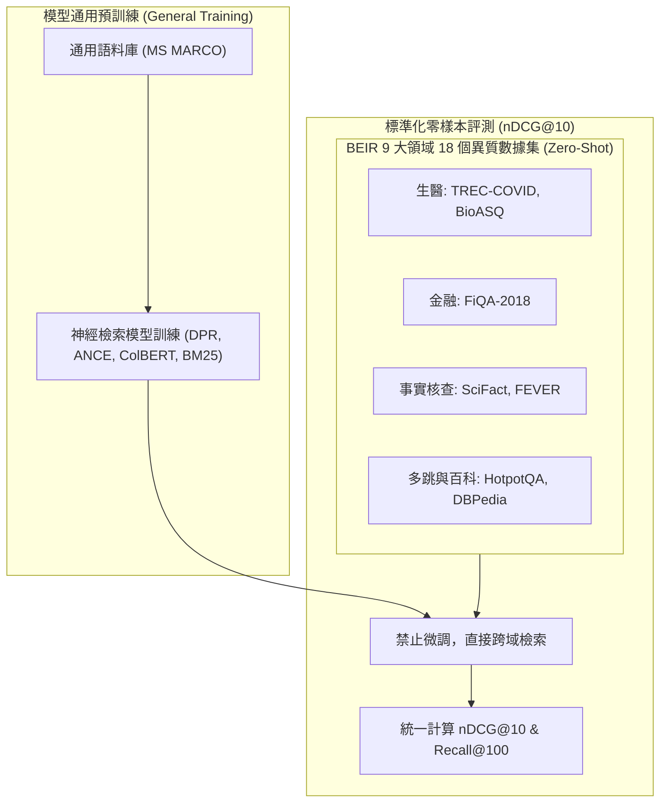

# BEIR: A Heterogeneous Benchmark for Zero-shot Evaluation of Information Retrieval Models

## 一話摘要 (TL;DR)
BEIR 是神經檢索領域最權威的異質零樣本評測基準（Zero-Shot Retrieval Benchmark），橫跨生醫、金融、法律、推特與問答等 9 大領域的 **18 個多樣化檢索資料集**，實證揭示在 MS MARCO 上表現優異的稠密檢索器（Dense Retrievers，如 DPR）在未經微調的分佈外領域（OOD）出現斷崖式性能下跌，而傳統 BM25 配合重排器（BM25 + Cross-Encoder）與後期交互（ColBERT）則展現出極強的零樣本泛化優勢。

---

## 研究背景與問題定義 (Problem Statement)
在神經檢索模型（Dense Retrieval）蓬勃發展初期，檢索領域面臨嚴重的評測同質化弊病：
1. **MS MARCO 單一資料集的嚴重過擬合**：幾乎所有神經檢索器均在 MS MARCO 搜尋查詢集上進行訓練與評測，形成了「學術指標高、真實落地差」的虛假繁榮。
2. **分佈外（OOD）泛化能力未知**：真實世界場景充斥著專有術語、罕見實體與長篇文檔（如醫學文獻 PubMed、金融報表 FiQA、事實核查 SciFact），稠密嵌入模型缺乏未見領域的零樣本檢驗標準。
3. **稀疏與稠密模型的公平對比缺失**：缺乏在統一 API、標準化文檔切塊與一致指標（nDCG@10）下的跨架構基準。

---

## 核心方法與技術架構 (Methodology & Architecture)

BEIR 構建了**標準化異質資料湖（Heterogeneous Benchmark Suite）** 與 **嚴格零樣本評估協議（Zero-Shot Protocol）**：
1. **九大領域 18 個異質資料集矩陣（Table 1, Page 4）**：
   - **生醫（Bio-Medical）**：TREC-COVID, BioASQ, NFCorpus；
   - **金融（Finance）**：FiQA-2018；
   - **學術事實核查（Fact-Checking）**：SciFact, FEVER, Climate-FEVER；
   - **問答與論證（QA & Argument）**：HotpotQA, Quora, ArguAna, Touché-2020, DBPedia 等；
   - 包含多種查詢模式（關鍵字查詢、自然語言問句、實體實例、事實論述）。
2. **標準化評測協議（Standardized Zero-Shot Protocol）**：
   - 嚴格禁止模型在 BEIR 包含的 18 個目標評測集上進行任何形式的監督微調；
   - 所有模型僅允許在通用語料（如 MS MARCO）上預訓練，直接在未見領域上執行檢索評分；
   - 統一以 **nDCG@10** 為主要指標，兼顧 Recall@100 與延遲/吞吐量分析。

### 圖中節點對照
- `MS`：模型唯一允許進行前置監督訓練的基礎語料。
- `beir`：涵蓋不同語義結構、專門詞彙與文檔長度的獨立靶場。
- `ZERO_SHOT`：禁止 Target Domain Fine-tuning 的剛性零樣本協議。

---

## 主要實驗結果與證據 (Empirical Results & Evidence)

論文橫向評測了稀疏檢索（BM25, SPARTA）、單塔稠密檢索（DPR, ANCE, TAS-B）、後期交互（ColBERT）以及重排序（BM25 + Cross-Encoder）（Table 2, Page 6）。

### 1. 稠密模型的分佈外崩塌 (Table 2, Page 6)
- **DPR 的跨域失靈**：在 MS MARCO 上表現優異的雙塔 DPR，在未見領域遭遇斷崖式下跌：
  - 在 **TREC-COVID** 上，BM25 取得 **0.616**，而 DPR 僅取得 **0.332**（落後近 50%）；
  - 在 **FiQA-2018（金融）** 上，BM25 達 **0.239**，DPR 僅為 **0.112**。
  - **核心原因**：雙塔向量檢索高度依賴關鍵詞嵌入分佈，面對領域專有詞（如醫學藥物名稱、金融代碼）時出現語義失真。

### 2. 最強泛化架構 (Table 2, Page 6)
- **BM25 + Cross-Encoder (CE)**：取得近乎全場最高的分佈外泛化分（TREC-COVID 達 **0.667**，FiQA 達 **0.326**）；
- **ColBERT 後期交互（Late Interaction）**：在不進行重度全交叉的情況下，取得 **TREC-COVID 0.677** 與 **FiQA 0.317**，兼具極高的泛化能力與十毫秒級檢索延遲。

---

## 優勢、限制及 Trade-offs (Strengths, Limitations & Trade-offs)

### 優勢
1. **確立現代資訊檢索的黃金標準**：徹底終結了單一資料集自嗨評測，成為此後所有檢索模型（Contriever, BGE, E5）必測的法定基準。
2. **正本清源的工程啟示**：證明了「BM25 絕非過時玩具」，在缺乏特定領域標註時，BM25 仍是極其強韌的第一道防線。

### 限制與 Trade-offs
1. **主要衡量檢索而非生成**：BEIR 專注於第一階段檢索（Passage Retrieval），並未直接評估後續生成器 LLM 的端到端回答品質。
2. **硬體開銷較大**：完整運行 18 個數據集的零樣本推論與索引建立需要數百 GB 存儲與大量 GPU 計算資源。

---

## 對本專案研究領域的實際意義 (Implications for Research Domains)
1. **對 D05 (Query Understanding & Retrieval) 的架構指引**：實證支持了工業級 RAG 必須採用 **Hybrid Search（BM25 + Dense） + Reranker**，不可單押純雙塔 Dense 向量。
2. **對 D13 (RAG Evaluation & Failure Attribution) 的基礎地位**：BEIR 是本專案評估檢索器召回能力的底座，為檢驗任何切塊策略或嵌入模型提供了終極審判場。

---

## 原始來源及相關筆記連結 (Sources & Related Notes)
- 原始論文 PDF：[[Papers/06 - Benchmarks & Evaluation/(NeurIPS 2021-12) BEIR - A Heterogeneous Benchmark for Zero-shot Evaluation of Information Retrieval Models.pdf|開啟本地 PDF]]
- arXiv 永久連結：[arXiv:2104.08663](https://arxiv.org/abs/2104.08663)
- 關聯專題領域：[[02 - 研究領域專題 (Research Domains)/Domain 05 - Query Understanding & Retrieval|D05 Query Understanding & Retrieval]]、[[02 - 研究領域專題 (Research Domains)/Domain 13 - RAG Evaluation & Failure Attribution|D13 RAG Evaluation & Failure Attribution]]
