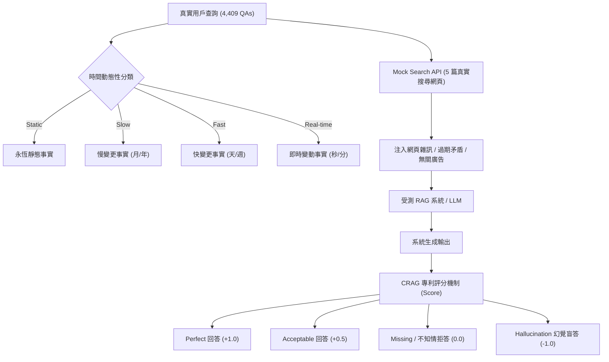

# CRAG -- Comprehensive RAG Benchmark

## 1. 一話摘要 (TL;DR)
CRAG（Comprehensive RAG Benchmark，NeurIPS 2024 / KDD Cup 2024）是針對真實網路搜尋情境設計的綜合性 RAG 評測基準，涵蓋 5 大領域、8 種問答類型與 4 種時間動態性（靜態至即時），並首創「獎勵正確、重罰幻覺、允許拒答」的客觀評分協議。

---

## 2. 研究背景與問題定義 (Problem Statement)

### 2.1 現有 RAG 評測與真實世界的脫節
現有大多數 RAG 評測基準（如 HotpotQA、NQ、TriviaQA）存在顯著侷限：
1. **靜態快照假設**：假設底層事實永恆不變，缺乏隨時間迅速變遷的事實（如最新股價、賽事比分、現任職務）；
2. **缺乏網路搜尋雜訊**：通常只提供完美裁切的黃金段落，忽略了真實搜尋引擎中普遍存在的廣告干擾、過期舊聞與內容衝突；
3. **幻覺代價不對稱**：傳統準確率指標忽視了在金融、醫療等關鍵領域中，「給出錯誤答案（幻覺）」的危害遠高於「主動坦承不知道（拒答 Abstention）」。

### 2.2 CRAG 的定位（特別注意去重與消歧義）
> [!IMPORTANT]
> **必須與「Corrective Retrieval Augmented Generation (Yan et al., 2024)」嚴格區分**：後者是一種引入檢索評估器與網頁搜尋 Fallback 的 RAG **方法**（Method）；而本論文是 Meta 主導建立的 **Comprehensive RAG Benchmark 評測基準**（Benchmark Paper）。

---

## 3. 核心方法與技術架構 (Methodology & Architecture)

### 3.1 基準設計與維度覆蓋
CRAG 包含 4,409 組高質量問答配對，並提供模擬真實網路搜尋環境的 Mock Search API（每次檢索回傳 5 篇網頁，包含標題、摘要與完整 HTML/Text）（Section 3, Page 3 & Table 1）：
1. **5 大領域覆蓋**：Movie、Music、Sports、Finance、Open domain；
2. **8 種問答類型**：Simple factoid、Comparison、Aggregation、Multi-hop、Post-processing、False-premise（前提錯誤判定）、Set（集合問答）等；
3. **4 種時間動態性 (Temporal Dynamism)**：
   - *Real-time*：秒級/分鐘級變化（如實時股價、正在進行的球賽）；
   - *Fast-changing*：天級/週級變化（如電影最新票房、單曲排行榜）；
   - *Slow-changing*：月級/年級變化（如公司 CEO、球員所屬球隊）；
   - *Static*：永恆不變事實（如歷史事件日期、導演姓名）。

### 3.2 評估指標：重罰幻覺的淨得分 (CRAG Score)
CRAG 制定了嚴格的答案評審機制（Page 5–6）：
- 將回答判定為四種狀態：$\text{Perfect}$（完全正確）、$\text{Acceptable}$（基本正確但有小瑕疵）、$\text{Missing}$（主動拒答或未提及）、$\text{Incorrect}$（包含幻覺或事實錯誤）。
$$\text{Score} = \frac{N_{\text{Perfect}} + 0.5 \times N_{\text{Acceptable}} - N_{\text{Incorrect}}}{N_{\text{Total}}}$$
- **拒答得分為 0，而捏造事實得分為 -1**：這極大促使 RAG 系統必須具備校準能力（Calibration），在證據不足時選擇安全拒答而非胡說八道。

---

## 4. 主要實驗結果與證據 (Empirical Results & Evidence)

論文對主流前沿模型（GPT-4、Command R+、Llama-3-70B、Mixtral 等）在 RAG 與非 RAG 設定下進行了基準評估（Table 2 & Table 3, Page 7–8）：
- **RAG 的實質提升與天花板**：
  - 在完全無檢索（No-RAG）設定下，GPT-4 的 CRAG Score 僅為 **15.6%**（存在大量過期幻覺）；
  - 接入標準 RAG 檢索後，GPT-4 的 CRAG Score 升至 **34.2%**（大幅增長 +18.6%）；
- **時效性維度的劇烈失效 (Section 4.2, Page 8)**：
  - 在 *Real-time* 與 *Fast-changing* 查詢上，所有受測模型的幻覺率均超過 **45%**，即使給予了搜尋網頁，模型依然傾向於依賴過期的預訓練參數記憶或誤信舊新聞；
- **拒答能力低下**：受測開源模型的拒答率普遍低於 5%，在搜尋結果不包含答案時盲目生成，導致大量負分。

---

## 5. 優勢、限制及 Trade-offs (Strengths, Limitations & Trade-offs)

### 優勢
1. **高度貼合工業搜索實情**：Mock API 完美重現了工程落地時面臨的 HTML 噪音、反爬片段與時間衝突；
2. **客觀重罰幻覺**：引導學界將研究重點從單純刷準確率轉向「抗噪音與自知之明（Abstention Calibration）」。

### 限制與 Trade-offs
1. **評估依賴 LLM-as-a-Judge**：評估多樣化開放答案時使用 GPT-4 裁判，存在潛在的評審模型偏置；
2. **領域主要集中於大眾消費領域**：如娛樂與體育，深度專業領域（如生物醫學、法律專用條例）覆蓋較少。

---

## 6. 對本專案研究領域的實際意義 (Implications for Research Domains)
- **直接支撐 Domain 15（時效衝突）與 Domain 17（評測協議）**：CRAG 提供了多時間維度動態查詢的黃金標準，驗證了動態衝突消解機制的急迫性。
- **與 Corrective RAG 概念對稱**：在知識庫中補齊了 Meta CRAG 評測基準，徹底消除了命名縮寫混淆的隱患。

---

## 7. 原始來源及相關筆記連結 (Sources & Related Notes)
- **開啟本地 PDF**：[[Papers/06 - Benchmarks & Evaluation/(NeurIPS 2024-12) CRAG - Comprehensive RAG Benchmark.pdf|開啟原始論文 PDF]]
- **關聯筆記**：
  - [[03 - 論文庫 (Literature Notes)/03 - RAG & Retrieval/(arXiv 2024-01) Corrective Retrieval Augmented Generation|(arXiv 2024-01) Corrective RAG (CRAG Method)]]
  - [[03 - 論文庫 (Literature Notes)/06 - Benchmarks & Evaluation/(NAACL 2021-06) KILT - A Benchmark for Knowledge Intensive Language Tasks|(NAACL 2021-06) KILT]]
  - [[03 - 論文庫 (Literature Notes)/06 - Benchmarks & Evaluation/(ACL 2024-08) RAGTruth - A Hallucination Corpus for Developing Trustworthy Retrieval-Augmented Language Models|(ACL 2024-08) RAGTruth]]
