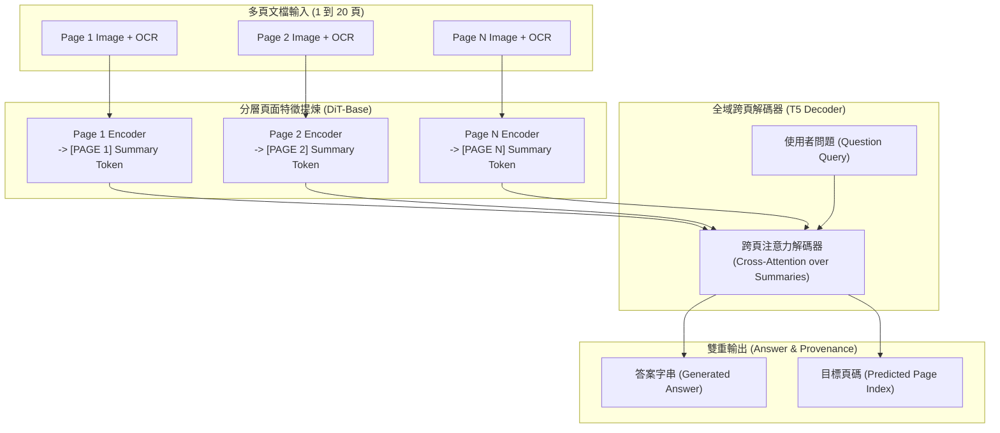

# Hierarchical Multimodal Transformers for Multi-Page DocVQA

## 一話摘要 (TL;DR)
巴塞隆納自治大學電腦視覺中心（CVC）提出的 **MP-DocVQA** 將傳統單頁文件視覺問答推進至長達 20 頁的真實多頁文件情境，並提出分層多模態模型 **Hi-VT5**，透過跨頁面特徵摘要與全域解碼器聯合生成答案並定位目標頁面，在長序列問答上達到 **0.6201 ANLS** 與 **79.23% 頁面定位精度**，顯著超越傳統拼接與單頁最大置信度基線。

---

## 研究背景與問題定義 (Problem Statement)

1. **單頁 DocVQA 的現實脫節**：
   - 先前的主流文件問答基準（如經典 DocVQA）均假設「給定包含答案的單一頁面影像」，直接省略了「從厚重文件中找出正確頁面」的檢索核心環節；但真實世界的公文、商業合約、學術報告幾乎均為數頁至數十頁的多頁結構。
2. **多頁文檔的多模態長序列瓶頸**：
   - 一份 20 頁的高解析度文件包含數千至上萬個文字 Token 以及複雜的空間幾何與視覺排版；現有多模態模型（如 LayoutLMv3 最大長度僅 512，Longformer 僅 4096）無法將多頁視覺特徵與文字一次性塞入顯存進行端到端自注意力運算。
3. **缺乏端到端回答與證據頁面可解釋性**：
   - 系統若僅給出答案字串，缺乏具體的答案頁面溯源（Answer Page Identification），在金融與法律等高敏場景中無法供審計者核實。

---

## 核心方法與技術架構 (Methodology & Architecture)

論文同時貢獻了大規模多頁基準 **MP-DocVQA** 與分層模型架構 **Hi-VT5**：

### 1. MP-DocVQA 資料集建構
- **規模與特徵（Table 1, Page 2）**：
  - 包含 **46,236 個問題**，對應 **48,272 張文件影像**（採樣自 Industry Documents Library）；
  - 每份文檔平均長度為 3–20 頁；
  - 任務要求模型接收「整份多頁文檔」與「問題」，同時輸出「答案文字」與「答案所在頁碼（Answer Page）」。
- **評測指標**：
  - **ANLS (Average Normalized Levenshtein Similarity)**：評估文字生成與金標間的編輯距離匹配度（區間 0.0 到 1.0）；
  - **Answer Page Accuracy (APPA)**：評估預測頁面是否與金標頁面完全一致。

### 2. Hi-VT5 分層架構設計
Hi-VT5（Hierarchical Visual T5）共 316M 參數，由兩層結構組成：
- **頁面級視覺特徵編碼器（Page-level Visual Encoder）**：基於預訓練的 Document Image Transformer（DiT-base, 85M），獨立對每頁圖像與 OCR 文字進行編碼，並引入特殊的 `[PAGE]` Token 提煉該頁面的緊湊全域語意摘要；
- **全域文字解碼器（Document-level T5 Decoder）**：將所有頁面的摘要 Token 與問題拼接（序列長度可支援高達 20,480 Tokens），並在解碼時同時回歸答案文字與目標頁碼標籤。

### 圖中節點對照
- `P1`, `P2`, `PN`：多頁文檔的各頁視覺圖像與文字串流。
- `ENC1`, `ENC2`, `ENCN`：低層頁面獨立編碼器，輸出頁面壓縮摘要。
- `DEC`：高層跨頁注意力解碼器，綜合各頁摘要進行端到端生成。
- `ANS`, `PAGE`：同時產出問答結果與頁面溯源資訊。

---

## 主要實驗結果與證據 (Empirical Results & Evidence)

論文在 MP-DocVQA 上比較了多種設定（Max Confidence, Concat, Oracle）下的強基準（第 6–8 頁）：

1. **多頁設定下基準模型對比（Table 2, Page 6）**：
   - **T5-base (Max Confidence)**：Accuracy **32.68%**，ANLS **0.4028**，Page Acc 46.05%；
   - **LayoutLMv3-base (Max Confidence)**：Accuracy **42.70%**，ANLS **0.5513**，Page Acc 74.02%；
   - **Longformer-base (Max Confidence)**：Accuracy **45.87%**，ANLS **0.5506**，Page Acc 70.37%；
   - **Hi-VT5（本文方法，Table 3, Page 8）**：
     - Accuracy 達到 **48.28%**；
     - ANLS 達到 **0.6201**（相較於 LayoutLMv3 提升近 **7 個百分點**）；
     - 答案頁面定位準確率（Page Acc）達到 **79.23%**；
     - 若提供真實金標頁面（Oracle Setting），Hi-VT5 的 ANLS 更可高達 **0.6572**。
2. **答案頁面位置對表現的影響（Figure 4, Page 7）**：
   - 傳統拼接（Concat）基線模型隨著答案出現在更後面的頁面（第 5 頁之後），其 ANLS 呈現急劇衰退（典型的 Lost in the Middle / Context Degradation 現象）；
   - Hi-VT5 得益於分層摘要機制，在第 1 頁至第 20 頁的各位置均能維持極為平穩的 ANLS 分數，展現出極強的抗位置偏置能力。

---

## 優勢、限制及 Trade-offs (Strengths, Limitations & Trade-offs)

### 優勢
1. **多模態真實性極高**：徹底擺脫單頁玩具任務限制，精準模擬企業公文問答與多頁報表查閱。
2. **階層式設計平衡計算量與長度**：利用頁面級壓縮 Token 將龐大的多頁特徵壓縮至 T5 解碼器可承受的範圍內。
3. **內建溯源（Built-in Page Attribution）**：不需額外訓練分類器即可輸出頁碼，便於審計。

### 限制與 Trade-offs
1. **跨頁實體多跳推理仍顯不足**：當一個問題的答案需要綜合第 2 頁與第 15 頁的數值進行運算時，壓縮摘要會抹除細粒度的單元格數值，導致跨頁數值多跳問題的準確率依然偏低。
2. **依賴 OCR 品質**：若低層 OCR 在複雜表格或模糊掃描件上出錯，高層解碼器難以逆轉錯誤。

---

## 對本專案研究領域的實際意義 (Implications for Research Domains)

1. **對 D04/D05（Hierarchical Representation & Retrieval）的啟示**：
   - Hi-VT5 的「頁面級獨立編碼摘要 $\to$ 跨頁全域解碼」機制，本質上與文字領域的 RAPTOR / 樹狀摘要完全契合，證明了多模態長文件解析必須走階層化路線。
2. **對 D13（RAG Evaluation & Failure Attribution）的啟示**：
   - MP-DocVQA 填補了純文字 RAG 基準（如 HotpotQA, BEIR）與視覺文件之間的空隙，是評測多模態 RAG（Document RAG）的關鍵基準。

---

## 原始來源及相關筆記連結 (Sources & Related Notes)

- **本地 PDF**：`[[Papers/06 - Benchmarks & Evaluation/(PR 2023-12) Hierarchical Multimodal Transformers for Multi-Page DocVQA.pdf|開啟本地 PDF 檔案]]`
- **官方開源庫**：[GitHub rubentito/mp-docvqa](https://github.com/rubentito/mp-docvqa) · [Hugging Face MP-DocVQA](https://huggingface.co/datasets/rubentito/mp-docvqa)
- **關聯領域筆記**：
  - [[02 - 研究領域專題 (Research Domains)/Canonical RAG Domains/Domain 13 - RAG Evaluation & Failure Attribution|D13 RAG Evaluation & Failure Attribution]]
  - [[02 - 研究領域專題 (Research Domains)/Canonical RAG Domains/Domain 04 - Knowledge Representation & Indexing|D04 Knowledge Representation & Indexing]]
  - [[00 - 導覽與心智圖 (Navigation & MOC)/RAG Adjacent Interfaces|A01 Long Context & Sequence Architecture]]
- **同類/相關論文筆記**：
  - [[03 - 論文庫 (Literature Notes)/06 - Benchmarks & Evaluation/(KDD 2022-08) DocLayNet - A Large Human-Annotated Dataset for Document-Layout Analysis|(KDD 2022-08) DocLayNet]]
  - [[03 - 論文庫 (Literature Notes)/06 - Benchmarks & Evaluation/(EACL 2026-03) T2-RAGBench - Benchmarking Text-and-Table Retrieval Augmented Generation|(EACL 2026-03) T2-RAGBench]]
