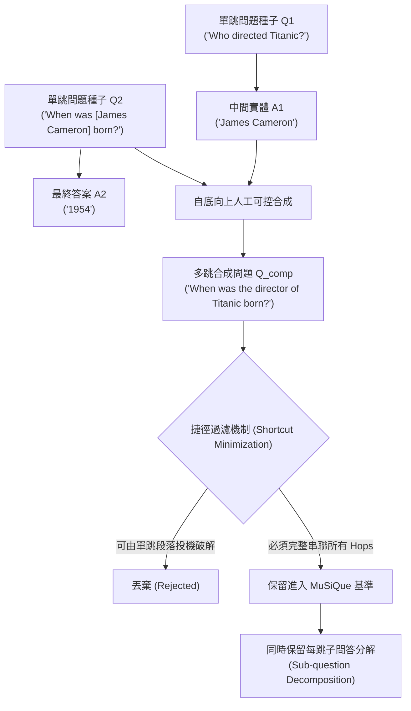

# MuSiQue: Multihop Questions via Single-hop Question Composition

## 1. 一話摘要 (TL;DR)
MuSiQue 揭露了現有多跳問答資料集（如 HotpotQA）中高達 60%+ 的題目可被模型利用「單跳捷徑（Reasoning Shortcuts）」投機破解的致命漏洞，並透過嚴格的單跳問題自底向上可控組合，構建了包含 25,000 題、真正需要 2–4 跳鏈式推理的嚴謹基準。

---

## 2. 研究背景與問題定義 (Problem Statement)

### 2.1 多跳問答的「偽推理」危機
多跳問答（Multi-hop QA）的初衷是評估模型如何將散落在不同段落的線索串聯（例如：$A \to B$ 且 $B \to C$，求 $C$）。然而，作者發現現有主流資料集（HotpotQA、2WikiMultiHopQA）存在嚴重的「推理捷徑」：
1. **單跳可解性 (Single-hop Solvability)**：模型往往無需檢索中間實體 $B$，只需利用預訓練常識或問題中的獨特偏誤詞（Unintended Biases），僅憑最後一跳段落就能直接猜中答案 $C$（在 HotpotQA 中高達 50%–67% 存在此問題）；
2. **表面特徵對齊**：模型學習到的是特定文本模式的表面比對，而非真正的多步邏輯合成；
3. **缺乏子問題拆解評估**：無法驗證模型究竟在第幾跳推理斷裂。

---

## 3. 核心方法與技術架構 (Methodology & Architecture)

### 3.1 自底向上單跳組合 (Bottom-Up Question Composition)
為了徹底封堵推理捷徑，MuSiQue 提出四階段構建管線（Section 3, Page 3–5）：
1. **單跳問答種子生成**：從 Wikipedia 抽取高質量的單跳問答對（Single-hop QAs）；
2. **語義連接驗證**：尋找在實體上存在明確傳遞依賴的單跳對（如 $Q_1 \to A_1$，$Q_2(A_1) \to A_2$）；
3. **自底向上合成多跳問題**：由人工標註員將單跳問題自然合併為流暢的多跳問題（$Q_{1+2}$）；
4. **捷徑過濾與負例篩選 (Shortcut Minimization)**：
   - 移除所有「只給第 2 跳段落就能回答問題」的題目；
   - 引入高度混淆但無關的硬負例段落（Adversarial Distractors），強迫模型必須完整走通 $Q_1 \to Q_2 \to Q_3$ 的每一步。

---

## 4. 主要實驗結果與證據 (Empirical Results & Evidence)

論文在 MuSiQue 上對比了主流神經模型（RoBERTa、Longformer、ETC）與傳統多跳基準（Table 2 & Table 3, Page 6–7）：
- **HotpotQA 的虛假高分被打破**：
  - 在 HotpotQA 上能輕鬆達到 **70+ F1** 的模型，在遷移至 MuSiQue 2-hop 題目時，F1 驟降至 **35.2%–41.5%**（Table 2, Page 6）；
  - 在 3-hop 與 4-hop 題目上，模型 F1 分數更是崩跌至 **15%–22%**，證明了現存模型在長鏈推理上的真實能力極為匱乏；
- **單段落欺騙測試 (Table 4, Page 8)**：
  - 當只給予包含答案的單個段落時，模型在 HotpotQA 上的正確率高達 62.4%，而在 MuSiQue 上僅為 11.2%，證實 MuSiQue 成功排除了單跳投機漏洞。

---

## 5. 優勢、限制及 Trade-offs (Strengths, Limitations & Trade-offs)

### 優勢
1. **嚴謹的推理保真度**：是當前唯一嚴格杜絕推理捷徑的多跳 QA 基準，真正考驗模型的多步鏈接能力；
2. **附帶子問題黃金分解**：每一道多跳題均附帶結構化的中間單跳拆解，為評估 Agentic RAG（如 IRCoT、ReAct）的中間推理軌跡提供了完美評估標註。

### 限制與 Trade-offs
1. **語料庫限於 Wikipedia**：仍以結構良好的百科文檔為主，未涵蓋代碼、法律文檔或多模態圖表；
2. **構建成本高昂**：依賴大量人工核驗以消除語言不自然與語意歧義，規模難以輕易擴展至數十萬級。

---

## 6. 對本專案研究領域的實際意義 (Implications for Research Domains)
- **支撐 Domain 03（多步檢索）與 Domain 07（樹狀推理）**：MuSiQue 是檢驗 IRCoT、Self-RAG 與 RAPTOR 多跳鏈接能力的終極試金石。
- **評測誠信守則**：警示本專案在進行多跳技術比較時，絕不能單憑 HotpotQA 的分數宣稱「多跳推理已解決」。

---

## 7. 原始來源及相關筆記連結 (Sources & Related Notes)
- **開啟本地 PDF**：[[Papers/06 - Benchmarks & Evaluation/(TACL 2022-05) MuSiQue - Multihop Questions via Single-hop Question Composition.pdf|開啟原始論文 PDF]]
- **關聯文獻**：
  - [[03 - 論文庫 (Literature Notes)/06 - Benchmarks & Evaluation/(EMNLP 2018-10) HotpotQA - A Dataset for Diverse, Explainable Multi-hop Question Answering|(EMNLP 2018-10) HotpotQA]]
  - [[03 - 論文庫 (Literature Notes)/03 - RAG & Retrieval/(ACL 2023-07) Interleaving Retrieval with Chain-of-Thought Reasoning for Knowledge-Intensive Multi-Step Questions|(ACL 2023-07) IRCoT]]
  - [[03 - 論文庫 (Literature Notes)/06 - Benchmarks & Evaluation/(COLM 2024-10) MultiHop-RAG - Benchmarking Retrieval-Augmented Generation for Multi-Hop Queries|(COLM 2024-10) MultiHop-RAG]]
