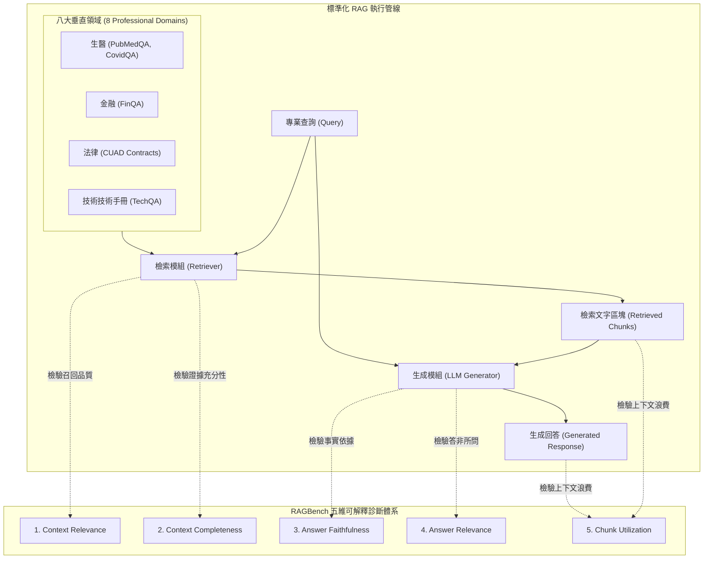

# RAGBench: Explainable Benchmark for Retrieval-Augmented Generation Systems

## 一話摘要 (TL;DR)
Galileo 推出的 RAGBench 是一個涵蓋生醫、金融、法律、技術手冊等 8 大專業領域、包含 **100,000 個標準樣本（78k 訓練 / 12k 驗證 / 11k 測試）** 的大規模可解釋 RAG 評測基準，透過五大可解釋診斷維度（上下文相關性、事實依據度、回答相關性、上下文完備性、切塊利用率），實現對 RAG 系統各元件失效環節的白盒化歸因。

---

## 研究背景與問題定義 (Problem Statement)
現有 RAG 評估體系在工業界落地時面臨三大「黑盒」瓶頸：
1. **端到端指標無法定位錯誤來源（Lack of Component Attribution）**：單純計算生成的 ROUGE、BLEU 或整體回答準確率，無法區分錯誤究竟是「檢索器召回無關文本（Retrieval Failure）」、「上下文過於冗餘被模型忽略（Context Blindness）」還是「生成器無視正確上下文自行幻覺（Generation Hallucination）」。
2. **缺乏多領域專業垂直語料（Lack of Domain Diversity）**：多數學術基準局限於維基百科（如 HotpotQA、NQ），缺乏對醫學術語、金融財報數值、複雜法律合約（CUAD）等高難度企業場景的覆蓋。
3. **缺乏切塊利用效率評估（Chunk Utilization Gap）**：現有基準不評估檢索到的多個 Chunk 中究竟有百分之幾被真正吸收進生成文本，忽視了昂貴 Context Window 的浪費現象。

---

## 核心方法與技術架構 (Methodology & Architecture)

RAGBench 構建了**多領域資料集重構管線**與**五維可解釋診斷指標矩陣**：
1. **八大專業領域資料集重構（Table 1, Page 4）**：
   - 彙整改編自 PubMedQA（生醫）、CovidQA-RAG、TechQA（IT 技術客服）、FinQA（金融）、CUAD（商業合約法律）等真實高專業度語料；
   - 包含完整的 `(Query, Retrieved Context Chunks, Model Response, Human Annotations)` 四元組；
   - 總量達 100,000 條樣本，分為 78k 訓練集、12k 驗證集、11k 獨立測試集。
2. **五大可解釋性診斷維度（5 Diagnostic Metrics）**：
   - **Context Relevance（上下文相關性）**：檢索回傳的文本塊是否包含回答問題所需的必要事實；
   - **Answer Faithfulness / Groundedness（回答忠實度）**：生成的每一項事實主張是否能在 Context 中找到直接佐證；
   - **Answer Relevance（回答相關性）**：回答是否切中題意、無答非所問或多餘廢話；
   - **Context Completeness（上下文完備性）**：檢索上下文是否提供了足夠的全部事實以支持完整解答（評估檢索是否漏檢）；
   - **Chunk Utilization（切塊利用率）**：送入 LLM 上下文的所有 Chunk 中，被生成文本實質引用的區塊比例（量化顯存與計算浪費）。

### 圖中節點對照
- `M1 (Context Relevance)`：診斷檢索器是否精準定位。
- `M2 (Context Completeness)`：診斷是否發生證據短缺（Evidence Gap）。
- `M3 (Answer Faithfulness)`：診斷生成器是否出現外插幻覺。
- `M5 (Chunk Utilization)`：診斷上下文注入是否過度膨脹浪費。

---

## 主要實驗結果與證據 (Empirical Results & Evidence)

論文在大規模測試集上評測了不同檢索器（BM25, BGE, Contriever, OpenAI Text-Embedding）與生成器（GPT-4, Llama-3-70B, Mixtral-8x7B）的詳細故障模式（Table 2 & Section 4, Page 7）。

### 1. 核心評估發現
- **檢索與生成的瓶頸劃分**：
  - 在技術客服（TechQA）與金融（FinQA）領域，**超過 52% 的端到端回答失敗並非 LLM 幻覺，而是檢索器召回的上下文完全不具備相關性（Context Relevance = 0）**；
  - 在生物醫學領域，檢索相關性高達 86%，但回答忠實度（Faithfulness）卻下降至 64%，主要歸咎於模型對專業醫學實體的混淆。
- **切塊利用率（Chunk Utilization）的驚人浪費**：
  - 業界常見的 Top-10 Chunk 傳入設定下，**平均 Chunk Utilization 僅為 21.4%**，意味著接近 80% 的 Context Window 填充了無關雜訊，嚴重誘發「Lost-in-the-Middle」注意力分散。
- **自動評判器對齊度 (Table 2, Page 7)**：
  - 以微調判別器在 RAGBench 上預測 Groundedness 與 Relevance，與資深行業專家的人工標註達到 **F1 > 0.88** 的高度一致性。

---

## 優勢、限制及 Trade-offs (Strengths, Limitations & Trade-offs)

### 優勢
1. **十萬級大工業規模**：遠超傳統學術數據集的千條級別，可直接用於微調輕量化端到端 RAG 監控模型（Guardrail Models）。
2. **多維故障根因定位**：將 RAG 系統的「模糊失敗」精確拆解至檢索、切塊配置、模型上下文利用等具體工程參數，具備直接的可操作性。

### 限制與 Trade-offs
1. **合成標註的潛在噪音**：部分任務依賴進階 LLM（如 GPT-4）輔助生成評估標籤，極端邊緣案例仍需人工二次抽檢。
2. **多跳關係覆蓋相對較少**：相較於 HotpotQA 或 MuSiQue，RAGBench 更偏向工業界常見的單篇或少文檔特定領域資訊提取。

---

## 對本專案研究領域的實際意義 (Implications for Research Domains)
1. **對 Domain 10 (Benchmarks & Safety) 的落地支撐**：為評估企業級 RAG 系統提供了開箱即用的多維診斷評測套件。
2. **對 Domain 02 (Context Compression) 與 Domain 04 (Chunking) 的直接啟發**：Chunk Utilization 指標實證證明了「粗切塊 + 大 Top-k」是極端浪費顯存且降低準確率的工程反模式，強烈支持本專案推動的「命題切塊（Dense X）」與「KV Cache 剪枝」。

---

## 原始來源及相關筆記連結 (Sources & Related Notes)
- 原始論文 PDF：[[Papers/06 - Benchmarks & Evaluation/(arXiv 2024-06) RAGBench - Explainable Benchmark for Retrieval-Augmented Generation Systems.pdf|開啟本地 PDF]]
- arXiv 永久連結：[arXiv:2407.11005](https://arxiv.org/abs/2407.11005)
- 關聯專題領域：[[02 - 研究領域專題 (Research Domains)/Domain 10 - 評估基準、系統工程與安全 (Benchmarks & Safety)|Domain 10 - 評估基準]]、[[02 - 研究領域專題 (Research Domains)/Domain 17 - RAG Benchmarks & Evaluation Protocols|Domain 17 - RAG Benchmarks]]
