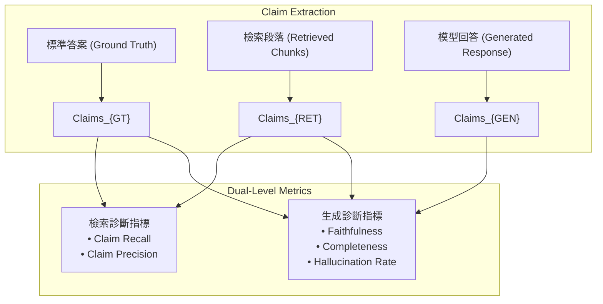

# RAGChecker: A Fine-grained Framework for Diagnosing Retrieval-Augmented Generation

> [!ABSTRACT] 一話摘要 (TL;DR)
> 本文提出 **RAGChecker**，首個基於命題/Claim 級別細粒度標註的 RAG 診斷與評估架構，定義了包含檢索端（Claim Recall, Precision）與生成端（Faithfulness, Completeness, Hallucination）的一整套診斷指標，能精準歸因 RAG 系統的失效根因。

---

## 一、研究背景與問題定義 (Problem Statement)
- **核心痛點**：長文本 RAG 生成通常是包含多個句子的複雜長篇回答（Long-form Generation）。現有的 RAG 評估工具（如 RAGAS）在長回答上難以進行精準的失效歸因 —— 到底是檢索器漏掉了關鍵事實、檢索器帶入了噪聲、生成器忽略了檢索內容，還是生成器自發產生了外部幻覺？
- **研究假設**：若能將 Ground Truth、檢索段落與模型生成內容全部標準化解構為**細粒度原子命題（Claims）**，並在 Claim 粒度上建立三者之間的雙向依賴矩陣，就能為 RAG 系統提供精確、可定位、高可靠性的診斷度量衡。

---

## 二、核心方法與技術架構 (Methodology & Architecture)

1. **三方 Claim 解構**：將 Ground Truth 答案、檢索到的 Context、模型生成的 Response 全部拆解為無歧義的原子 Claim 集合。
2. **細粒度檢索度量 (Retrieval Diagnostics)**：
   - **Claim Recall**：檢索段落所包含的 Claim 覆蓋了多少標準答案中的 Claim；
   - **Claim Precision**：檢索段落中的 Claim 有多少是對回答問題有用的。
3. **細粒度生成度量 (Generation Diagnostics)**：
   - **Faithfulness (忠實度)**：生成 Claim 中能被檢索段落支撐的比例；
   - **Completeness (完整度)**：生成 Claim 覆蓋標準答案 Claim 的比例；
   - **Hallucination (幻覺度)**：生成 Claim 既未被檢索支撐也非標準答案的比例。

---

## 三、主要實驗結果與證據 (Empirical Results & Evidence)
- **出處**：Table 2, Page 7.
- **評估基準與數據**：
  - 在 **CRUD-RAG** 等複雜長篇問答基準上，與人類專家評分進行 Pearson 與 Spearman 相關係數檢驗：
  - **Correctness 相關性**：RAGChecker 的 Overall Metric 達到 **45.11**，顯著高於 Ragas (30.93) 與 GPT-4 粗粒度直接打分；
  - **Completeness 相關性**：達到 **43.76**，大幅領先所有現有 Baseline。
  - **診斷有效性**：在對多個 SOTA RAG 系統的實證分析中，RAGChecker 成功揭示出「增加 Top-K 雖提升了 Claim Recall，但由於噪聲增加，導致生成器的 Hallucination Rate 顯著上升」的量化 Trade-off。

---

## 四、優勢、限制及 Trade-offs (Strengths, Limitations & Trade-offs)
- **優勢**：
  - 首個實現端到端細粒度失效歸因的框架，能明確告訴工程師問題出在 Retriever 還是 Generator；
  - 與人類專家對長篇回答評分的相關性達到目前公開基準最高水準。
- **限制與工程代價**：
  - **計算複雜度高**：需對全文進行三次 Claim 抽取與成對 NLI 矩陣比對，評測一次 Benchmark 的 Token 消耗顯著高於傳統指標；
  - **高度依賴 Claim 抽取器品質**：若 Claim 抽取不均勻，會直接影響分母統計。

---

## 五、對本專案研究領域的實際意義 (Implications for Research Domains)
- **直接指引失效歸因研究**：本專案在 `04 - 研究想法` 中構想的 `Idea 04: End-to-End RAG Failure Attribution`，其核心問題意識與 RAGChecker 完全對齊，RAGChecker 提供了極其扎實的文獻支撐與評測標準。
- **驗證 Claim-level 治理的必要性**：RAGChecker 的實驗從反面證明了單純在 Passage 層級做 RAG 的脆弱性，支持了本專案將 Claim 設為核心治理單元的決策。

---

## 六、原始來源及相關筆記連結 (Sources & Related Notes)
- **本地原始文獻**：[[Papers/06 - Benchmarks & Evaluation/(arXiv 2024-08) RAGChecker - A Fine-grained Framework for Diagnosing Retrieval-Augmented Generation.pdf|開啟本地 PDF 檔案]]
- **關聯專題**：[[02 - 研究領域專題 (Research Domains)/Domain 13 - RAG Evaluation & Failure Attribution|D13 RAG Evaluation & Failure Attribution]]
- **關聯構想**：[[04 - 研究想法與待驗證提案 (Ideas & Hypotheses)/Idea 04 - End-to-End RAG Failure Attribution and Evidence Governance|Idea 04: RAG 失效歸因與治理構想]]
