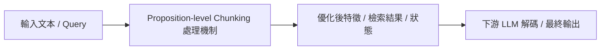

# Dense X: Exploring the Limit of Proposition Retrieval for Open-Domain QA

> [!INFO] 論文元數據 (Metadata)
> - **作者**：Tong Chen, Hongwei Wang, Sihao Chen, Wenhao Yu, Kaixin Ma, Xinran Zhao, Hongming Zhang, Dong Yu
> - **年份 / 會議**：2023 (EMNLP 2024)
> - **arXiv**：[2312.06648](https://arxiv.org/abs/2312.06648)
> - **論文分類**：`Proposition-level Chunking`
> - **本地 PDF 連結**：[[Papers/04 - Knowledge & Graph RAG/(EMNLP 2024-11) Dense X - Exploring the Limit of Proposition Retrieval for Open-Domain QA.pdf|開啟本地 PDF 檔案]]

---

## 一話摘要 (TL;DR)
**提出命題級檢索（Proposition Retrieval），將非結構化段落解構為自包含的原生事實單元，徹底解決固定長度切塊的語義割裂。**

---

## 核心痛點與研究背景 (Problem Statement)
傳統固定 Token 數量的 Chunking 存在嚴重兩難：Chunk 太大包含過多無關雜訊；Chunk 太小則代名詞與上下文遺失，語義不自足。

---

## 核心方法與技術架構 (Methodology & Architecture)
將文本切分至『命題（Proposition）』層次：每個命題定義為一個最小的、不可再分的、語義完全自足（包含明確主詞與時空條件）的原生事實陳述。透過 LLM（如 Propositionizer）自動將段落改寫為命題集合並分別構建向量索引。

---

## 關鍵優勢與權衡限制 (Strengths & Trade-offs)
優點：證據檢索顆粒度極其精準、徹底杜絕代名詞歧義、顯著提升高難度事實檢索召回率；缺點：向量庫中向量數量膨脹 5-10 倍，前置處理與離線抽取的運算成本昂貴。

---

## 在長文件處理任務中的角色與啟發 (Implications for Long-Doc Processing)
重新定義了 Chunking 的本質是『知識表示（Knowledge Representation）』而非物理切分，為高精度長文件知識檢索建立了新標竿。

---

## 關聯領域與推薦閱讀 (Related Links)
- **所屬研究領域**：
  - [[02 - 研究領域專題 (Research Domains)/Domain 04 - Chunking 策略與知識擷取 (Proposition, Cross-chunk)|Domain 04 - Chunking 策略與知識擷取 (Proposition, Cross-chunk)]]
- **回主目錄**：[[00 - 導覽與心智圖 (Navigation & MOC)/Home (主目錄與知識庫導覽)|主目錄與知識庫導覽]]
- **全景心智圖**：[[00 - 導覽與心智圖 (Navigation & MOC)/LLM 超長文件處理心智圖 (MOC)|超長文件處理研究方向心智圖]]
