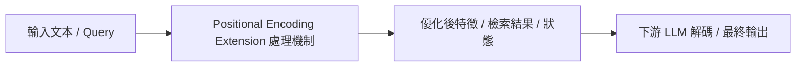

# LongRoPE: Extending LLM Context Window Beyond 2 Million Tokens

> [!INFO] 論文元數據 (Metadata)
> - **作者**：Yiran Ding, Li Lyna Zhang, Chengruidong Zhang, Yuanyuan Xu, Ning Shang, Jiahang Xu, Fan Yang, Mao Yang
> - **年份 / 會議**：2024 (Microsoft Research / ICML 2024)
> - **arXiv**：[2402.13753](https://arxiv.org/abs/2402.13753)
> - **論文分類**：`Positional Encoding Extension`
> - **本地 PDF 連結**：[[Papers/01 - Long Context & Sequence/(ICML 2024-07) LongRoPE - Extending LLM Context Window Beyond 2 Million Tokens.pdf|開啟本地 PDF 檔案]]

---

## 一話摘要 (TL;DR)
**透過演化搜尋非均勻位置插值，僅需微調 1000 步即可將 LLaMA 擴展至 2.048M 上下文。**

---

## 核心痛點與研究背景 (Problem Statement)
標準 RoPE 外推會導致注意力分配劇烈混亂，而傳統線性插值（PI）或 YaRN 在極限外推比例（如 8x 以上）時高頻與低頻維度的插值嚴重破壞短距離語言建模能力。

---

## 核心方法與技術架構 (Methodology & Architecture)
1. 發現 RoPE 維度之間存在極大的不均勻性，採用演化演算法搜尋最優的非均勻頻率縮放因數；2. Progressive Extension：先從 4k 插值到 256k 微調，再以此為基座外推至 2048k，並結合長短序列兼顧策略避免短期退化。

---

## 關鍵優勢與權衡限制 (Strengths & Trade-offs)
優點：成本極低（微調 token 量極少）、外推長度達 2M；缺點：位置編碼插值僅解決了模型『看得懂位置』，不代表模型具備在 2M 長度下不遺忘、複雜多跳邏輯推理的能力。

---

## 在長文件處理任務中的角色與啟發 (Implications for Long-Doc Processing)
極致展現了位置編碼外推的工程極限，明確劃分了『Context Window 長度』與『Long Reasoning 深度』的本質區別。

---

## 關聯領域與推薦閱讀 (Related Links)
- **所屬研究領域**：
  - [[02 - 研究領域專題 (Research Domains)/Domain 01 - Long Context 與序列架構 (Attention, SSM, Ring)|Domain 01 - Long Context 與序列架構 (Attention, SSM, Ring)]]
- **回主目錄**：[[00 - 導覽與心智圖 (Navigation & MOC)/Home (主目錄與知識庫導覽)|主目錄與知識庫導覽]]
- **全景心智圖**：[[00 - 導覽與心智圖 (Navigation & MOC)/LLM 超長文件處理心智圖 (MOC)|超長文件處理研究方向心智圖]]
