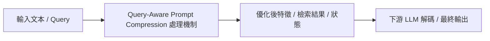

# LongLLMLingua: Accelerating and Enhancing LLMs in Long Context Scenarios via Prompt Compression

> [!INFO] 論文元數據 (Metadata)
> - **作者**：Huiqiang Jiang, Qianhui Wu, Xufang Luo, Dongsheng Li, Chin-Yew Lin, Yuqing Yang, Lili Qiu
> - **年份 / 會議**：2023 (ACL 2024)
> - **arXiv**：[2310.06201](https://arxiv.org/abs/2310.06201)
> - **論文分類**：`Query-Aware Prompt Compression`
> - **本地 PDF 連結**：[[Papers/02 - Compression & KV Cache/(ACL 2024-08) LongLLMLingua - Accelerating and Enhancing LLMs in Long Context Scenarios via Prompt Compression.pdf|開啟本地 PDF 檔案]]

---

## 一話摘要 (TL;DR)
**解決 LLMLingua 在長文本場景中 Lost in the Middle 的問題，引入 Question-Aware 條件感知壓縮機制。**

---

## 核心痛點與研究背景 (Problem Statement)
原本 LLMLingua 是 Query-Agnostic 的，會依照文本自然語言概率刪詞，導致長文件中與問題最相關的細微線索被意外刪除，且無法緩解模型對中間段落的遺忘。

---

## 核心方法與技術架構 (Methodology & Architecture)
1. 引入問題對文件條件概率 $P(Doc|Query)$ 作為重要性評估基準；2. 依照與問題關聯度重排文檔，將高相關文件置於開頭與結尾（對抗 Lost in the Middle）；3. 動態分配不同文檔的壓縮率。

---

## 關鍵優勢與權衡限制 (Strengths & Trade-offs)
優點：長文問答準確率提升顯著，壓縮 4x 甚至出現超越原始 Prompt 表現的現象（濾除干擾雜訊）；缺點：必須預先已知 Query，無法用於長篇離線預索引快取。

---

## 在長文件處理任務中的角色與啟發 (Implications for Long-Doc Processing)
明確奠定了長文本壓縮必須區分『Query-Aware（線上動態）』與『Query-Agnostic（離線靜態）』兩大路線。

---

## 關聯領域與推薦閱讀 (Related Links)
- **所屬研究領域**：
  - [[02 - 研究領域專題 (Research Domains)/Domain 02 - 多層次壓縮技術 (Token, KV Cache, Context)|Domain 02 - 多層次壓縮技術 (Token, KV Cache, Context)]]
- **回主目錄**：[[00 - 導覽與心智圖 (Navigation & MOC)/Home (主目錄與知識庫導覽)|主目錄與知識庫導覽]]
- **全景心智圖**：[[00 - 導覽與心智圖 (Navigation & MOC)/LLM 超長文件處理心智圖 (MOC)|超長文件處理研究方向心智圖]]
