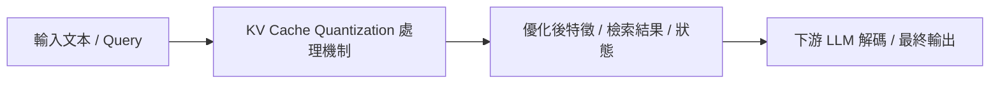

# KIVI: A Tuning-Free Asymmetric 2-bit Quantization for KV Cache

> [!INFO] 論文元數據 (Metadata)
> - **作者**：Zirui Liu, Jiayi Yuan, Hongye Jin, Shaochen Zhong, Zhaozhuo Xu, Vladimir Braverman, Xia Hu
> - **年份 / 會議**：2024 (ICML 2024)
> - **arXiv**：[2402.02750](https://arxiv.org/abs/2402.02750)
> - **論文分類**：`KV Cache Quantization`
> - **本地 PDF 連結**：[[Papers/02 - Compression & KV Cache/(ICML 2024-07) KIVI - A Tuning-Free Asymmetric 2-bit Quantization for KV Cache.pdf|開啟本地 PDF 檔案]]

---

## 一話摘要 (TL;DR)
**無需微調（Tuning-Free）的非對稱 2-bit KV 快取量化，將超長上下文的顯存佔用縮減至原本的 1/4。**

---

## 核心痛點與研究背景 (Problem Statement)
長文本推論時，KV Cache 的顯存佔用遠遠超過模型權重本身，限制了單卡批次大小（Batch Size）與最大上下文長度。

---

## 核心方法與技術架構 (Methodology & Architecture)
深入分析 Key 與 Value 快取的數值分佈特性：發現 Key 向量在特定通道維度存在離群值（Outliers），適合按 Channel-wise 量化；而 Value 向量分佈相對平滑，適合按 Token-wise 量化。結合非對稱量化策略，將 KV Cache 壓縮為 2-bit，並保留小規模的 Full-precision Residual Window。

---

## 關鍵優勢與權衡限制 (Strengths & Trade-offs)
優點：無需重新訓練、即插即用、顯存節省極大、長文本準確率幾乎無損；缺點：引入了 Dequantization 的計算開銷，對極低延遲的短文本任務加速有限。

---

## 在長文件處理任務中的角色與啟發 (Implications for Long-Doc Processing)
證明了 KV Cache 可以在完全不修改文本內容的前提下，純粹透過底層數值精度壓縮解決顯存瓶頸，已成為各推理框架（vLLM、TensorRT-LLM）必備能力。

---

## 關聯領域與推薦閱讀 (Related Links)
- **所屬研究領域**：
  - [[02 - 研究領域專題 (Research Domains)/Domain 02 - 多層次壓縮技術 (Token, KV Cache, Context)|Domain 02 - 多層次壓縮技術 (Token, KV Cache, Context)]]
- **回主目錄**：[[00 - 導覽與心智圖 (Navigation & MOC)/Home (主目錄與知識庫導覽)|主目錄與知識庫導覽]]
- **全景心智圖**：[[00 - 導覽與心智圖 (Navigation & MOC)/LLM 超長文件處理心智圖 (MOC)|超長文件處理研究方向心智圖]]
