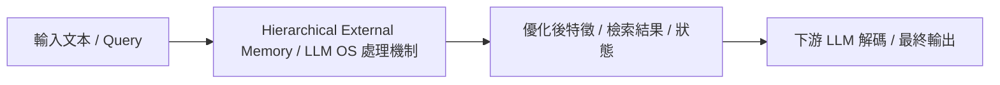

# MemGPT: Towards LLMs as Operating Systems

> [!INFO] 論文元數據 (Metadata)
> - **作者**：Charles Packer, Vivian Fang, Shishir G. Patil, Kevin Lin, Sarah Wooders, Joseph E. Gonzalez
> - **年份 / 會議**：2023 (UC Berkeley / arXiv 2023)
> - **arXiv**：[2310.08560](https://arxiv.org/abs/2310.08560)
> - **論文分類**：`Hierarchical External Memory / LLM OS`
> - **本地 PDF 連結**：[[Papers/05 - Memory & Agents/(arXiv 2023-10) MemGPT - Towards LLMs as Operating Systems.pdf|開啟本地 PDF 檔案]]

---

## 一話摘要 (TL;DR)
**借鑑傳統作業系統的階層式記憶體虛擬化技術，讓 LLM 自主管理主記憶體（Context）與外部磁碟存儲，實現無限上下文錯覺。**

---

## 核心痛點與研究背景 (Problem Statement)
固定 Context Window 限制了長對話與長期文件的連續性，單純 RAG 缺乏自主狀態控制權與記憶主動寫入/更新機制。

---

## 核心方法與技術架構 (Methodology & Architecture)
將 LLM 視為 CPU，Context Window 視為 RAM，外部資料庫視為 Disk。定義三層記憶架構：1. Working Context（當前可見 prompt）；2. Recall Storage（對話歷史檢索庫）；3. Archival Storage（外部長期知識庫）。LLM 透過專用函數呼叫（Function Calling）自主執行 `memory_read`、`memory_write`、`memory_edit` 與分頁換入/換出（Paging）。

---

## 關鍵優勢與權衡限制 (Strengths & Trade-offs)
優點：模型具備自我修正與長期狀態維護能力，理論上支援無限長壽命 Agent；缺點：LLM 需要耗費大量的思考步數管理自身記憶，在複雜任務中易發生記憶策略失調（Memory thrashing）。

---

## 在長文件處理任務中的角色與啟發 (Implications for Long-Doc Processing)
提出『LLM 即作業系統』的宏偉藍圖，是智慧體長期記憶體架構（Agentic Long-term Memory）的先驅代表作。

---

## 關聯領域與推薦閱讀 (Related Links)
- **所屬研究領域**：
  - [[02 - 研究領域專題 (Research Domains)/Domain 06 - 外部記憶體架構 (MemGPT, A-MEM, Working Memory)|Domain 06 - 外部記憶體架構 (MemGPT, A-MEM, Working Memory)]]
- **回主目錄**：[[00 - 導覽與心智圖 (Navigation & MOC)/Home (主目錄與知識庫導覽)|主目錄與知識庫導覽]]
- **全景心智圖**：[[00 - 導覽與心智圖 (Navigation & MOC)/LLM 超長文件處理心智圖 (MOC)|超長文件處理研究方向心智圖]]
