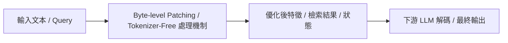

# Byte Latent Transformer: Patches Scale Better Than Tokens

> [!INFO] 論文元數據 (Metadata)
> - **作者**：Artidoro Pagnoni, Ram Pasunuru, Pedro Rodriguez, John Nguyen, Benjamin Muller, et al.
> - **年份 / 會議**：2024 (Meta FAIR / arXiv 2024)
> - **arXiv**：[2412.09871](https://arxiv.org/abs/2412.09871)
> - **論文分類**：`Byte-level Patching / Tokenizer-Free`
> - **本地 PDF 連結**：[[Papers/02 - Compression & KV Cache/(arXiv 2024-12) Byte Latent Transformer - Patches Scale Better Than Tokens.pdf|開啟本地 PDF 檔案]]

---

## 一話摘要 (TL;DR)
**Meta 拋棄傳統固定 Tokenizer，以動態字節斑塊（Byte Patches）實現依資訊熵自適應分配計算量的新型架構。**

---

## 核心痛點與研究背景 (Problem Statement)
固定詞表 Tokenizer 存在跨語言不平等、拼寫脆弱、領域泛化差等問題，且將長文本機械化切片，無法在複雜長句中靈活分配計算資源。

---

## 核心方法與技術架構 (Methodology & Architecture)
基於原生 Byte 輸入，使用輕量熵模型檢測資訊密度變化邊界，動態將字節聚合成 Patch（Patch 尺寸隨熵動態增減）。主幹大模型僅在 Patch 隱空間上執行 Attention 計算，再由輕量解碼器還原為 Byte。

---

## 關鍵優勢與權衡限制 (Strengths & Trade-offs)
優點：徹底告別 Tokenizer 偏見、高壓縮比、長文本在非結構化資料下更穩健；缺點：需要從頭預訓練全新的基座模型，無法直接套用於現有 LLaMA/GPT 架構。

---

## 在長文件處理任務中的角色與啟發 (Implications for Long-Doc Processing)
代表了 2025-2026 年底層架構從 Token 級向 Byte 級自適應長文本建模典範轉移的重要嘗試。

---

## 關聯領域與推薦閱讀 (Related Links)
- **所屬研究領域**：
  - [[02 - 研究領域專題 (Research Domains)/Domain 01 - Long Context 與序列架構 (Attention, SSM, Ring)|Domain 01 - Long Context 與序列架構 (Attention, SSM, Ring)]]
  - [[02 - 研究領域專題 (Research Domains)/Domain 02 - 多層次壓縮技術 (Token, KV Cache, Context)|Domain 02 - 多層次壓縮技術 (Token, KV Cache, Context)]]
- **回主目錄**：[[00 - 導覽與心智圖 (Navigation & MOC)/Home (主目錄與知識庫導覽)|主目錄與知識庫導覽]]
- **全景心智圖**：[[00 - 導覽與心智圖 (Navigation & MOC)/LLM 超長文件處理心智圖 (MOC)|超長文件處理研究方向心智圖]]
