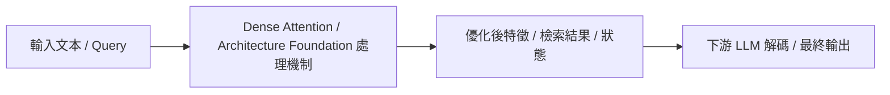

# Attention Is All You Need

> [!INFO] 論文元數據 (Metadata)
> - **作者**：Ashish Vaswani, Noam Shazeer, Niki Parmar, Jakob Uszkoreit, Llion Jones, Aidan N. Gomez, Łukasz Kaiser, Illia Polosukhin
> - **年份 / 會議**：2017 (NeurIPS 2017)
> - **arXiv**：[1706.03762](https://arxiv.org/abs/1706.03762)
> - **論文分類**：`Dense Attention / Architecture Foundation`
> - **本地 PDF 連結**：[[Papers/01 - Long Context & Sequence/(NeurIPS 2017-12) Attention Is All You Need.pdf|開啟本地 PDF 檔案]]

---

## 一話摘要 (TL;DR)
**提出 Transformer 架構與 Multi-Head Self-Attention，徹底揚棄 RNN 與 CNN，成為現代所有 LLM 的骨幹基石。**

---

## 核心痛點與研究背景 (Problem Statement)
傳統 RNN/LSTM 的循序特性使其無法平行計算，且在捕捉極長距離依賴時面臨梯度消失與記憶瓶頸；CNN 雖然可平行，但感受野擴展受限於卷積層數。

---

## 核心方法與技術架構 (Methodology & Architecture)
引入 Scaled Dot-Product Attention 與 Multi-Head Attention 機制，計算公式為 $\text{Attention}(Q, K, V) = \text{softmax}\left(\frac{QK^T}{\sqrt{d_k}}\right)V$。完全透過自注意力捕捉序列中任兩個 token 間的直接交互關係，並搭配 Sinusoidal Positional Encoding 賦予序列順序資訊。

---

## 關鍵優勢與權衡限制 (Strengths & Trade-offs)
優點：全局交互能力極強、高度可平行運算；缺點：時間與記憶體複雜度皆為 $O(L^2)$，造成 Context Window 擴展至長文本時面臨極嚴重的運算與顯存瓶頸（二次方爆炸）。

---

## 在長文件處理任務中的角色與啟發 (Implications for Long-Doc Processing)
所有後續 Long Context（如 FlashAttention、Sparse Attention、Linear Attention、Ring Attention）與 KV Cache 壓縮研究的出發點與比較基準點。

---

## 關聯領域與推薦閱讀 (Related Links)
- **所屬研究領域**：
  - [[02 - 研究領域專題 (Research Domains)/Domain 01 - Long Context 與序列架構 (Attention, SSM, Ring)|Domain 01 - Long Context 與序列架構 (Attention, SSM, Ring)]]
- **回主目錄**：[[00 - 導覽與心智圖 (Navigation & MOC)/Home (主目錄與知識庫導覽)|主目錄與知識庫導覽]]
- **全景心智圖**：[[00 - 導覽與心智圖 (Navigation & MOC)/LLM 超長文件處理心智圖 (MOC)|超長文件處理研究方向心智圖]]
