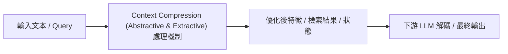

# RECOMP: Improving Retrieval-Augmented LMs with Compression and Selective Augmentation

> [!INFO] 論文元數據 (Metadata)
> - **作者**：Fangyuan Xu, Weijia Shi, Eunsol Choi
> - **年份 / 會議**：2023 (ICLR 2024)
> - **arXiv**：[2310.04408](https://arxiv.org/abs/2310.04408)
> - **論文分類**：`Context Compression (Abstractive & Extractive)`
> - **本地 PDF 連結**：[[Papers/02 - Compression & KV Cache/(ICLR 2024-05) RECOMP - Improving Retrieval-Augmented LMs with Compression and Selective Augmentation.pdf|開啟本地 PDF 檔案]]

---

## 一話摘要 (TL;DR)
**提出針對 RAG 任務專門訓練的摘要型與抽取型上下文壓縮器，大幅降低 LLM 輸入長度並過濾不相關資訊。**

---

## 核心痛點與研究背景 (Problem Statement)
RAG 檢索出的多個文檔存在大量重複、相互衝突或與問題無關的噪音，若直接拼接餵入 LLM 會佔滿上下文並引發幻覺。

---

## 核心方法與技術架構 (Methodology & Architecture)
設計兩類壓縮器：1. Extractive Compressor：基於雙向編碼器挑選最具信息量的句子；2. Abstractive Compressor：訓練序列到序列模型將檢索到的多篇文檔融合成濃縮摘要；3. 採用端到端目標進行訓練，目標是最大化下游 LLM 生成正確答案的對數似然。

---

## 關鍵優勢與權衡限制 (Strengths & Trade-offs)
優點：語意連貫度遠高於 Token 刪減、資訊密度極高；缺點：需要額外訓練壓縮器模型，摘要過程可能產生二次幻覺（將原文件的細節篡改）。

---

## 在長文件處理任務中的角色與啟發 (Implications for Long-Doc Processing)
證實了『上下文壓縮』不等於『Token 剪枝』，推動了 RAG 系統中在 Retrieve 與 Generate 之間加入專門壓縮層的架構演化。

---

## 關聯領域與推薦閱讀 (Related Links)
- **所屬研究領域**：
  - [[02 - 研究領域專題 (Research Domains)/Domain 02 - 多層次壓縮技術 (Token, KV Cache, Context)|Domain 02 - 多層次壓縮技術 (Token, KV Cache, Context)]]
  - [[02 - 研究領域專題 (Research Domains)/Domain 03 - 先進 RAG 與檢索機制 (ColBERT, HyDE, Self-RAG)|Domain 03 - 先進 RAG 與檢索機制 (ColBERT, HyDE, Self-RAG)]]
- **回主目錄**：[[00 - 導覽與心智圖 (Navigation & MOC)/Home (主目錄與知識庫導覽)|主目錄與知識庫導覽]]
- **全景心智圖**：[[00 - 導覽與心智圖 (Navigation & MOC)/LLM 超長文件處理心智圖 (MOC)|超長文件處理研究方向心智圖]]
