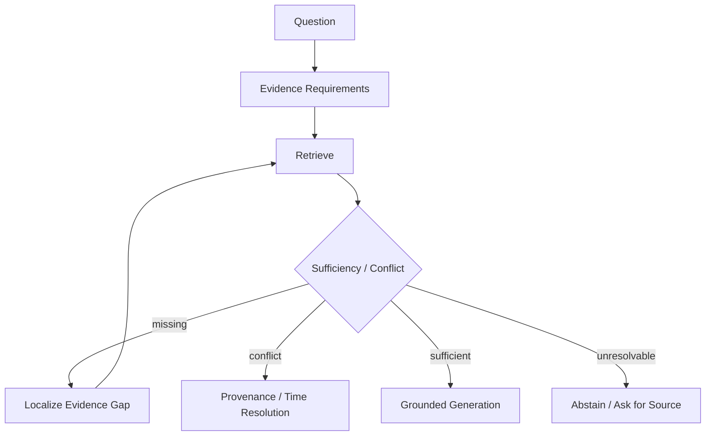

# Idea 02: Evidence Gap-Aware Adaptive Retrieval

> [!WARNING]
> Adaptive-RAG、Self-RAG、IRCoT 等證明「何時檢索 / 如何迭代檢索」是可研究問題；但本頁提出的 **explicit evidence requirement → gap localization → targeted next action** controller 是 project hypothesis。

## 問題定義

不是只問「要不要再搜」，而是顯式表示：
1. 問題需要哪些 evidence requirements？
2. 現有 evidence set 已支持哪些？
3. 哪些 requirement 缺失、部分支持或互相衝突？
4. 下一步應 retrieve、re-extract、decompose、resolve conflict、abstain 還是 stop？

## 可反駁假設

Gap-aware controller 應在相同 token / retrieval budget 下，提高：
- evidence coverage；
- answer correctness；
- citation completeness；
並降低不必要 retrieval calls。

## Baselines

- fixed top-k RAG
- IRCoT
- Self-RAG
- Adaptive-RAG
- query decomposition + fixed stopping

## Oracle

- gold decomposition
- gold evidence requirements
- gold gap labels
- gold stopping point

## Metrics

Evidence recall、requirement coverage、retrieval calls、latency/cost、answer correctness、abstention calibration。

## Evidence Slot State Model（project controller state）

> [!WARNING]
> 這是本專案 controller 的狀態設計，不等同於任何 benchmark 的官方 label set。

每個 required evidence slot 可處於：

1. `missing`：尚未找到候選證據。
2. `retrieved-unverified`：找到候選，但尚未完成 entailment / authority 驗證。
3. `supported`：已有足以支持該 requirement 的證據。
4. `conflicting`：存在互相矛盾的可用證據。
5. `ineligible`：內容相關，但因版本、authority、scope 或其他治理條件不能作為有效支持。

Action policy 不應只做 retrieve-more：
- missing → targeted retrieval；
- retrieved-unverified → verify；
- conflicting → D08 provenance/time resolution；
- ineligible → search alternate source；
- all required slots supported → stop / generate；
- budget exhausted → abstain / escalate。

## Stopping and Abstention Policy（proposed）

Evidence sufficiency 不應只是一個模糊的 0–1 self-score。對 requirement set (R(q)=\{r_1,...,r_m\}) 可定義 weighted coverage（本專案 proposed metric）：

$$
\text{Coverage}(q,E)=\frac{\sum_i w_i s_i}{\sum_i w_i}
$$

其中 $s_i=1$ 表示 eligible evidence 已完整支持 requirement $r_i$。

建議 stopping 同時滿足：

$$
\text{Coverage} \ge \tau_{cov}
$$

$$
\text{CriticalMissing} = 0
$$

$$
\text{HighSeverityConflict} = 0
$$

並額外考慮：
- estimated marginal gain of another retrieval；
- remaining retrieval / token / latency budget。

### Abstention / downgrade cases

| Condition | Proposed action |
|---|---|
| critical evidence missing | abstain / partial answer |
| only stale evidence | explicitly state temporal limitation |
| only ineligible source | abstain / search alternate source |
| authoritative sources conflict | report conflict; do not guess |
| coverage below threshold | targeted retrieval; abstain after budget exhaustion |
| evidence retrieved but verifier cannot support claim | do not generate that claim |

### Metrics

- Evidence Slot Recall
- Critical Evidence Recall
- Counter-evidence Recall
- False-Sufficient Rate
- False-Insufficient Rate
- Early-stop Error Rate
- Abstention Accuracy
- Retrieval Rounds / Documents Read / Input Tokens / LLM Calls

## 鄰接專題與文獻

- [[02 - 研究領域專題 (Research Domains)/Domain 06 - Evidence Sufficiency & Adaptive Retrieval|D06 Evidence Sufficiency & Adaptive Retrieval]]
- [[02 - 研究領域專題 (Research Domains)/Domain 05 - Query Understanding & Retrieval|D05 Query Understanding & Retrieval]]
- [[02 - 研究領域專題 (Research Domains)/Domain 08 - Temporal Conflict & Provenance Resolution|D08 Temporal Conflict & Provenance Resolution]]
- [[02 - 研究領域專題 (Research Domains)/Domain 12 - Agentic RAG & Orchestration|D12 Agentic RAG & Orchestration]]

## Retained Falsifiable Experiment: Gap-Aware vs Fixed-Round

比較：
- fixed Top-k RAG；
- fixed N-round iterative RAG；
- Self-RAG / Adaptive-RAG；
- explicit slot/gap-aware controller。

在相同 retrieval / token / LLM-call budget 下，比較 answer quality、evidence coverage、false-sufficient rate、abstention quality 與平均 retrieval rounds。

若 gap localization 本身的成本抵銷了節省的 retrieval，且品質沒有穩定改善，則 gap-aware controller 在該 task 上不成立。
