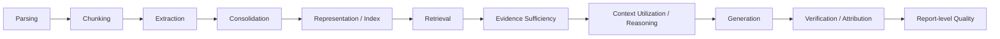

# Idea 04: End-to-End RAG Failure Attribution & Evidence Governance

> [!WARNING]
> 下列 controller、F/R/D/A/P/C/T typing 與 deterministic repair loop 是本專案設計。它們可以受 IE、attribution、trustworthy RAG、report generation 文獻啟發，但目前不得標成 survey-established framework。

## Failure taxonomy

## Controller

- missing knowledge → retrieve
- extracted wrong → re-extract
- incomplete evidence → gap search
- conflicting evidence → provenance / temporal resolution
- gold evidence present but answer wrong → context-utilization / reasoning failure
- sufficient evidence + supported claims → stop

## F/R/D/A/P/C/T（project-specific operational typing）

- F = Fact
- R = Requirement
- D = Confirmed Design
- A = Assumption
- P = Proposal
- C = Capability
- T = Terms

這套 typing 可用於企業交付物，但不是通用 IE taxonomy。若用於研究，必須與 NER/RE/EE/UIE、event/temporal extraction 等 established tasks 分開報告。

## Claim-Evidence Ledger（project mechanism）

每個 claim 保存：
- claim text；
- supporting / contradicting evidence IDs；
- entailment status；
- source authority / version；
- unresolved gap；
- output section。

## Oracle localization

| Oracle | 若結果顯著改善，主要錯誤來源 |
|---|---|
| Gold parsing | parsing / layout |
| Gold chunks | segmentation |
| Gold extraction | IE |
| Gold consolidated facts | entity/coreference/temporal merge |
| Gold retrieval | retrieval |
| Gold complete evidence set | sufficiency |
| Gold evidence in context | utilization / reasoning |
| Gold claims | generation |
| Gold citations | attribution |

## 研究價值

目標不是再做一個 end-to-end score，而是回答：**錯在 pipeline 哪一層，以及修哪一層最划算。**

## 鄰接專題與文獻

- [[02 - 研究領域專題 (Research Domains)/Domain 13 - RAG Evaluation & Failure Attribution|D13 RAG Evaluation & Failure Attribution]]
- [[00 - 導覽與心智圖 (Navigation & MOC)/RAG Benchmark Catalog|RAG Benchmark Catalog]]
- [[04 - 研究想法與待驗證提案 (Ideas & Hypotheses)/Idea 05 - Evidence-Governed RAG 系統架構構想 (Delta Pipeline Design)|Idea 05: Evidence-Governed RAG 系統架構構想]]
- [[04 - 研究想法與待驗證提案 (Ideas & Hypotheses)/Idea 06 - 主流 RAG 框架生態與系統定位分析 (Framework Landscape & Positioning)|Idea 06: 主流 RAG 框架生態與系統定位分析]]

## Retained Falsifiable Experiment: Oracle Error Localization Validity

用逐層 oracle replacement 檢查 failure attribution 是否可信：

- gold parse / layout；
- gold segmentation；
- gold extraction / consolidation；
- gold retrieval / evidence set；
- gold context；
- gold claims / citations。

核心問題：**oracle intervention 所造成的改善，是否能穩定對應到 human expert 對 bottleneck 的判斷？**

反例也必須保留：pipeline component 可能高度耦合，某層修正會改變其他層輸入分布，因此 oracle gain 不應被當成可線性相加的「責任百分比」。
