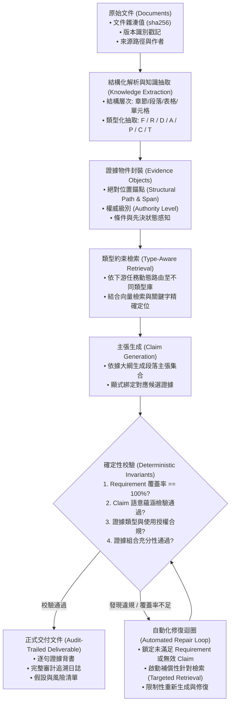

# 💡 Evidence-Governed RAG 系統架構構想 (Delta Pipeline Design)

> [!NOTE] 構想說明與邊界宣告 (Non-Survey Disclaimer)
> **本文件屬於自主研究構想、系統架構提案與工作假設（Working Hypothesis），非經過同行評審之公開 Survey 論文。**
>
> 本構想源自使用者在實務工程與學術探索中針對「企業級長篇交付物、招標規格書（RFP）與審計報告」之核心痛點所提出的 **Evidence-Governed Pipeline**。
> 相關經過同行評審的基礎研究（如 Dense X, STORM, GraphRAG, NLI）請參閱文獻庫與各領域專題。

---

## 一、核心問題意識：從問答式 RAG 到長篇交付物生成

傳統 RAG（Retrieval-Augmented Generation）的核心範式本質上是：
\[
\text{Question} \longrightarrow \text{Retrieve Chunks} \longrightarrow \text{Answer with Citations}
\]
這種設計在面對嚴肅企業交付物時，會出現三大根本性失效：
1. **無操作語意（No Operational Semantics）**：將需求條款、物理事實、推測假設混為一談，模型常拿客戶的「招標需求」當成我方的「現有能力」自我背書。
2. **表面引用幻覺（Citation Fallacy）**：生成內容結尾附帶文檔腳標 `[Doc A]`，但不代表該文檔在邏輯上必然支持該論點（缺乏 NLI 蘊涵檢驗），更不代表證據具備充分性。
3. **缺乏硬約束保證（No Deterministic Guarantees）**：依賴 LLM 的主觀自我審查，無法確保「100% 滿足所有招標條件（Coverage=1.0）」，一旦遺漏關鍵條款直接導致投標失敗。

---

## 二、端到端證據生命週期管道 (The $D \rightarrow K \rightarrow E \rightarrow C \rightarrow V \rightarrow O$ Pipeline)

本架構提出六階段端到端受治理管線：

\[
\boxed{D \longrightarrow K \longrightarrow E \longrightarrow C \longrightarrow V \longrightarrow O}
\]

---

## 三、企業知識分類體系 (F/R/D/A/P/C/T) 與操作語意

本構想的核心學術假設在於：**分類標籤必須對下游處理產生因果約束，即操作語意（Operational Semantics）**：

\[
\boxed{\text{type}(x) \Longrightarrow \text{allowed\_operations}(x)}
\]

| 類型 | 代號 | 語意定義 | 下游操作規則與硬約束 |
| :--- | :---: | :--- | :--- |
| **Fact (客觀事實)** | **F** | 客觀已發生之確定數據、歷史事件、物理參數。 | 高權威度證據；允許直接作為能力宣稱與技術規格的背書依據。 |
| **Requirement (需求條件)** | **R** | 客戶招標規格、法規合規之約束條件。 | **下游交付物必須 100% 覆蓋**；嚴禁作為「本系統已實現某功能」之證明；需進行 Coverage 硬約束校驗。 |
| **Confirmed Design (確認設計)** | **D** | 專案團隊已敲定的架構決策與選用技術。 | 作為交付物技術方案章節的核心骨幹。 |
| **Assumption (假設條件)** | **A** | 缺乏直接文獻但為推進設計暫時設定之前提。 | **必須顯式標註風險與前置宣告**；絕不得偽裝成 Fact；賦予折扣置信度。 |
| **Proposal (建議方案)** | **P** | 團隊提出的候選實施路徑與備選做法。 | 需對齊相關需求（R），論證其可行性；非最終確定結論。 |
| **Capability (現有能力)** | **C** | 供應商目前已具備的產品指標與歷史實績。 | 需引用歷史測試報告或案例背書；用以回應需求。 |
| **Terms (術語規範)** | **T** | 專案專有名詞、定義與業界標準縮寫。 | 建立全域對齊詞彙庫，防止跨章節名詞歧義。 |

---

## 四、四層證據審計階梯 (The 4-Layer Evidence Hierarchy)

超越傳統 RAG 的表面腳標，建立四層可驗證的審計階梯：

\[
\boxed{\text{Citation} \neq \text{Entailment} \neq \text{Authority} \neq \text{Sufficiency}}
\]

1. **Citation（表面引用）**：答案末尾標記 `[Doc A, p.3]`，僅為文字指向標籤，無真實性保證。
2. **Entailment（語意蘊涵）**：利用微調之 NLI 模型驗證 Evidence 與 Claim 之間是否存在邏輯蘊涵關係。
3. **Authority（權威性與合法性）**：
   - 依據 Source Manifest 核驗該文檔是否為最新版本（Hash 匹配）；
   - 核驗 Evidence 類型與 Claim 類型是否相容（如嚴禁拿 Requirement 作為 Capability 的證明依據）。
4. **Sufficiency（證據充分性）**：
   - 檢驗給定的證據集合是否足以完全論證該主張，杜絕無支撐的推論跳躍（如宣稱「24 小時無中斷運作且 RPO=0」，需同時具備雙機熱備與同步複寫兩項獨立證據）。

---

## 五、確定性不變量與自動化修復迴圈 (Deterministic Repair Loop)

不同於現有 Agent 框架依賴「LLM 自我反思（Self-Reflection）」，本構想主張**程式碼級確定性約束**：

### 1. 核心不變量定義
- **不變量 1：需求覆蓋率硬約束**
  \[
  \text{Coverage}(R) = \frac{|\{r \in R \mid \exists c \in C_{\text{deliverable}}, \text{Addresses}(c, r) \land \text{Valid}(c)\}|}{|R|} = 1.0
  \]
- **不變量 2：無漂浮主張硬約束**
  \[
  \forall c \in C_{\text{deliverable}}, \quad \text{Sufficiency}(E(c), c) = \text{True}
  \]
- **不變量 3：類型語意相容性硬約束**
  \[
  \forall c \in C_{\text{capability}}, \quad \text{type}(E(c)) \in \{F, C, D\} \quad (\text{嚴禁 } type(E(c)) \in \{R, A\})
  \]

### 2. 自動化修復迴圈
若驗證器偵測到任何不變量違規：
1. **精準鎖定失敗節點**：標記未被滿足的 $r_k$ 或證據不足的 $c_j$；
2. **定向補償檢索**：以 $r_k$ 為特定目標發動針對性檢索，擴展 Candidate Evidence 池；
3. **受限局部重寫**：僅對違規章節進行重構與重生成，保持其他通過驗證的章節不變；
4. **再次提交驗證**：直至所有不變量檢驗均通過。

---

## 六、學術論文貢獻與消融實驗設計 (Ablation Hypothesis)

> [!WARNING] 研究陷阱防範
> 單純提出 F/R/D/A/P/C/T 分類法並不能直接算作學術貢獻（易被審稿人視為純標籤 Taxonomy）。
> 必須透過**嚴格的消融實驗（Ablation Study）**證明其因果價值：

### 待驗證之核心研究假設
- **$H_1$**：在檢索階段引入 Type-aware Filtering，相較於純語意向量檢索，能顯著提升關鍵條款的 Precision@K 與有效證據命中率。
- **$H_2$**：在生成階段施加基於操作語意的確定性硬校驗（Deterministic Verification），相較於純 Prompt-based Self-Reflection，能將交付物的需求遺漏率（Omission Rate）降至 0%，並顯著降低幻覺率。
- **$H_3$**：四層證據階梯能夠準確攔截「有引用但無蘊涵」與「證據類型不相容」的偽真實生成。

---

## 相關參考文獻與專題連結
- **基礎文獻筆記**：
  - [[03 - 論文庫 (Literature Notes)/Chen2023 - Dense X Proposition Retrieval|Dense X: Proposition Retrieval (Chen et al., EMNLP 2024)]]
  - [[03 - 論文庫 (Literature Notes)/Shao2024 - STORM Writing Wikipedia From Scratch|STORM: 長篇寫作與大綱生成 (Shao et al., 2024)]]
  - [[03 - 論文庫 (Literature Notes)/Edge2024 - Microsoft GraphRAG|Microsoft GraphRAG: 社群摘要 (Edge et al., 2024)]]
- **相關專題**：
  - [[02 - 研究領域專題 (Research Domains)/Domain 04 - Chunking 策略與知識擷取 (Proposition, Cross-chunk)|Domain 04: Chunking 策略與知識擷取綜述]]
  - [[04 - 研究想法與待驗證提案 (Ideas & Hypotheses)/Idea 06 - 主流 RAG 框架生態與系統定位分析 (Framework Landscape & Positioning)|Idea 06 - 主流 RAG 框架生態與系統定位分析]]
