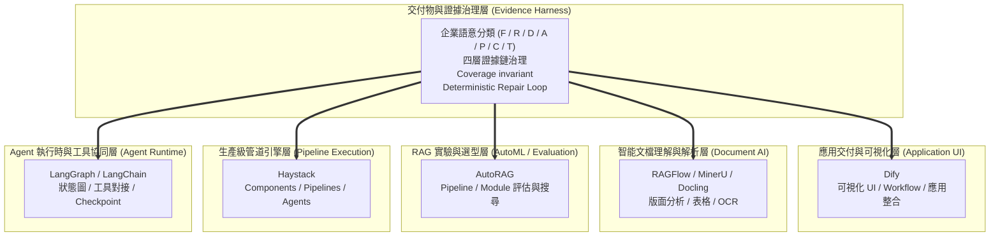

# 📊 主流 RAG 框架生態與系統定位分析 (Framework Landscape & Positioning)

> [!NOTE] 構想與選型分析說明
> **本文件旨在探討自主研發之 Evidence-Governed Harness（證據治理交付物生成系統）相較於現有工業界與開源界五大主流框架（LangChain, AutoRAG, Haystack, Dify, RAGFlow）之架構定位與委託邊界。**
>
> 本文分析重點在於「避免重複造輪子」，將通用排程、版面解析與超參數搜尋委託給成熟開源工具，將有限研究精力聚焦於獨特之證據治理與操作語意。

> [!CAUTION] 驗證狀態
> 本頁是工程選型與研究定位提案，不是 framework benchmark。各框架的功能、硬體需求、支援模型與效能會隨版本快速變動；表中的具體能力與數字在正式採用前應以官方文件與同條件 benchmark 重新核驗，不可把此頁當成固定事實或產品排名。

---

## 一、主流 RAG 系統生態速查表

| 系統 / 專案 | 核心定位與最強領域 | 本構想之相對優勢 | 本構想明確劣勢 / 應直接借力處 |
| :--- | :--- | :--- | :--- |
| **LangChain / LangGraph** | Agent 流程編排、工具生態、開源社群 | **證據鏈溯源、領域操作語意、確定性硬校驗** | 社群規模、工具連接器、執行時生態 |
| **AutoRAG** | RAG 超參數與組件自動搜尋 (AutoML RAG) | **不只搜尋檢索，而是治理證據 $\rightarrow$ 主張 $\rightarrow$ 交付物全生命週期** | **RAG 參數搜尋可直接借力，不優先自研** |
| **Haystack** | 生產級模組化 Pipeline、組件化 RAG / Agent 開發 | **具備操作語意的領域知識模型、審計追溯性** | Pipeline 執行與組件生態可直接借力 |
| **Dify** | Low-Code AI 應用平台、可視化 Workflow | **細粒度版本審計、可重現性實驗控制、確定性修復** | 視覺化 UI、使用者體驗、應用整合可直接借力 |
| **RAGFlow** | 文件理解、知識庫與 RAG 工作流 | **Claim 級證據治理、需求覆蓋率硬校驗、長篇方案生成** | **PDF / 表格 / OCR 等文件解析能力應優先評估整合，而非重造** |
| **Evidence-Governed Harness** | **面向長篇交付物的可審計證據治理系統** | —— | 開源生態、GUI、通用連接器仍處於提案/早期階段 |

---

## 二、六大維度深度評析 (The 6-Dimension Architectural Comparison)

> [!WARNING] 評估條件提示
> 下列系統設計目標不同（例如 QA Bot vs. AutoML vs. 長篇提案生成）。各維度比較旨在明確技術邊界與選型條件，不可無條件跨任務直接衡量分數優劣。

### 1. 適用任務與資料集 (Task & Dataset)
- **LangChain / Dify**：可用於問答、Tool-use Agent、知識庫檢索等應用；實際 benchmark 取決於組件與應用設計。
- **AutoRAG**：定位於 RAG pipeline / module 評估與自動化選型；正式實驗應依其官方支援資料格式與 evaluator 核對。
- **Haystack**：適合組件化 RAG、搜尋、Agent 與企業應用整合。
- **RAGFlow**：強調文件理解、知識庫與 RAG 工作流，適合評估財報、合約、手冊等重排版文件場景。
- **Evidence-Governed Harness**：研究目標面向**企業投標書（RFP）、工程規格書、法律意見書與科研報告**等高覆蓋、高可追溯交付物。

### 2. 模型規模及上下文長度 (Model Scale & Context Length)
- **通用應用層 (LangChain, Dify, Haystack)**：通常可接多種商業 API 或開源模型，並不綁定固定參數規模。
- **AutoRAG**：模型與 embedding / reranker 選擇依實驗配置而定，不應預設固定為 7B/14B。
- **RAGFlow**：可整合多種解析、embedding、reranking 與生成模型；具體支援列表應以使用版本的官方文件為準。
- **Evidence-Governed Harness**：候選設計採用**階層式多模型協同**——較小模型可負責命題解構與 F/R/D/A/P/C/T 分類，較強生成模型負責大綱與章節撰寫，NLI / verifier 模型負責語意蘊涵檢驗。模型大小本身屬待實驗變數。

### 3. 硬體資源與推論成本 (Hardware & Inference Costs)
- **LangChain / Dify / Haystack**：資源需求取決於部署的是 API-based workflow 還是本地模型，不能一概視為低伺服器負擔。
- **AutoRAG**：Sweep 成本隨候選模組、資料量與評估次數增加；複雜度應依 search space 實際計算，不預設為單一固定 Big-O。
- **RAGFlow**：本機文件解析、OCR、embedding 與 LLM 部署的 GPU/VRAM 需求依所選模型而定；不在此頁固定宣稱 16–24GB。
- **Evidence-Governed Harness**：索引階段增加命題抽取與分類標註成本；是否能在生成階段透過類型化檢索與驗證減少重試與 token，屬於待驗證假設。

### 4. 記憶體需求、延遲及吞吐量 (VRAM, Latency & Throughput)
- **互動式問答 / Agent 系統**：通常關注 TTFT、端到端 latency 與 concurrency，但不同框架本身不決定固定的 TTFT。
- **AutoRAG**：常用於離線評估與選型，主要關注實驗成本與評估時間。
- **Evidence-Governed Harness**：定位為**批次交付物生成管線（Batch Document Harness）**；品質、coverage、auditability 與總成本優先於即時 TTFT。完整生成時間應由實驗測量，不預設為 2–10 分鐘。

### 5. 正確性、檢索品質及生成品質 (Accuracy & Evidence Quality)
- **一般 RAG pipeline**：Citation 存在不等於 entailment、authority 或 sufficiency；需要獨立評估 attribution / grounding。
- **AutoRAG**：可用 evaluator 比較 retrieval / generation pipeline；是否能找到全域最佳配置取決於 search space、metric 與 validation set。
- **RAGFlow**：文件解析與 chunk / citation 等能力可作為 evidence anchoring 的上游基礎；實際數值檢索準確性需 benchmark。
- **Evidence-Governed Harness**：提出**四層證據治理**（$\text{Citation} \neq \text{Entailment} \neq \text{Authority} \neq \text{Sufficiency}$），並把 $\text{Coverage}(R)=1.0$ 與證據類型合法性定義成待實作與驗證的系統 invariant。

### 6. 失效情境與工程複雜度 (Failure Modes & Complexity)
- **LangChain / LangGraph**：複雜 agent graph 可能出現狀態、重試與觀測性問題；具體 failure rate 需依應用測量。
- **AutoRAG**：若 validation / test distribution 與正式資料不同，pipeline selection 可能過擬合評估集。
- **Dify**：複雜客製邏輯是否適合 GUI workflow，取決於 extension / code node / plugin 能力與版本。
- **Evidence-Governed Harness**：工程複雜度高；若前端知識分類（F/R/D/A/P/C/T）發生偏差，可能透過操作規則傳播至下游，因此必須設計 oracle 與 error-propagation ablation。

---

## 三、多層次系統架構堆疊 (The Complete Abstraction Stack)

> [!NOTE]
> 此圖是「可委託能力」的概念堆疊，不表示五個框架必須同時部署，也不表示它們之間存在固定上下層依賴。

---

## 四、研發預算分配：委託 vs. 聚焦 (What to Delegate vs. What to Keep)

為確保工程資源與學術精力高度聚焦，制定以下開發邊界矩陣：

| 功能模組 | 建議策略 | 候選借力之開源專案 | 決策依據 |
| :--- | :---: | :--- | :--- |
| **通用 Pipeline / DAG 執行** | **優先評估委託** | Haystack | 先評估既有 Component / Pipeline 抽象能否滿足需求，再決定是否自研。 |
| **PDF 複雜排版與表格 OCR** | **優先評估委託** | RAGFlow / MinerU / Docling | 排版解析屬重工程、多模型任務，應先 benchmark 現成方案。 |
| **RAG 參數 / 組件搜尋** | **優先評估委託** | AutoRAG | 若官方 evaluator 與 search space 符合資料契約，避免重造實驗 orchestrator。 |
| **Agent 狀態圖持久化** | **優先評估委託** | LangGraph | 評估 checkpoint、interrupt、state persistence 與觀測性是否符合需求。 |
| **通用視覺化 Web UI** | **優先評估委託** | Dify | UI 非核心研究問題，除非 Evidence Governance 需要現有平台無法表達的 audit UX。 |
| **企業語意知識模型 (F/R/D/A/P/C/T)** | **核心自研候選** | 本系統 | Operational Semantics 是主要研究假設之一，需以 ablation 證明價值。 |
| **四層證據階梯與溯源鏈** | **核心自研候選** | 本系統 | 研究 claim-level span provenance、authority 與 sufficiency 的組合價值。 |
| **確定性校驗與修復迴圈** | **核心自研候選** | 本系統 | 驗證 Coverage invariant 與 targeted repair 是否能改善 omission / unsupported claim。 |
| **正式交付物生成政策** | **核心自研候選** | 本系統 | 控制章節規劃、claim-evidence binding、coverage 與 audit report。 |

---

## 相關參考文獻與專題連結
- **架構設計**：[[04 - 研究想法與待驗證提案 (Ideas & Hypotheses)/Idea 05 - Evidence-Governed RAG 系統架構構想 (Delta Pipeline Design)|Idea 05 - Evidence-Governed RAG 系統架構構想]]
- **對照專題**：[[02 - 研究領域專題 (Research Domains)/Domain 02 - Segmentation & Contextualization|D02 Segmentation & Contextualization]] · [[02 - 研究領域專題 (Research Domains)/Domain 13 - RAG Evaluation & Failure Attribution|D13 RAG Evaluation & Failure Attribution]] · [[02 - 研究領域專題 (Research Domains)/Domain 14 - RAG Systems, Robustness & Security|D14 RAG Systems, Robustness & Security]]
- **權衡決策**：[[00 - 導覽與心智圖 (Navigation & MOC)/技術全景與 Pareto 權衡分析 (Trade-offs)|技術全景與 Pareto 權衡分析]]
- **Benchmark / Dataset 導覽**：[[00 - 導覽與心智圖 (Navigation & MOC)/RAG Benchmark Catalog|RAG Benchmark Catalog]]
