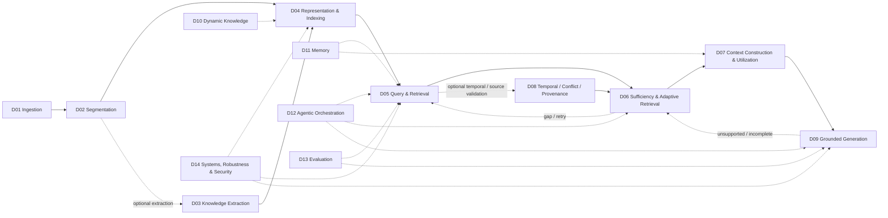

# RAG Survey

A structured literature survey and research map for Retrieval-Augmented Generation (RAG).

> **Current taxonomy:** 14 Research Domains (D01–D14).  
> This is the only active top-level domain model in the repository.

## Start Here

- [Home](./00%20-%20%E5%B0%8E%E8%A6%BD%E8%88%87%E5%BF%83%E6%99%BA%E5%9C%96%20%28Navigation%20%26%20MOC%29/Home%20%28%E4%B8%BB%E7%9B%AE%E9%8C%84%E8%88%87%E7%9F%A5%E8%AD%98%E5%BA%AB%E5%B0%8E%E8%A6%BD%29.md)
- [RAG Research Taxonomy & Domain Map](./00%20-%20%E5%B0%8E%E8%A6%BD%E8%88%87%E5%BF%83%E6%99%BA%E5%9C%96%20%28Navigation%20%26%20MOC%29/RAG%20Research%20Taxonomy%20%26%20Domain%20Map.md)
- [RAG System Maps](./00%20-%20%E5%B0%8E%E8%A6%BD%E8%88%87%E5%BF%83%E6%99%BA%E5%9C%96%20%28Navigation%20%26%20MOC%29/RAG%20System%20Maps.md)
- [Research Domains](./02%20-%20%E7%A0%94%E7%A9%B6%E9%A0%98%E5%9F%9F%E5%B0%88%E9%A1%8C%20%28Research%20Domains%29/README.md)
- [Literature Notes](./03%20-%20%E8%AB%96%E6%96%87%E5%BA%AB%20%28Literature%20Notes%29/README.md)
- [Benchmark Catalog](./00%20-%20%E5%B0%8E%E8%A6%BD%E8%88%87%E5%BF%83%E6%99%BA%E5%9C%96%20%28Navigation%20%26%20MOC%29/RAG%20Benchmark%20Catalog.md)
- [Ideas & Hypotheses](./04%20-%20%E7%A0%94%E7%A9%B6%E6%83%B3%E6%B3%95%E8%88%87%E5%BE%85%E9%A9%97%E8%AD%89%E6%8F%90%E6%A1%88%20%28Ideas%20%26%20Hypotheses%29/README.md)

## Taxonomy at a Glance



## 14 Research Domains

| ID | Domain |
|---|---|
| D01 | Document Ingestion & Structure |
| D02 | Segmentation & Contextualization |
| D03 | Knowledge Extraction & Information Preservation |
| D04 | Knowledge Representation & Indexing |
| D05 | Query Understanding & Retrieval |
| D06 | Evidence Sufficiency & Adaptive Retrieval |
| D07 | Context Construction & Evidence Utilization |
| D08 | Temporal Conflict & Provenance Resolution |
| D09 | Grounded Generation, Attribution & Long-form Synthesis |
| D10 | Dynamic Knowledge & Index Maintenance |
| D11 | Memory-Augmented RAG |
| D12 | Agentic RAG & Orchestration |
| D13 | RAG Evaluation & Failure Attribution |
| D14 | RAG Systems, Robustness & Security |

## Classification Rules

- **Domain** = where the research problem occurs in the RAG lifecycle/system.
- **Topic** = a subproblem inside a Domain.
- **Paradigm Tag** = a cross-cutting method family, e.g. GraphRAG, Hierarchical RAG, Agentic RAG.
- **Adjacent Interface** = related but non-core RAG research, e.g. Long Context, KV Cache, General Agents.
- **Idea** = project-specific hypothesis; it is kept separate from published literature.

Key boundaries:

```text
Segmentation != Extraction != Representation
Relevance != Sufficiency != Utilization != Faithfulness
Dynamic Index != Persistent Memory
Domain != Paradigm Tag != Benchmark
```

## Repository Layout

```text
00 - Navigation & MOC
02 - Research Domains          # D01-D14
03 - Literature Notes         # paper notes; storage folders are not Domains
04 - Ideas & Hypotheses       # project proposals / research ideas
Papers                         # local paper artifacts
```

The literature storage folders (Long Context, Compression/KV, RAG/Retrieval, Knowledge/Graph, Memory/Agents, Benchmarks/Evaluation) are organizational buckets only and are **not** a second taxonomy.
