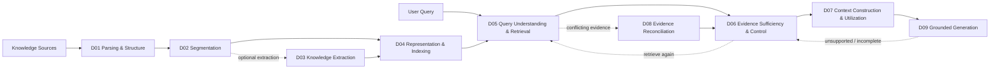

# RAG Survey: From Knowledge Construction to Evidence-Grounded Generation

> **Readable survey — classification updated 2026-10-02**
> This is the main human-readable synthesis of this repository.  
> The detailed taxonomy, literature notes, benchmarks, and audit trail remain available as supporting material.

## Abstract

Retrieval-Augmented Generation (RAG) has evolved from a simple retrieve-then-generate pattern into a broader evidence-processing system. A practical RAG pipeline must construct knowledge, retrieve evidence, decide whether the evidence is sufficient, resolve conflicts, control context, generate attributable outputs, maintain changing knowledge and persistent state, evaluate failures, and operate under real deployment constraints.

Existing RAG surveys commonly use broad stages such as indexing, retrieval, post-retrieval processing, generation, and evaluation. Those views are useful for overview, but they can be too coarse for diagnosing where a system succeeds or fails. This survey therefore uses an **operational taxonomy of fourteen research domains (D01–D14)**. It is not presented as an existing community standard; it is a research map designed to separate problems that require different mechanisms and evaluation protocols.

Huang and Huang organize their 2024 v2 survey into pre-retrieval, retrieval, post-retrieval, and generation (§2.2, Figure 3). We use that as a complementary process view: query manipulation maps to D05 even when it precedes retrieval, and reranking remains D05 even when it follows retrieval. The chapter mapping and limits of survey coverage are maintained in the [Survey Papers Index](./00%20-%20%E5%B0%8E%E8%A6%BD%E8%88%87%E5%BF%83%E6%99%BA%E5%9C%96%20%28Navigation%20%26%20MOC%29/Survey%20Papers%20Index.md). [Huang & Huang (2024/08), §2.2, Figure 3](https://arxiv.org/html/2404.10981v2).

For readability, the fourteen domains are grouped into six macro areas:

1. **Source & Knowledge Construction** — D01–D04
2. **Retrieval & Evidence Control** — D05–D08
3. **Grounded Generation** — D09
4. **Stateful & Agentic RAG** — D10–D12
5. **Evaluation** — D13
6. **Deployment & Trust** — D14

The central argument of this survey is simple: **modern RAG is better understood as an evidence lifecycle than as a retriever attached to an LLM.**

---

## 1. From Retrieve-Then-Generate to an Evidence Lifecycle

A minimal RAG system is often written as:

```text
Query → Retrieve → Context → Generate
```

or mathematically,

$$
q \rightarrow \mathrm{Retrieve}(q) \rightarrow C \rightarrow \mathrm{Generate}(q,C),
$$

where (q) is a query and (C) is retrieved context.

This abstraction hides much of the real problem. Before retrieval, documents must be parsed, segmented, transformed, represented, indexed, and eventually maintained. At query time, the system may rewrite or decompose the query, retrieve from several channels, rerank candidates, judge whether the evidence is sufficient, reconcile temporal or source conflicts, compress and order context, and decide whether to answer, retrieve again, or abstain.

A more complete RAG lifecycle is:



Three other domains operate across the lifecycle:

- **D10 Knowledge & Index Maintenance** — synchronize RAG artifacts when source knowledge changes.
- **D11 Persistent Memory Management** — maintain derived state across interactions and tasks.
- **D12 RAG Orchestration & Action Control** — choose the next retrieval, verification, memory, tool, or generation action.

Finally:

- **D13 Evaluation & Failure Attribution** measures and diagnoses the pipeline.
- **D14 RAG Systems, Security & Privacy** handles deployment efficiency and trust boundaries.

The taxonomy is intentionally based on **research problems**, not buzzwords. The most important boundaries are:

```text
Segmentation != Extraction != Representation
Relevance != Sufficiency != Context Utilization != Faithfulness
Initial Index Construction != Index Maintenance
Canonical Knowledge Synchronization != Persistent Derived Memory
Iterative Retrieval != General State-to-Action Orchestration
Evaluation != Runtime Observability
Domain != Paradigm Tag != Benchmark
```

For the formal definitions and paper-level assignment rules, see [RAG Research Taxonomy & Domain Map](./00%20-%20%E5%B0%8E%E8%A6%BD%E8%88%87%E5%BF%83%E6%99%BA%E5%9C%96%20%28Navigation%20%26%20MOC%29/RAG%20Research%20Taxonomy%20%26%20Domain%20Map.md).

---

# Part I — Source & Knowledge Construction

## 2. D01 — Document Parsing & Structure Recovery

**Core question:** How should heterogeneous sources such as PDFs, scanned documents, web pages, tables, figures, and structured files be converted into machine-processable units while preserving layout, hierarchy, reading order, and source structure?

D01 occurs before chunking. Its job is to recover what the source **is** before deciding what should later become a retrieval unit.

Typical problems include OCR, layout analysis, reading-order recovery, document hierarchy parsing, table/formula/figure parsing, and multimodal document structure recovery. Representative literature in the repository includes DocLayNet, OmniDocBench, PDF-to-Tree, Intelligent Document Parsing, and READoc.

For classification, we separate table detection, table structure recovery, and functional roles such as headers. Formula transcription recovers the source notation; reasoning over the formula belongs to the downstream task. Parsing quality and downstream evidence recovery are separate evaluation targets; the detailed D01 page records the supporting sources and remaining coverage gaps.

The most important boundary is that D01 should not become a generic data-ingestion bucket. File connectors, URI normalization, hashing, and upload plumbing matter in production systems, but they are implementation infrastructure rather than the research identity of document parsing.

Why does this distinction matter? Because downstream retrieval cannot reliably reconstruct structure that was destroyed upstream. A table flattened into an arbitrary token sequence may lose row/column relations. A document with lost heading hierarchy gives later segmentation and retrieval fewer structural cues.

Detailed domain note: [D01 Document Parsing & Structure Recovery](./02%20-%20%E7%A0%94%E7%A9%B6%E9%A0%98%E5%9F%9F%E5%B0%88%E9%A1%8C%20%28Research%20Domains%29/Domain%2001%20-%20Document%20Ingestion%20%26%20Structure.md).

---

## 3. D02 — Segmentation & Retrieval Granularity

**Core question:** What should constitute a retrievable unit, and how can a system preserve enough local context while balancing retrieval precision, semantic completeness, index size, and downstream generation quality?

Common strategies include:

| Family | Retrieval unit | Main trade-off |
|---|---|---|
| Fixed / token window | fixed token span | cheap, but may cut semantic boundaries |
| Recursive | paragraph → sentence → token fallback | preserves some hierarchy |
| Semantic | topic / semantic shift | better coherence, higher preprocessing cost |
| Structure-aware | heading / section / table / list | uses D01 structure |
| Proposition-level | atomic/self-contained statement | fine precision, transformation cost |
| Parent-child | small retrieval unit + larger parent | precision vs context completeness |

The basic tension is:

$$
\text{smaller units}\Rightarrow\text{higher local precision but more context loss},
$$

whereas

$$
\text{larger units}\Rightarrow\text{more preserved context but lower specificity and higher context cost}.
$$

Representative works include Dense X, LumberChunker, and LongRAG.

Our operational map distinguishes three units: the **indexed unit**, the **retrieved unit**, and the **reader-context unit**. They may coincide or differ, as in parent-child expansion. D02 forms the available units; D04 encodes them; D05 selects units or granularity for a query; D07 constructs the context actually read by the generator. Query-adaptive selection therefore connects these domains without changing their boundaries.

D02 is not simply “choose a chunk size.” It asks what information unit should be independently retrievable. Contextualized representation methods such as Late Chunking may interface with D02, but belong primarily to D04 when the main innovation is representation rather than boundary selection.

Detailed domain note: [D02 Segmentation & Retrieval Granularity](./02%20-%20%E7%A0%94%E7%A9%B6%E9%A0%98%E5%9F%9F%E5%B0%88%E9%A1%8C%20%28Research%20Domains%29/Domain%2002%20-%20Segmentation%20%26%20Contextualization.md).

---

## 4. D03 — Knowledge Extraction & Consolidation

**Core question:** What semantic units should be extracted from text, and how can extraction, alignment, and consolidation avoid distorting the source meaning?

Possible outputs include entities, relations, events, propositions, claims, and typed records. Representative literature includes DocRED, DyGIE++, MAVEN, OpenIE6, UIE, and InstructUIE.

A central concern is **information preservation**. Correct extraction is not merely correct entity or relation labels. The structured result may need to preserve:

- negation,
- modality,
- conditions,
- temporal scope,
- quantity and units,
- source scope,
- status.

For example, the triple

$$
(\text{Company},\text{supports},\text{Feature})
$$

is misleading if the source actually says that the company **may** support the feature **after approval** in **Q4**.

Cross-document RAG also requires coreference resolution, entity alignment, event linking, deduplication, temporal normalization, and prevention of unsupported merges.

The refined D03 topic map separates entity recognition, coreference, and canonical entity linking. It also separates event triggers, argument-role filling, and relations between events. Using retrieval inside an entity linker does not by itself make the work D05: its target is entity identity rather than evidence selection for a user question. Supporting sources and candidate papers are listed separately in the detailed D03 page.

The key boundary is:

$$
\boxed{\text{retrieval unit}\neq\text{semantic unit}}
$$

A paragraph can contain many claims, while one claim may depend on several passages.

The repository's F/R/D/A/P/C/T ontology is deliberately kept as a project hypothesis rather than described as literature consensus. UIE-style research supports schema-guided extraction as a mechanism; it does not validate that specific ontology.

Detailed domain note: [D03 Knowledge Extraction & Consolidation](./02%20-%20%E7%A0%94%E7%A9%B6%E9%A0%98%E5%9F%9F%E5%B0%88%E9%A1%8C%20%28Research%20Domains%29/Domain%2003%20-%20Knowledge%20Extraction%20%26%20Information%20Preservation.md).

---

## 5. D04 — Representation & Indexing

**Core question:** How should knowledge be represented, encoded, and organized so that retrieval can efficiently recover useful evidence?

Our representation map uses three independent facets:

| Facet | Classification examples |
|---|---|
| Unit supplied by D02/D03 | passage, proposition, entity, event, table, visual region |
| Encoding | lexical weighting, learned sparse, single-vector dense, multi-vector / late interaction, multimodal |
| Index organization | inverted index, vector-neighbor index, semantic graph, hierarchy, hybrid |

These facets describe different choices and can be combined. Representative notes include RAPTOR, Microsoft GraphRAG, LightRAG, Late Chunking, and LinearRAG; the detailed D04 page provides their primary/secondary assignments.

An ANN neighbor graph and a semantic knowledge graph must be recorded separately. Index organization interfaces with D04; generic vector-database serving, storage, concurrency, and deployment engineering interface with D14. Query-time search and scoring remain D05.

A crucial distinction is the difference between **corpus-side representation** and **query-time retrieval**:

- building a graph is D04;
- traversing or searching it at query time is D05;
- building a hierarchy is D04;
- deciding how to retrieve from the hierarchy is D05.

This avoids turning labels such as GraphRAG, Hierarchical RAG, and Vector RAG into mutually exclusive top-level domains. They are better modeled as representation/retrieval paradigms crossing several lifecycle stages.

Detailed domain note: [D04 Representation & Indexing](./02%20-%20%E7%A0%94%E7%A9%B6%E9%A0%98%E5%9F%9F%E5%B0%88%E9%A1%8C%20%28Research%20Domains%29/Domain%2004%20-%20Knowledge%20Representation%20%26%20Indexing.md).

---

# Part II — Retrieval & Evidence Control

## 6. D05 — Query Understanding & Retrieval

**Core question:** How should a system understand the user query, choose retrieval strategies, and find, fuse, and rank relevant candidate evidence?

This is the most historically mature RAG domain. Representative works include DPR, ColBERT, HyDE, IRCoT, RankRAG, REALM, RETRO, Atlas, and RA-DIT.

D05 includes:

- query rewriting and expansion,
- dense and sparse retrieval,
- hybrid retrieval,
- decomposition and multi-hop retrieval,
- retrieval fusion,
- reranking.

For comparison, we distinguish rewriting, term expansion, pseudo-document expansion, dependent subquestion decomposition, and generation-feedback retrieval. A generated query or pseudo-document is a search aid and requires source verification before being used as evidence. Retriever–generator alignment is recorded by both the supervision signal and the trained module; a method that trains one component is not automatically joint training. The detailed D05 page links the corresponding primary notes and clearly marks additional abstract-verified candidates.

The core objective is relevance:

$$
\mathrm{Retrieve}(q)\rightarrow\{e_1,\ldots,e_k\}
$$

such that useful evidence ranks highly.

However, relevance is not answerability. A retriever can return passages that are strongly related to the query but collectively fail to provide all evidence needed to answer it. That is the boundary between D05 and D06.

Detailed domain note: [D05 Query Understanding & Retrieval](./02%20-%20%E7%A0%94%E7%A9%B6%E9%A0%98%E5%9F%9F%E5%B0%88%E9%A1%8C%20%28Research%20Domains%29/Domain%2005%20-%20Query%20Understanding%20%26%20Retrieval.md).

---

## 7. D06 — Evidence Sufficiency & Retrieval Control

**Core question:** Is the currently available evidence sufficient to answer the question? If not, what is missing, should the system retrieve again, change strategy, abstain, or stop?

Representative work includes FLARE, Self-RAG, Adaptive-RAG, and CRAG, with more recent work extending explicit sufficient-context and retrieval-control formulations.

The key conceptual split is:

$$
\boxed{\text{D05: What is relevant?}}
$$

versus

$$
\boxed{\text{D06: Is what we have enough?}}
$$

Suppose a query requires evidence components (E_1,E_2,E_3). Retrieving five passages about (E_1) does not compensate for missing (E_3).

A project design sketch is:

$$
S(E,q)\in\{\text{sufficient},\text{insufficient},\text{unresolvable}\},
$$

followed by a control policy:

$$
\pi(S,\text{budget},\text{state})\rightarrow\{\text{retrieve},\text{rewrite},\text{switch source},\text{answer},\text{abstain}\}.
$$

This combined evidence-gap controller is a repository hypothesis, recorded in [Idea 02 — Evidence Gap-Aware Adaptive Retrieval](./04%20-%20%E7%A0%94%E7%A9%B6%E6%83%B3%E6%B3%95%E8%88%87%E5%BE%85%E9%A9%97%E8%AD%89%E6%8F%90%E6%A1%88%20%28Ideas%20%26%20Hypotheses%29/Idea%2002%20-%20Evidence%20Gap-Aware%20Adaptive%20Retrieval.md). Existing adaptive-retrieval work does not establish the entire combination as a standard method.

The D06 comparison axes are **trigger timing × observed signal × decision**. Query complexity, model uncertainty, retrieval quality, and evidence-set sufficiency describe different signals. Stopping retrieval can reflect a budget limit rather than answerability. Statistical coverage of an answer set is another distinct object, with method-specific calibration assumptions. D13 evaluates these decisions; D07 context construction can require a new sufficiency check if it removes necessary evidence.

Important failure modes include false-sufficient decisions, infinite retrieval loops, overly conservative abstention, and adaptation whose extra cost exceeds its quality gain.

Detailed domain note: [D06 Evidence Sufficiency & Retrieval Control](./02%20-%20%E7%A0%94%E7%A9%B6%E9%A0%98%E5%9F%9F%E5%B0%88%E9%A1%8C%20%28Research%20Domains%29/Domain%2006%20-%20Evidence%20Sufficiency%20%26%20Adaptive%20Retrieval.md).

---

## 8. D07 — Context Construction & Utilization

**Core question:** Once candidate evidence has been retrieved, how should it be selected, deduplicated, compressed, ordered, packed, and budgeted so that the model actually uses the important information?

Representative work includes RECOMP and Chain-of-Note. Long-context studies such as Lost in the Middle provide related evidence about position sensitivity, although they are not necessarily RAG-primary contributions.

D07 exists because:

$$
\boxed{\text{evidence retrieved}\not\Rightarrow\text{evidence effectively used}}
$$

A retriever may succeed while the generator fails because the crucial passage is truncated, buried at an unfavorable position, diluted by distractors, or damaged by compression.

D07 therefore studies the transition from candidate evidence to usable model context.

Detailed domain note: [D07 Context Construction & Utilization](./02%20-%20%E7%A0%94%E7%A9%B6%E9%A0%98%E5%9F%9F%E5%B0%88%E9%A1%8C%20%28Research%20Domains%29/Domain%2007%20-%20Context%20Construction%20%26%20Evidence%20Utilization.md).

---

## 9. D08 — Evidence Reconciliation

**Core question:** When multiple pieces of evidence cannot simultaneously be treated as valid because of time, version, source reliability, applicability, or direct contradiction, how should the system resolve the conflict?

Representative anchors include FreshLLMs/FreshQA, Re³, When Facts Change, and RA-RAG.

D08 should activate only when evidence **cannot simply coexist**. Two complementary facts do not require reconciliation. A current policy and an obsolete version do.

Possible actions include:

- retain one source,
- down-weight another,
- split answers by time or applicability,
- expose disagreement,
- declare the conflict unresolved.

This area is broader than temporal freshness. Current literature supports temporal/version conflict and source reliability, while provenance lineage, approval-state arbitration, applicability scope, and multi-signal evidence governance remain thinner research areas.

Detailed domain note: [D08 Evidence Reconciliation](./02%20-%20%E7%A0%94%E7%A9%B6%E9%A0%98%E5%9F%9F%E5%B0%88%E9%A1%8C%20%28Research%20Domains%29/Domain%2008%20-%20Temporal%20Conflict%20%26%20Provenance%20Resolution.md).

---

# Part III — Grounded Generation

## 10. D09 — Grounded Generation & Long-form Synthesis

**Core question:** How should a system transform evidence into a verifiable, attributable answer or long-form report, and what should it do when support is incomplete?

Representative systems include STORM, OpenScholar, EviReport, EFSG, and GopherCite.

Grounded generation is not merely the final LLM call. It includes claim construction, citation and attribution, evidence-to-claim alignment, long-form organization, revision, and abstention.

Long-form RAG commonly uses several patterns:

| Pattern | Basic idea |
|---|---|
| Outline-first / research-first | research and plan before drafting |
| Evidence-first fixed pool | freeze evidence before generation |
| Gap-aware iterative writing | retrieve again when drafting exposes missing evidence |

No one pattern is universally best. Their value depends on evidence coverage, auditability, latency, and task type.

An idealized evidence relationship is:

$$
c_i\longleftrightarrow\{e_{i1},e_{i2},\ldots\},
$$

meaning that important generated claims should be traceable to supporting evidence. Citation presence alone does not guarantee that the cited evidence actually supports the claim; citation correctness remains an evaluation problem in D13.

Detailed domain note: [D09 Grounded Generation & Long-form Synthesis](./02%20-%20%E7%A0%94%E7%A9%B6%E9%A0%98%E5%9F%9F%E5%B0%88%E9%A1%8C%20%28Research%20Domains%29/Domain%2009%20-%20Grounded%20Generation%20Attribution%20%26%20Long-form%20Synthesis.md).

---

# Part IV — Stateful & Agentic RAG

## 11. D10 — Knowledge & Index Maintenance

**Core question:** When the canonical knowledge source changes, how should derived chunks, embeddings, graphs, summaries, and indexes be updated correctly and efficiently?

The repository currently identifies AURORA as the most direct D10 primary anchor. Compared with retrieval or evaluation, however, this literature remains relatively thin.

The central problem is dependency propagation:

```text
source change
   ↓
affected source units
   ↓
affected chunks / extracted objects
   ↓
affected embeddings / graph edges / summaries
   ↓
partial re-index / invalidation / deletion
```

A real system needs insert, update, delete, stale-artifact detection, partial recomputation, and version-aware synchronization. Yet many RAG studies still assume a static corpus.

D10 is therefore a strong open area, especially for **deletion propagation, dependency-aware recomputation, and realistic update-stream benchmarks**.

Detailed domain note: [D10 Knowledge & Index Maintenance](./02%20-%20%E7%A0%94%E7%A9%B6%E9%A0%98%E5%9F%9F%E5%B0%88%E9%A1%8C%20%28Research%20Domains%29/Domain%2010%20-%20Dynamic%20Knowledge%20%26%20Index%20Maintenance.md).

---

## 12. D11 — Persistent Memory Management

**Core question:** How should a RAG system create and manage derived state that persists across interactions or tasks?

Representative RAG-oriented anchors include MemoRAG and From RAG to Memory / HippoRAG 2, while MemoryBank, A-MEM, MemGPT, and LongMem provide adjacent mechanisms from broader memory research.

The key distinction is:

$$
\text{D10}=\text{keep source-derived artifacts synchronized}
$$

while

$$
\text{D11}=\text{maintain persistent derived state across interactions/tasks}.
$$

Memory operations include write, retrieve, link, consolidate, evolve, invalidate, and forget.

This becomes a governance problem as well as a capability problem. Deleting a source does not automatically imply that derived summaries, embeddings, graph relations, or remembered task state have disappeared.

The literature is much stronger on writing and retrieving memory than on forgetting, ownership, invalidation, and governance.

Detailed domain note: [D11 Persistent Memory Management](./02%20-%20%E7%A0%94%E7%A9%B6%E9%A0%98%E5%9F%9F%E5%B0%88%E9%A1%8C%20%28Research%20Domains%29/Domain%2011%20-%20Memory-Augmented%20RAG.md).

---

## 13. D12 — RAG Orchestration & Action Control

**Core question:** Given the current query, evidence, memory, failures, tools, and budget, what action should the RAG system execute next?

Representative work includes GraphReader, RAG-Critic, DecEx-RAG, Reflective RAG, and Agentic RAG survey literature.

The scientific core is not the word *agent*. It is a state-dependent policy:

$$
a_t=\pi(s_t),
$$

where (s_t) can contain the query, evidence, evidence gaps, verification results, memory, cost, and previous actions.

Possible actions include query rewrite, retrieval, graph search, web search, verification, memory access, generation, repair, and abstention.

This creates a useful hard boundary:

```text
multi-step != automatically agentic
reflection != automatically agentic
multiple agents != automatically adaptive
fixed workflow != D12 unless state changes action selection
```

D06 handles the narrower retrieve/retry/stop decision around evidence sufficiency. D12 handles heterogeneous actions across the broader RAG workflow.

Detailed domain note: [D12 RAG Orchestration & Action Control](./02%20-%20%E7%A0%94%E7%A9%B6%E9%A0%98%E5%9F%9F%E5%B0%88%E9%A1%8C%20%28Research%20Domains%29/Domain%2012%20-%20Agentic%20RAG%20%26%20Orchestration.md).

---

# Part V — Evaluation

## 14. D13 — Evaluation & Failure Attribution

**Core question:** How can RAG quality be measured at different layers, and how can a failure be localized to the component that actually caused it?

Representative frameworks and benchmarks include RAGAS, ARES, RAGChecker, RAGBench, ALCE, the Evidence Sufficiency Benchmark, and ReportLogic.

The domain explicitly separates four artifacts that are frequently mixed together:

| Object | Meaning |
|---|---|
| Dataset / Corpus | data and annotations |
| Benchmark / Shared Task | task and evaluation protocol |
| Metric | scoring rule |
| Evaluation Framework | process/software that runs evaluations |

A single end-to-end answer score is not enough for diagnosis. Evaluation should inspect retrieval relevance, evidence coverage, context utilization, faithfulness, attribution, citation quality, and final task success.

### Oracle intervention

One useful diagnostic test is:

$$
\mathrm{Generator}(\mathrm{Gold\ Evidence}).
$$

If the generator still fails when gold evidence is directly provided, the problem should not be attributed to the retriever. The next suspects are context utilization, reasoning, generation, or attribution.

More generally, swapping one component with an oracle can help localize bottlenecks. These interventions should be treated as diagnostics rather than a perfectly additive decomposition because RAG components interact nonlinearly.

Important evaluation risks include benchmark contamination, LLM-as-a-judge bias, changing model/API snapshots, mismatched compute budgets, and hidden module interactions.

Detailed domain note: [D13 Evaluation & Failure Attribution](./02%20-%20%E7%A0%94%E7%A9%B6%E9%A0%98%E5%9F%9F%E5%B0%88%E9%A1%8C%20%28Research%20Domains%29/Domain%2013%20-%20RAG%20Evaluation%20%26%20Failure%20Attribution.md).

---

# Part VI — Deployment & Trust

## 15. D14 — RAG Systems, Security & Privacy

**Core question:** How can RAG operate efficiently and safely under real deployment constraints, including latency, throughput, cost, security, privacy, and access control?

D14 contains three related but distinct tracks:

1. **Systems & Serving**
2. **Security & Integrity**
3. **Privacy & Access Control**

Representative systems work includes METIS, PipeRAG, CacheBlend, RAGCache, and TeleRAG. Security anchors include PoisonedRAG and retrieved-content / indirect-prompt-injection research.

A simplified latency model is:

$$
T_{\text{total}}=T_{\text{parse/embed}}+T_{\text{search}}+T_{\text{rerank}}+T_{\text{prefill}}+T_{\text{decode}}.
$$

A deployment study should therefore report more than final accuracy: latency/TTFT, throughput, token and model-call budget, peak memory, indexing cost, and serving cost also matter.

Two security invariants are particularly important:

```text
Retrieved document != trusted instruction
Retrieved document != trusted truth
```

RAG introduces attack surfaces through corpus poisoning, retrieval manipulation, indirect prompt injection, privacy leakage, tenant-isolation failure, and persistence of derived data after source deletion.

Current literature is stronger for serving systems and poisoning than for **RAG-specific observability/tracing, tenant isolation, access-control semantics, and derived-data deletion governance**.

Detailed domain note: [D14 RAG Systems, Security & Privacy](./02%20-%20%E7%A0%94%E7%A9%B6%E9%A0%98%E5%9F%9F%E5%B0%88%E9%A1%8C%20%28Research%20Domains%29/Domain%2014%20-%20RAG%20Systems%2C%20Robustness%20%26%20Security.md).

---

# Part VII — Cross-Cutting Paradigms

## 16. Why GraphRAG, Agentic RAG, Multimodal RAG, and Adaptive RAG Are Not Separate Domains

Many popular labels describe method families crossing several lifecycle problems.

For example, GraphRAG may involve:

$$
\text{D03 extraction}\rightarrow\text{D04 graph representation}\rightarrow\text{D05 graph retrieval}\rightarrow\text{D09 synthesis}.
$$

Adaptive RAG commonly spans D05, D06, and sometimes D12. Agentic RAG is primarily a control paradigm centered on D12 but can invoke any earlier domain. Multimodal RAG may affect parsing, representation, retrieval, context construction, and generation.

Treating these labels as parallel lifecycle stages creates overlap and unstable paper classification. This repository therefore models them as **Paradigm Tags**, not additional top-level Domains.

See [RAG Paradigm Tags](./00%20-%20%E5%B0%8E%E8%A6%BD%E8%88%87%E5%BF%83%E6%99%BA%E5%9C%96%20%28Navigation%20%26%20MOC%29/RAG%20Paradigm%20Tags.md).

---

# Part VIII — What the Current Literature Map Shows

## 17. Coverage Snapshot

The metadata recount on **2026-10-02** contains **177 literature notes with a `paper_id`**, excluding supplemental slide artifacts.

- **123** have a D01–D14 `primary_domain`.
- **54** are Adjacent/CROSS and are deliberately not forced into a core RAG domain.

| Domain | Primary notes |
|---|---:|
| D01 | 5 |
| D02 | 5 |
| D03 | 18 |
| D04 | 7 |
| D05 | 19 |
| D06 | 6 |
| D07 | 5 |
| D08 | 9 |
| D09 | 8 |
| D10 | 1 |
| D11 | 7 |
| D12 | 6 |
| D13 | 19 |
| D14 | 8 |

These counts should **not** be interpreted as the relative importance of each area. They describe the current curated repository.

The clearest thin areas are:

- **D08:** provenance lineage, approval state, applicability-scope governance;
- **D10:** source-level CRUD, deletion propagation, dependency-aware partial recomputation;
- **D11:** memory forgetting, invalidation, ownership, governance;
- **D14:** observability/tracing, tenant isolation, access control, derived-data deletion.

For current count definitions and classification updates, see [Research Domains](./02%20-%20%E7%A0%94%E7%A9%B6%E9%A0%98%E5%9F%9F%E5%B0%88%E9%A1%8C%20%28Research%20Domains%29/README.md). The earlier baseline is preserved in [Phase 1 Taxonomy Closure Audit](./00%20-%20%E5%B0%8E%E8%A6%BD%E8%88%87%E5%BF%83%E6%99%BA%E5%9C%96%20%28Navigation%20%26%20MOC%29/Phase%201%20Taxonomy%20Closure%20Audit%20-%202026-09-27.md).

---

## 18. Open Research Problems

### 18.1 Evidence is becoming the central object

Early RAG research focused heavily on retrieving relevant passages. More recent systems increasingly need to reason about the **evidence set**: whether it is complete, mutually compatible, current, sufficiently trustworthy, and actually used by the model.

The trajectory can be summarized as:

$$
\text{retrieve relevant passages}
$$

evolving toward:

$$
\boxed{\text{construct, validate, reconcile, and govern an evidence state}}.
$$

This shift connects D05–D09 and is one of the clearest themes across the current literature map.

### 18.2 Failure attribution is still underdeveloped

The same wrong answer can result from:

- parsing,
- segmentation,
- extraction,
- representation,
- retrieval,
- insufficient evidence,
- evidence conflict,
- context packing,
- or generation.

A single end-to-end score cannot distinguish these cases.

Future evaluation should therefore use layer-specific metrics, controlled interventions, and traceable evidence objects.

### 18.3 Dynamic knowledge is not solved by web search

Fresh web retrieval can answer current questions, but it does not solve synchronization of enterprise indexes, embeddings, extracted graphs, cached summaries, or persistent memory.

The research problem is not only:

> Can the system retrieve a current answer?

but also:

> Can all derived artifacts remain consistent when the source of truth changes?

### 18.4 Long-form RAG needs explicit evidence accounting

Short QA can sometimes tolerate implicit evidence alignment. Long reports cannot.

As output length grows, a system must increasingly track:

- coverage,
- claim support,
- citation completeness,
- cross-section consistency,
- contradictions,
- unsupported synthesis.

This makes evidence-aware planning and claim-level provenance increasingly important.

### 18.5 Systems and governance are becoming first-class RAG research

As RAG moves from demos to shared services, access control, tenant isolation, deletion semantics, derived-data persistence, tracing, cost control, and attack resistance become part of the RAG problem rather than afterthoughts.

---

## 19. A Compact Mental Model

The whole survey can be remembered through six questions:

| Macro area | Question |
|---|---|
| Source & Knowledge Construction | What knowledge object do we actually have? |
| Retrieval & Evidence Control | What evidence is relevant, sufficient, usable, and mutually consistent? |
| Grounded Generation | What can we safely claim from that evidence? |
| Stateful & Agentic RAG | What should the system remember or do next? |
| Evaluation | Where did the system actually fail? |
| Deployment & Trust | Can this process run efficiently and safely in the real world? |

D01–D14 are a finer operational decomposition of those six questions.

---

## 20. Conclusion

RAG is better understood as an **evidence lifecycle** than as a retriever attached to a language model.

The research problem begins before retrieval, with document structure, segmentation, extraction, and representation. It continues through query understanding, retrieval relevance, evidence sufficiency, context construction, conflict reconciliation, and grounded generation. Persistent knowledge, memory, and agentic control add state across the lifecycle. Evaluation must distinguish where failure occurs, while deployment introduces systems, security, and privacy constraints.

The most important separations are:

```text
relevance is not sufficiency
sufficiency is not utilization
utilization is not faithfulness
freshness is not index maintenance
memory is not simply a vector database
agentic behavior is not merely multi-step execution
evaluation is not a single end-to-end score
```

These distinctions make the taxonomy useful not only for organizing papers but also for designing experiments. Each domain corresponds to a research problem that can be isolated, ablated, measured, and improved.

The resulting view is intentionally modular: **D01–D14 form the operational research map, while GraphRAG, Multimodal RAG, Agentic RAG, Adaptive RAG, and similar labels remain cross-cutting paradigms.**

This provides a stable basis for the next stage of the project: turning the literature map into a modular RAG experimentation framework with explicit evidence sufficiency, evidence reconciliation, failure attribution, and adaptive orchestration.

---

## Further Reading Inside This Repository

- [Research Taxonomy & Domain Map](./00%20-%20%E5%B0%8E%E8%A6%BD%E8%88%87%E5%BF%83%E6%99%BA%E5%9C%96%20%28Navigation%20%26%20MOC%29/RAG%20Research%20Taxonomy%20%26%20Domain%20Map.md)
- [RAG System Maps](./00%20-%20%E5%B0%8E%E8%A6%BD%E8%88%87%E5%BF%83%E6%99%BA%E5%9C%96%20%28Navigation%20%26%20MOC%29/RAG%20System%20Maps.md)
- [Research Domains](./02%20-%20%E7%A0%94%E7%A9%B6%E9%A0%98%E5%9F%9F%E5%B0%88%E9%A1%8C%20%28Research%20Domains%29/README.md)
- [Literature Notes](./03%20-%20%E8%AB%96%E6%96%87%E5%BA%AB%20%28Literature%20Notes%29/README.md)
- [Survey Papers Index](./00%20-%20%E5%B0%8E%E8%A6%BD%E8%88%87%E5%BF%83%E6%99%BA%E5%9C%96%20%28Navigation%20%26%20MOC%29/Survey%20Papers%20Index.md)
- [Benchmark Catalog](./00%20-%20%E5%B0%8E%E8%A6%BD%E8%88%87%E5%BF%83%E6%99%BA%E5%9C%96%20%28Navigation%20%26%20MOC%29/RAG%20Benchmark%20Catalog.md)
- [Phase 1 Taxonomy Closure Audit](./00%20-%20%E5%B0%8E%E8%A6%BD%E8%88%87%E5%BF%83%E6%99%BA%E5%9C%96%20%28Navigation%20%26%20MOC%29/Phase%201%20Taxonomy%20Closure%20Audit%20-%202026-09-27.md)

---

## Status

This is the repository's **readable survey layer**. The detailed literature notes remain the source for paper-level metadata, primary/secondary-domain mappings, benchmarks, and factual audit.

The next refinement should add formal citation density and comparison figures **without reopening the already-closed D01–D14 taxonomy unless new evidence demonstrates a real structural problem**.
